# 1. Overview

This section will house fundamental concepts, theoretical underpinnings, and key definitions in Machine Learning.

## 1.1. Introduction

### 1.1.1. Why ML

Machine Learning is the science and art of programming computers so they can learn from data.

This diagram illustrates a traditional problem-solving workflow. It begins with studying the problem, followed by manually writing rules. The outcome is then evaluated; if successful, it's launched, and if not, errors are analyzed, leading back to studying the problem and refining the rules. The emphasis is on explicit rule creation.

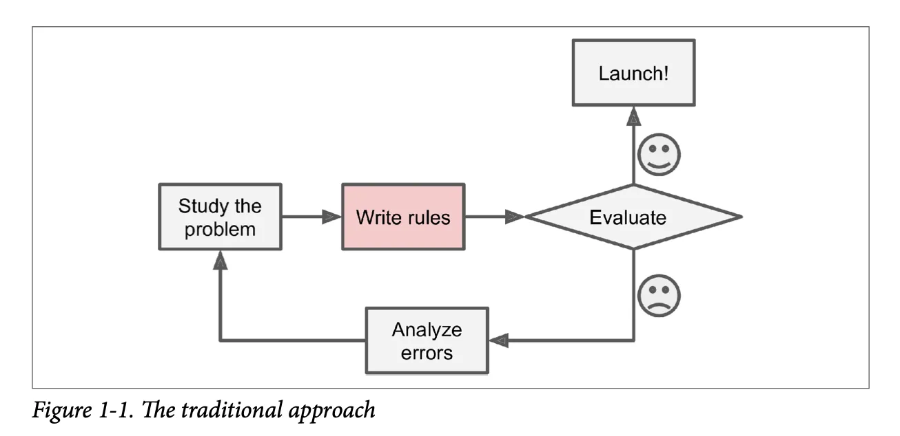

This diagram depicts a machine learning workflow. It also starts with studying the problem, but then diverges to training an ML algorithm using data. The resulting solution is evaluated; a successful outcome leads to launch, while an unsuccessful one leads to error analysis and a return to studying the problem, potentially retraining the algorithm with adjusted data or parameters. The key elements here are the data-driven training of an algorithm.

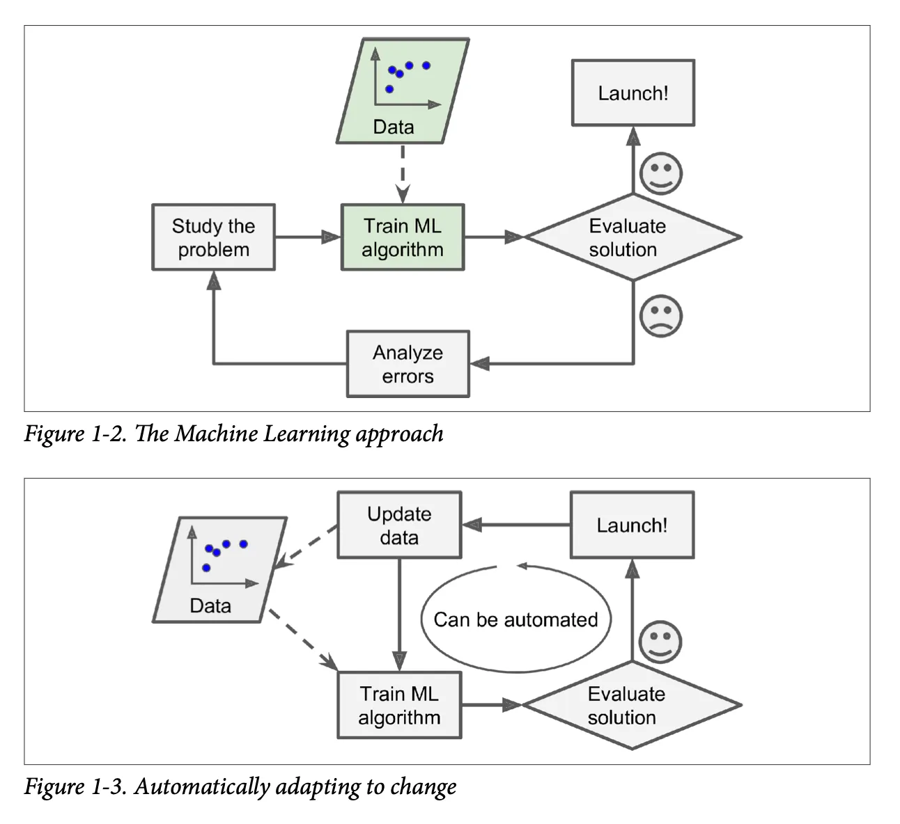

This diagram illustrates how a machine learning system can continuously adapt. Data is used to train an ML algorithm, the solution is evaluated, and if successful, it's launched. The key aspect is the feedback loop where the launched system can trigger data updates, which then automatically retrain the algorithm, allowing the system to adapt to new information over time. This cycle can be automated for continuous improvement.

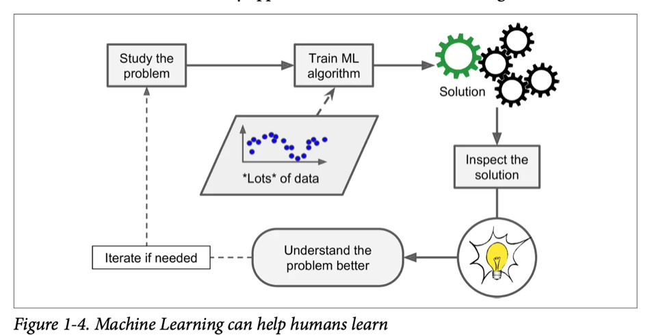

This figure shows how machine learning can enhance human understanding. The process starts with **studying a problem** and **training an ML algorithm** with extensive **data** to generate a **solution**. Humans then **inspect this solution**, leading to a deeper **understanding of the problem** itself. This improved insight can then feed back into further study and iteration if necessary, creating a synergistic learning loop between humans and the ML system.

To summarize, ML is great for:

  - Problems for which existing solutions require a lot of fine-tuning or long lists of rules
  - Complex problems for which using a traditional approach yields no good solution
  - Fluctuating environments
  - Getting insights about complex problems and large amounts of data

### 1.1.2. Types of ML Systems

There are many different types of ML systems so it’s useful to classify them in broad categories, based on the following criteria:

  - How they are supervised during training (supervised, unsupervised, etc.)
  - Whether or not they can learn incrementally on the fly (online learning vs. batch learning)
  - Whether they work by simply comparing new data points to know data points, or instead by detecting patterns in the training data and building a predictive model

### **Training Supervision**

  - Supervised learning (regression, classification)
  - Unsupervised learning (clustering, dimensionality reduction, anomaly detection)
  - Semi-supervised learning
  - Reinforcement learning (an agent in an environment given rewards and penalties to find the most optimal policy)

### **Batch vs Online Learning**

In **batch learning**, the system is incapable of learning incrementally: it must be trained using all the available data. This takes a lot of time and computing resources, so it’s typically done offline. First the system is trained, and then it is launched into production and runs without learning anymore (offline learning), it just applies what it has learned.

In **online learning**, you train the system incrementally by feeding in data instances sequentially, individually or in small groups called mini-batches. Each learning step is fast and cheap, so the system can learn about new data on the fly, as it arrives. Additionally, they can be used to train models on huge datasets that cannot fit in one’s machine’s main memory (this is called out-of-core learning). The algorithm loads part of the data, runs a training step on that data, and repeats the process until it has run on all of the data. Out-of-core learning is usually done offline, so think of it as incremental learning rather than online learning.

A big challenge of online learning is that if bad data is fed to the system, performance will drop. To reduce this risk, monitor the system closely and switch learning off if you detect a decline in performance. Monitor the input data and react to abnormal data, for example by using an anomaly detection algorithm.

### 1.1.3. Main Challenges of ML

The two things that can go wrong are “bad model” and “bad data”.

Bad data:

  - Insufficient quantity of training data
  - Nonrepresentative training data
  - Poor quality data
  - Irrelevant features

Bad model:

  - Overfitting the training data. Possible solutions:

      - Simplify the model by selecting one with fewer parameters, by reducing the number of features in the training data, or by constraining the model
      - Gather more training data
      - Reduce the noise in the training data (higher quality data)
  - Underfitting the training data. Possible solutions:

      - Select a more powerful model, with more parameters
      - Feed better features to the learning algorithm (feature engineering)
      - Reduce the constraints on the model (for example by reducing the regularization hyperparameter)

### 1.1.4. ML in Production

Deploying machine learning (ML) models into production environments involves challenges that extend beyond model development. Effective deployment integrates machine learning expertise with software engineering practices to ensure continuous and reliable operation within a larger system.

Key challenges include:

  - Ensuring consistent performance in real-world conditions.
  - Managing concept drift and data drift.
  - Handling extensive software infrastructure, where ML code typically comprises only 5-10% of the total codebase.

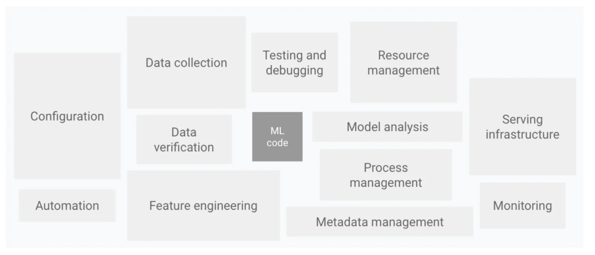

Beyond the machine learning code, there are also many other components for managing the data, such as data collection, data verification, feature extraction. And after you are serving it, we also need to consider how to monitor and analyze the system. There are often many other components that need to be built to enable a working production deployment.

**MLOps** encompasses the practices for the continuous, reliable, and efficient design, deployment, and maintenance of machine learning systems in production.

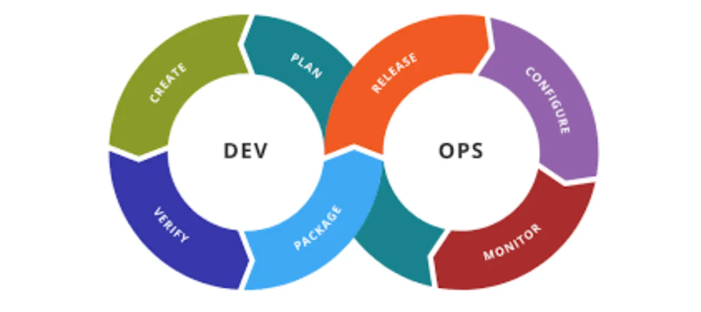

Originating from DevOps, MLOps addresses the full machine learning lifecycle. Its benefits include:

  - Improved collaboration
  - Automated deployment
  - Robust monitoring of model performance

## 1.2. ML Project Lifecycle

When building a machine learning (ML) system, planning the project lifecycle helps outline all necessary steps effectively. As you work on an ML system, this framework will help you identify critical tasks, ensure the system functions properly, and minimize unexpected challenges.

The ML project lifecycle consists of iterative stages that guide the development and deployment of an ML system.

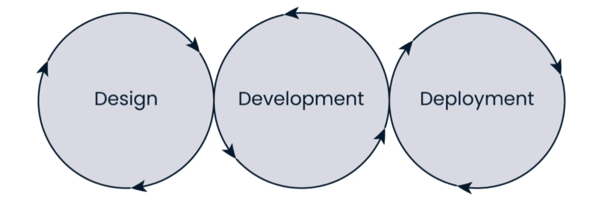

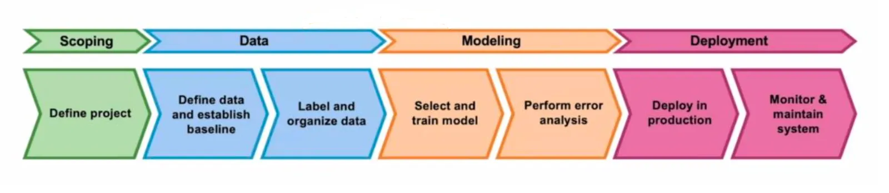

The iterative nature of this lifecycle means feedback from later stages often informs adjustments to earlier ones. ML projects are often highly iterative. During error analysis, you may need to refine the model or revisit earlier steps to collect additional data. Before deployment, you typically perform a final check or audit to verify that the system’s performance is adequate and reliable for its intended application. Deploying a system for the first time means you’re only about halfway to completion. Live traffic often reveals critical insights needed to optimize performance.

### 1.2.1. Design

**Scoping**

Begin by defining the project and deciding what to focus on. Specify the ML application, including what X (input) and Y (output) represent.

  - Define project objectives, specifying inputs (X) and outputs (Y).
  - Establish performance metrics (e.g., accuracy, latency, throughput).
  - Estimate required resources (e.g., time, compute, budget).

**Data**

After selecting the project, gather the required data for your algorithm. This involves defining the data, establishing a baseline, labeling, and organizing it.

  - Collect, label, and organize data, ensuring quality and consistency.
  - Address issues such as inconsistent labeling or missing values.
  - Establish a performance baseline.

### 1.2.2. Development

With data in hand, proceed to train the model. This phase includes selecting and training the model and conducting error analysis.

  - Select and train a model using the prepared dataset.
  - Conduct error analysis to identify improvement areas.
  - Iterate on model architecture, hyper-parameters, or data as needed.

### 1.2.3. Deployment

To deploy the system, integrate it into production, develop the necessary software, and monitor the system. Continuously track incoming data and maintain the system’s performance. For instance, if the data distribution shifts, you may need to update the model.

  - Integrate the model into a production environment (e.g., via APIs).
  - Ensure compliance with performance requirements (e.g., latency, throughput).
  - Address operational constraints (e.g., resource availability, security).

**Maintenance**

Post-deployment maintenance often involves further error analysis, retraining the model, or incorporating new data. As the system runs on live data, its output can be fed back into the dataset to update the data, retrain the model, and deploy an improved version.

  - Monitor system performance for issues like concept or data drift.
  - Update the model with new data or retraining as required.
  - Refine the system based on real-world feedback.

### 1.2.4. Roles

  - Business roles

      - Business stakeholder
      - Subject matter expert
  - Technical roles

      - Data Engineer
      - Data Scientist
      - Machine Learning Engineer

## 1.3. ML Project Checklist

This checklist can guide you through your ML projects. There are eight main steps:

### i. Frame the problem and look at the big picture

  -  Define the objective in business terms
  -  How will your solution be used?
  -  What are the current solutions/workarounds (if any)?
  -  How should you frame this problem (supervised/unsupervised, online/offline, etc.)?
  -  How should performance be measured?
  -  Is the performance measure aligned with the business objective?
  -  What would be the minimum performance needed to reach the business objective?
  -  What are comparable problems? Can you reuse experience or tools?
  -  Is human expertise available?
  -  How would you solve the problem manually?
  -  List the assumptions you (or others) have made so far
  -  Verify assumptions if possible

### ii. Get the data

*Note: automate as much as possible so you can easily get fresh data.*

  -  List the data you need and how much you need
  -  Find and document where you can get that data
  -  Check how much space it will take
  -  Check legal obligations, and get authorization if necessary
  -  Get access authorization
  -  Create a workspace (with enough storage space)
  -  Get the data
  -  Convert the data to a format you can easily manipulate (without changing the data itself)
  -  Ensure sensitive information is deleted or protected (e.g., anonymized)
  -  Check the size and type of data (time series, sample, geographical, etc.)
  -  Sample a test set, put it aside, and never look at it (no data snooping\!)

### iii. Explore the data

*Note: try to get insights from a field expert for these steps.*

  -  Create a copy of the data for exploration (sampling it down to a manageable size if necessary)
  -  Create a Jupyter notebook to keep a record of your data exploration
  -  Study each attribute and its characteristics:

      - Name
      - Type
      - % of missing values
      - Noisiness and type of noise (stochastic, outliers, rounding errors, etc.)
      - Usefulness for the task
      - Type of distribution (normal, uniform, logarithmic, etc.)
  -  For supervised learning tasks, identify the target attribute(s)
  -  Visualize the data
  -  Study the correlations between attributes
  -  Study how would you solve the problem manually
  -  Identify the promising transformations you may want to apply
  -  Identify extra data that would be useful (go back to “Get the data”)
  -  Document what you have learned

### iv. Prepare the data

… to better expose the underlying data patterns to machine learning algorithms.

*Notes:*

  - *Work on copies of the data (keep the original dataset intact)*
  - *Write functions for all data transformations you apply, for five reasons:*

      - *So you can easily prepare the data the next time you get a fresh dataset*
      - *So you can apply these transformations in future projects*
      - *To clean and prepare the test set*
      - *To clean and prepare the new instances once your solution is live*
      - *To make it easy to treat your preparation choices as hyperparameters*

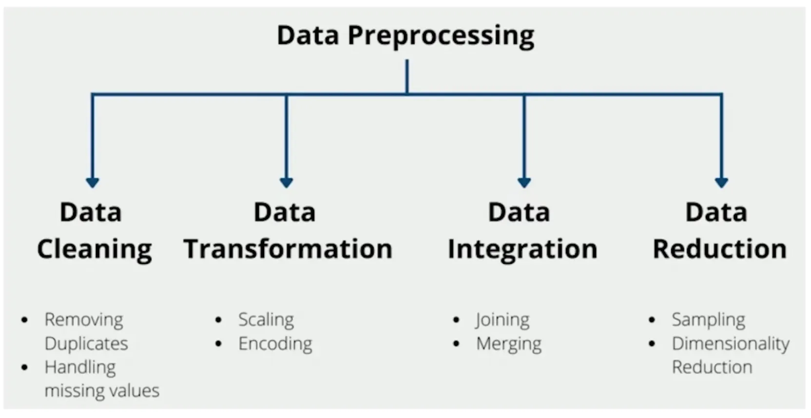

  -  Clean the data

      - Fix or remove outliers (optional)
      - Fill in missing values (e.g., with zero, mean, median…) or drop their rows (or columns)
  -  Perform feature selection (optional)

      - Drop the features that provide no useful information for the task
  -  Perform feature engineering, where appropriate:

      - Discretize continuous features
      - Decompose features (e.g, categorical, date/time, etc.)
      - Add promising transformations of features (e.g., log(x), sqrt(x), x2, etc.)
      - Aggregate features into promising new features
  -  Perform feature scaling

      - Standardize or normalize features

### v. Model candidates

*Notes:*

  - *\*If the data is huge, you may want to sample smaller training sets so you can train many different models in a reasonable time (be aware that this penalizes complex models such as large neural nets or random forests)\**
  - *\*Try to automate these steps as much as possible\**

  -  Train many quick-and-dirty models from different categories (e.g., linear, tree-based) using standard parameters
  -  Measure and compare their performance

      - For each model, use *N*-fold cross-validation and compute the mean and standard deviation of the performance measure on the *N* folds
  -  Analyze the most significant variables for each algorithm
  -  Analyze the types of errors the model make

      - What data would a human have used to avoid these errors?
  -  Perform a quick round of feature selection and engineering
  -  Shortlist the top three to five most promising models, preferring models that make different types of errors

### vi. Fine-tune models

*Notes:*

  - *\*Your will want to use as much data as possible for this step, especially as you move toward the end of fine-tuning\**
  - *\*As always, automate when you can\*\*  &#10;  &#10;\**

  -  Fine-tune the hyperparameters using cross-validation

      - Treat your data transformation choices as hyperparameters, especially when you are not sure about them (e.g., if you’re not sure whether to replace missing values with zeros or with the median value, or to just drop the rows)
      - Unless there are very few hyperparameter values to explore, prefer random search over grid search. If training is very long, you may prefer a Bayesian optimization approach (<https://homl.info/134>).
  -  Try ensemble methods. Combining your best models will often produce better performance than running them individually.
  -  Once you are confident about your final model, measure its performance on the test set to estimate the generalization error. Don’t tweak your model after measuring the generalization error; you would just start overfitting the test set.

### vii. Present your solution

  -  Document what you have done
  -  Create a nice presentation

      - Make sure you highlight the big picture first
  -  Explain why your solution achieves the business objective
  -  Don’t forget to present interesting points you noticed along the way

      - Describe what work and what did not
      - List your assumptions and your system’s limitations
  -  Ensure your key findings are communicated through beautiful visualizations or easy-to-remember statements (e.g.: “The median income is the number-one predictor of housing prices.”)

### viii. Launch, monitor, and maintain

  -  Get your solution ready for production (plug into production data inputs, write unit tests, etc.)
  -  Write monitoring code to check your system’s live performance at regular intervals and trigger alters when it drops

      - Beware of slow degradation: models tend to “rot” as data evolves
      - Measuring performance may require a human pipeline
      - Also monitor your inputs’ quality – this is particularly important for online learning systems
  -  Retrain your models on a regular basis on fresh data (automate as much as possible)

## 1.4. MLOps

MLOps (Machine Learning Operations) is a set of practices that integrates Machine Learning, DevOps, and Data Engineering to streamline and automate the entire lifecycle of machine learning models, from development and experimentation to reliable deployment, monitoring, and continuous improvement in production environments.

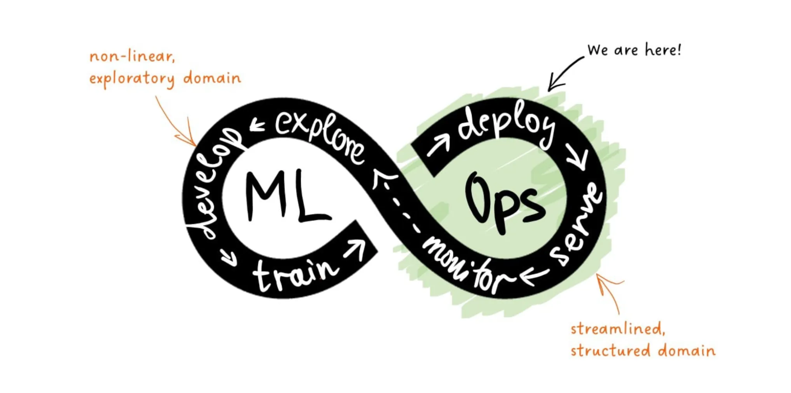

It focuses on ensuring reproducibility, scalability, version control, and efficient collaboration among data scientists, ML engineers, and operations teams to deliver and maintain high-performing ML solutions.

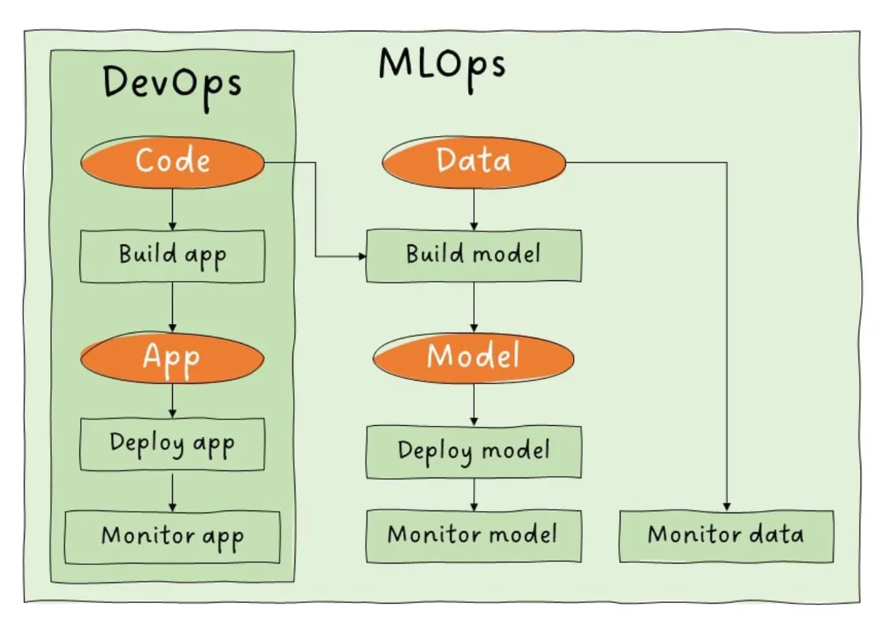

Regarding **maturity levels**, an usual starting point is:

  - Manual ML workflows
  - Manual deployment
  - Ad hoc monitoring

\=\> Accumulation of technical debt

As companies progress in the ML maturity levels:

  - Level of automation, collaboration, and monitoring within MLOps processes
  - Higher level is not necessarily better
  - Focus on development and deployment phase

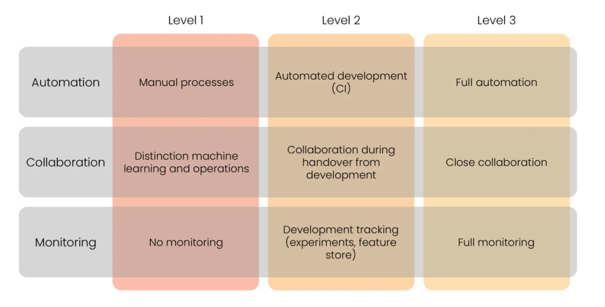

**ML Workflows**

  - Data collection and preparation
  - Data-labeling
  - Model selection
  - Model training
  - Model packaging
  - Model deployment
  - Model monitoring and maintenance

ML workflow automation == MLOps maturity

### **Level 1: Manual Processes**

  - Manual process for development
  - Manual process for deployment
  - No collaboration between ML and operations
  - Teams work in isolation
  - No tracking of development
  - No monitoring after deployment

### **Level 2: Automated development**

  - Automated development pipeline (Continuous integration)
  - Manual process for deployment
  - After development teams will collaborate to deploy model
  - Tracking of ML experiments and features
  - Little monitoring after deployment

### **Level 3: Automated development and deployment**

  - Automated development pipeline (CI)
  - Automated deployment pipeline (CD)
  - Close collaboration between teams
  - Monitoring of development and deployment
  - Potentially automatically triggering retraining

## 1.5. Case Study: Speech Recognition System

This example illustrates the steps required to build and deploy a speech recognition system using the machine learning (ML) project lifecycle.

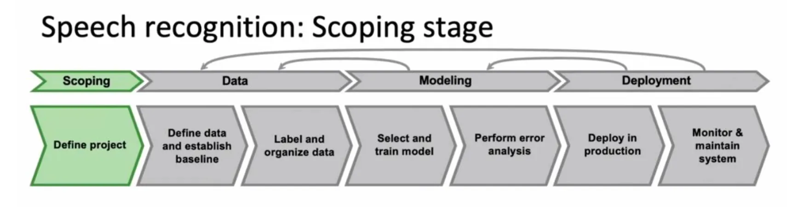

Begin by defining the project, such as developing a speech recognition system for voice search. This involves identifying key metrics, which vary by application. For speech recognition, critical metrics include:

  - **Accuracy**: How precise is the system in transcribing speech?
  - **Latency**: How long does it take to process and transcribe speech?
  - **Throughput**: How many queries per second can the system handle?
  - Additionally, estimate the resources needed, such as time, computational power, budget, and project timeline.

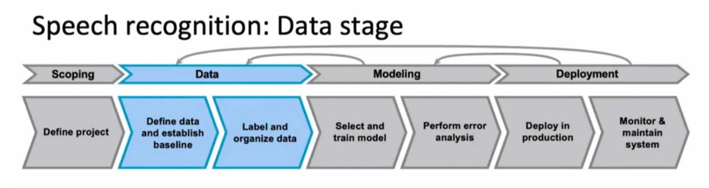

In this phase, define the data, establish a baseline, and label and organize it. A key challenge in speech recognition is ensuring consistent data labeling. For example, consider an audio clip for voice search with the phrase “Um, today’s weather.” Possible transcriptions include:

1.  “Um, today’s weather”
2.  “Um… today’s weather”
3.  “Today’s weather” Any of these transcriptions may be reasonable, but inconsistency—e.g., using all three across the dataset—can confuse the learning algorithm and degrade performance. Standardizing on one convention, such as the first or second option, significantly improves results.

Other data definition questions include:

  - How much silence should be included before and after a speaker’s audio (e.g., 100, 300, or 500 milliseconds)?
  - How should volume normalization be handled? Some speakers are loud, others soft, and some clips may contain both loud and soft segments within the same audio. Addressing these questions ensures high-quality data.

In production systems, datasets are not static. You may need to edit the training or test sets to improve data quality and enhance system performance.

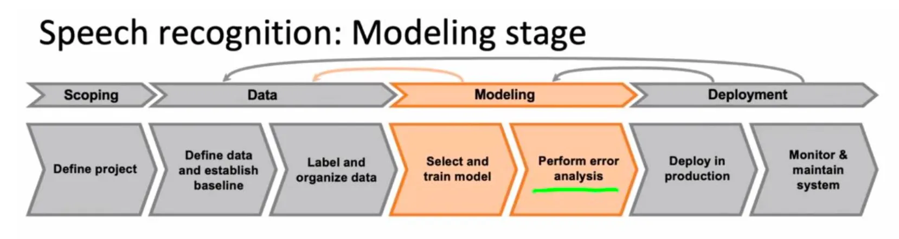

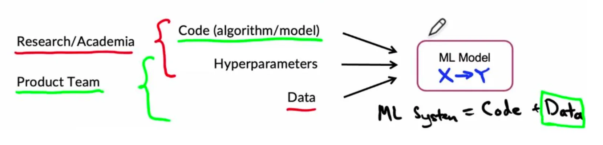

Training an ML model requires three key inputs:

  - **Code**: The algorithm or neural network architecture.
  - **Hyperparameters**: Settings that tune the model’s performance.
  - **Data**: The labeled dataset used for training.

In academic research, the focus is often on varying the code or hyperparameters while keeping the data fixed. However, when building a production ML system, it’s often more effective to use a reliable open-source implementation (e.g., from GitHub) and focus on optimizing the data and hyperparameters. Error analysis is critical here, as it identifies where the model falls short and guides systematic improvements to the data or code.

Rather than collecting more data indiscriminately, which can be costly, error analysis helps target specific data needs, making the process more efficient and leading to a high-accuracy model.

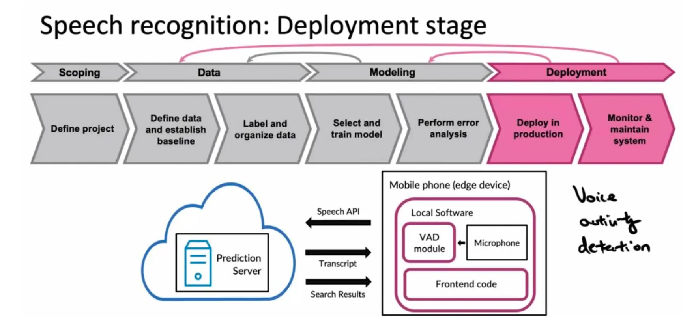

Once the model is trained and error analysis indicates satisfactory performance, the system is ready for deployment. A typical speech recognition deployment for voice search might involve:

  - An **edge device** (e.g., a smartphone) running software that records audio via the microphone.
  - A **Voice Activity Detection (VAD)** module that isolates audio segments containing speech, sending only those to a prediction server (often hosted in the cloud).
  - The prediction server, which returns the transcribed text and search results to the user, displayed through the smartphone’s frontend interface.

Deploying the system requires integrating it into production, developing supporting software, and implementing monitoring to track performance and incoming data.

### **Maintenance**

Post-deployment, continuous monitoring and maintenance are essential. For example, my team once deployed a speech recognition system trained primarily on adult voices. After deployment, we noticed an increasing number of younger users (teenagers and children) whose voices differed significantly, causing performance degradation. To address this, we collected additional data from younger speakers to retrain the model.

A key challenge in deployment is **concept drift** or **data drift**, where the data distribution changes (e.g., more young voices). Effective monitoring systems are crucial for detecting such issues, and timely fixes—such as collecting targeted data or retraining the model—are necessary to maintain performance and deliver value.
