# 2. Design

This section will house fundamental concepts, theoretical underpinnings, and key definitions in Machine Learning.

## 2.1. Scoping

### 2.1.1. Scoping Overview

Choosing the right ML project is a rare and valuable skill. Careful scoping—evaluating options and selecting high-impact projects—maximizes success.

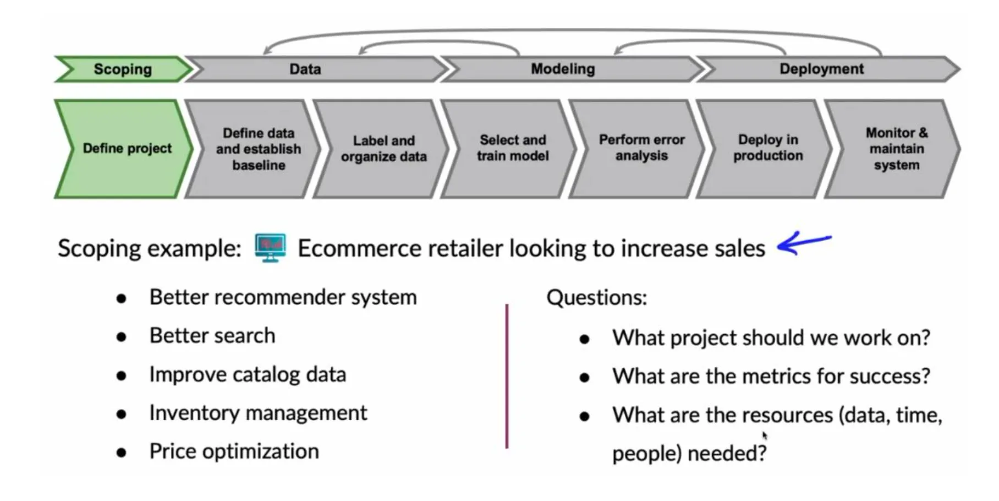

### 2.1.2. Scoping Process

Scoping involves identifying business problems, brainstorming AI solutions, and assessing feasibility and value.

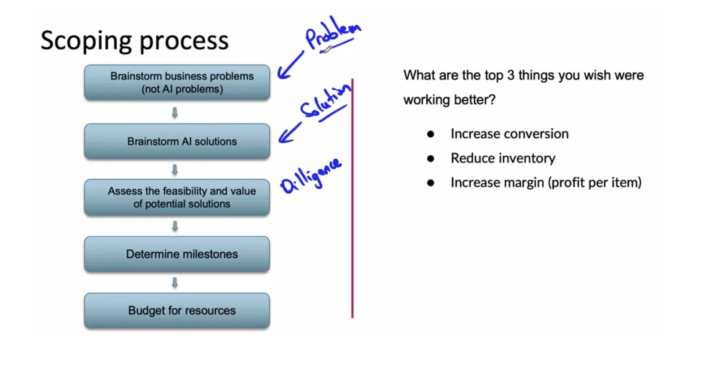

For an e-commerce retailer aiming to increase sales (as an example), follow these steps:

### i. Identify Business Problems

  - Collaborate with business owners to brainstorm problems (e.g., low conversions, excess inventory, low profit margins).
  - Focus on business objectives, not AI solutions. Ask, “What are the top three things you wish worked better?” Avoid AI-specific discussions initially.

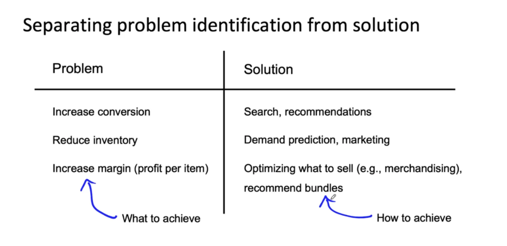

### ii. Brainstorm AI Solutions

  - Once problems are clear, explore AI solutions. Not all problems require AI, and that’s acceptable.
  - Example problems and solutions:

      - **Increase Conversions**: Improve website search, enhance product recommendations, redesign product displays, or surface relevant reviews.
      - **Reduce Inventory**: Predict demand to optimize stock, launch marketing campaigns to sell overstocked items.
      - **Increase Margins**: Optimize product selection (merchandising), recommend product bundles (e.g., camera with case).

### iii. Assess Feasibility and Value

  - **Feasibility**: Evaluate technical viability using benchmarks (e.g., literature, competitor solutions) and a 2x2 matrix:

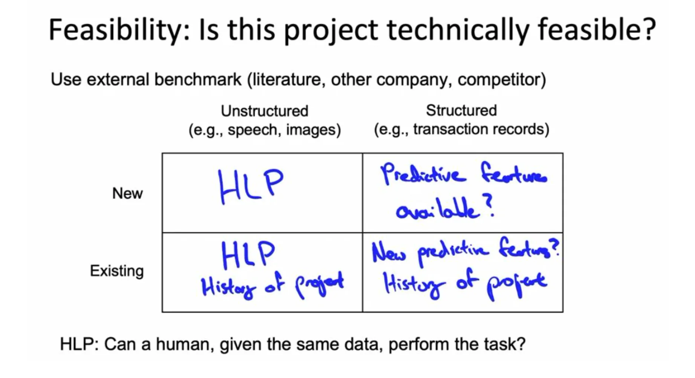
  - **Unstructured Data**:

      - **New Projects**: Use HLP to assess feasibility. If humans can perform the task (e.g., detect scratches in images), an algorithm likely can too.
      - **Existing Projects**: Compare to HLP and project history (past progress predicts future gains).
  - **Structured Data**:

      - **New Projects**: Ensure predictive features exist (e.g., past purchases predict future ones).
      - **Existing Projects**: Identify new predictive features to improve performance.
  - **HLP for Unstructured Data**: Ensure humans receive the same data as the algorithm (e.g., only camera images for traffic light detection, not in-car views). If humans can’t perform the task, improve inputs (e.g., better cameras) before proceeding.

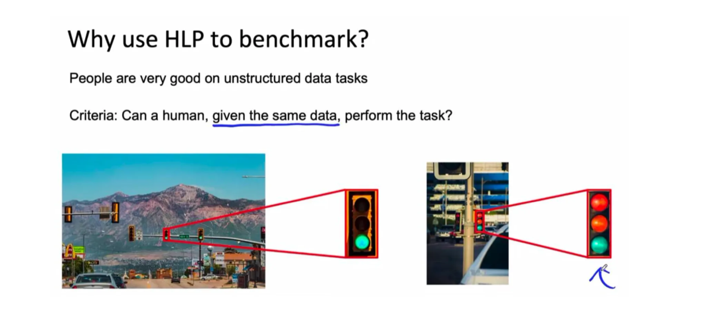

  - **Structured Data Feasibility**: Verify that input features (x) predict outputs (y).

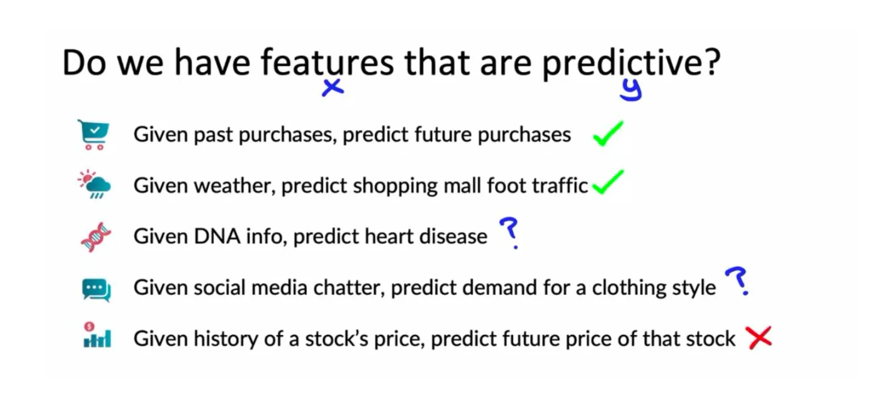

Examples:

  - **E-commerce**: Past purchases predict future ones (feasible).
  - **Mall Foot Traffic**: Weather predicts traffic (feasible).
  - **Heart Disease from DNA**: Genetic data is weakly predictive (challenging).
  - **Fashion Trends from Social Media**: Predicting future trends is difficult (iffy).
  - **Stock Prices**: Historical prices are not predictive (infeasible).

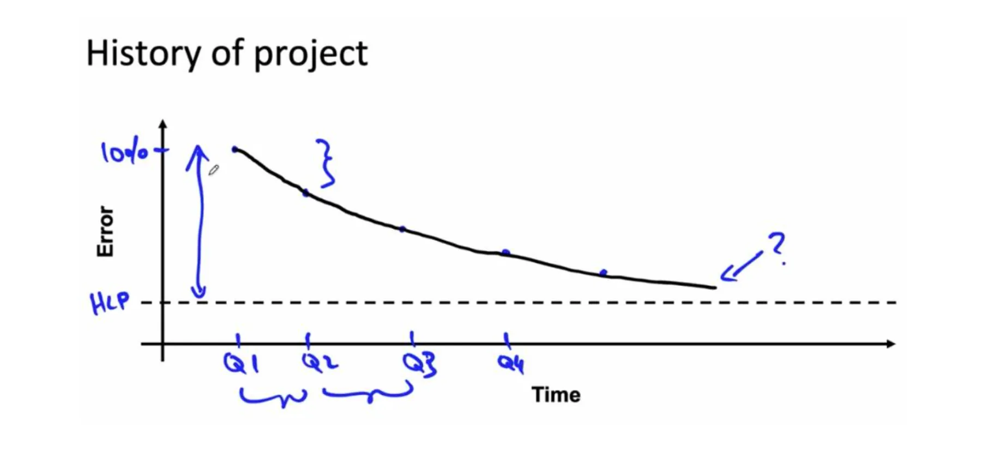

  - **Value**: Estimate business impact, bridging ML and business metrics:

      - ML teams optimize metrics like word-level accuracy (e.g., in speech recognition), while businesses prioritize user engagement or revenue.
      - Use Fermi estimates to relate ML improvements (e.g., 1% word accuracy increase) to business outcomes (e.g., 0.7% query accuracy increase, improving user engagement and revenue).
      - Compromise on metrics that both teams accept, requiring ML teams to stretch toward business goals and business teams to accept technical constraints.

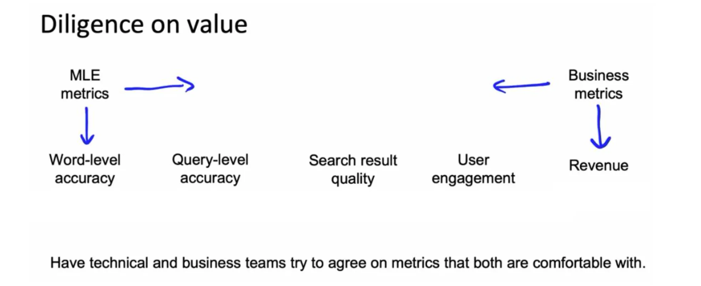

  - **Ethical Considerations**: Ensure the project creates positive societal value and is fair and unbiased. Consult industry-specific ethical frameworks (e.g., for lending, healthcare, or retail). If a project lacks societal benefit, consider abandoning it, even if economically viable.

### iv. Define Milestones and Resources

  - Specify **ML metrics** (e.g., accuracy, precision-recall, fairness), **software metrics** (e.g., latency, throughput), and **business metrics** (e.g., revenue increase).
  - Estimate **resources**: Data volume, team involvement, cross-functional support, and timelines.
  - If specifications are unclear, conduct **benchmarking** (compare to similar projects) or build a **proof of concept** to refine estimates.

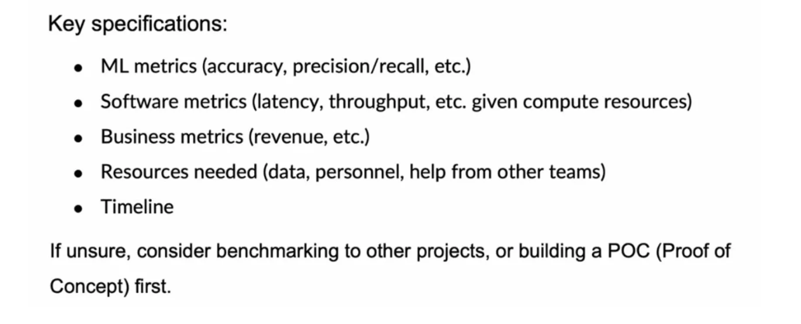

### v. Define Key Metrics

Successful data-driven initiatives require collaboration between technical experts (data scientists), domain specialists (SMEs), and business leaders (stakeholders) to achieve measurable business benefits like increased accuracy, customer satisfaction, and revenue generation. It underscores the interdisciplinary nature of bringing data insights to fruition.

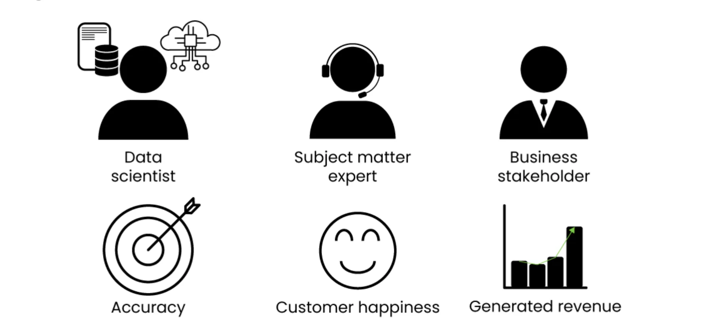

### 2.1.3. Workflows

### i. Project Workflow

This image illustrates a simplified workflow for an ML Project, outlining a typical iterative development process. It begins with defining the "problem," which then feeds into an "analysis" phase where data exploration and initial model considerations would take place. Following analysis, "development" occurs. Crucially, the "ML application" box, containing "ML model A" and "ML model B," represents the practical implementation where developed models are integrated for use. The arrows indicate an iterative loop, showing that insights or performance from the ML application can feed back into the "analysis" and "development" stages, suggesting continuous improvement and refinement of the models and the overall solution based on real-world application or further analysis of the problem.

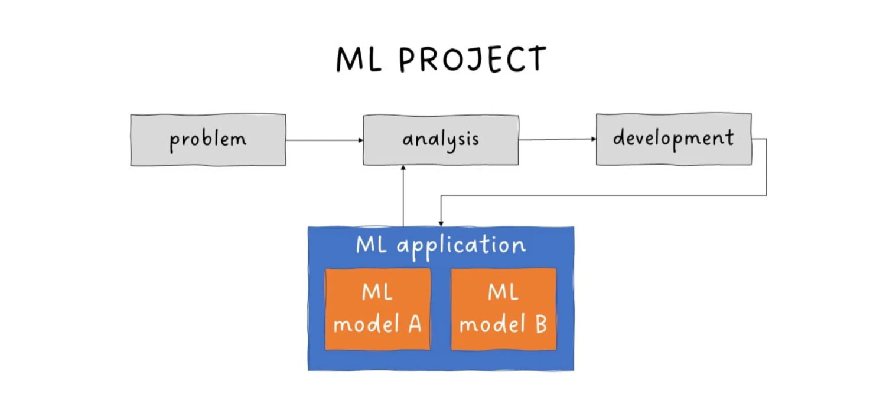

### ii. Modeling Workflow

This image demonstrates that an ML model acts as an intelligent function: it takes "input data" (raw information) and, based on its learned patterns, produces "predictions" (derived insights or decisions), functioning as a sophisticated transformer of information.

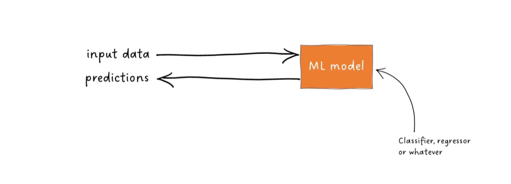

This image illustrates how an ML model is integrated within a broader application. The 'ML model' box represents the core predictive engine, receiving 'input data' via an API and generating predictions. These predictions can also contain 'business rules' to make decisions or drive actions, and are often presented to users through a GUI. The database stores the data used by the model and the results it generates.

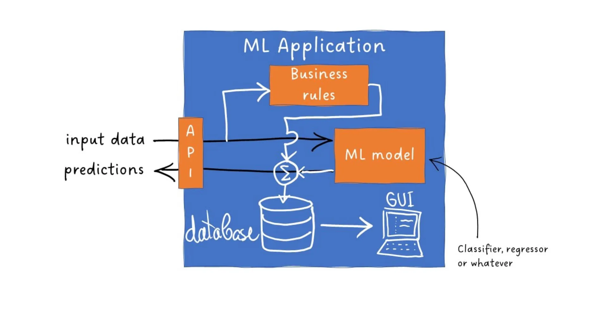

This diagram illustrates the independent but often synchronized lifecycles of an "Application" and its embedded "Model" over time. The key takeaway is that the model's lifecycle, including its updates and retraining, can operate independently from the application's release schedule, allowing for agile improvements to the ML intelligence without requiring a full application redeployment, or vice-versa, which is a core concept in modern MLOps practices.

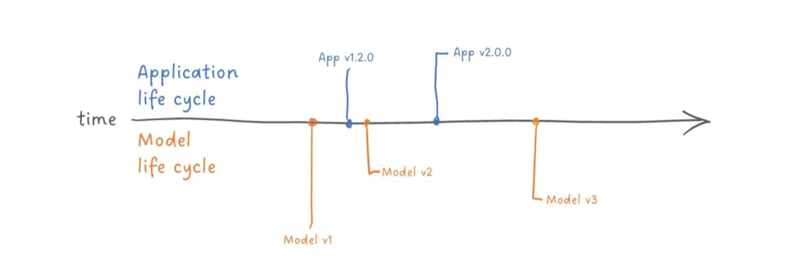

## 2.2. Data

### 2.2.1. Big Data vs. Good Data

Modern AI often leverages massive datasets from large internet companies with billions of users. While big data can significantly boost performance, many industries lack access to such volumes. In these cases, focusing on good data—high-quality, well-curated data—is critical.

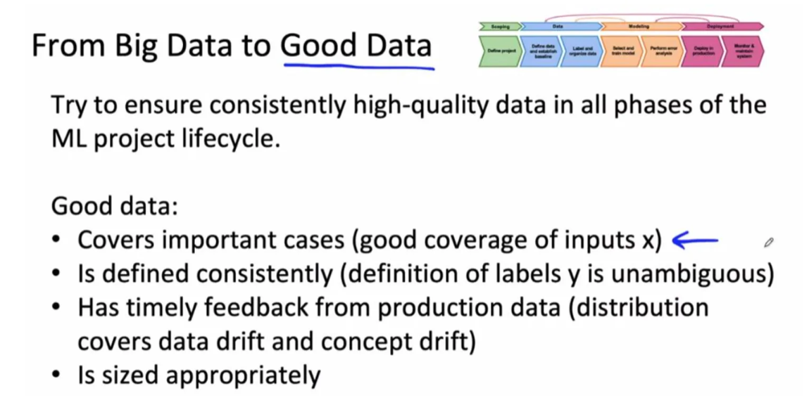

### i. Characteristics of Good Data

Good data exhibits the following qualities:

1.  **Comprehensive Coverage**: Includes diverse inputs (x) to cover important cases. If coverage is lacking, data augmentation can generate additional examples to improve diversity.
2.  **Consistent and Unambiguous Labels**: Ensures labels (y) are clearly defined and consistently applied.
3.  **Timely Feedback**: Incorporates monitoring systems to track concept drift and data drift in production, providing actionable feedback to maintain performance.
4.  **Reasonable Size**: While not necessarily massive, the dataset should be sufficiently large to support effective training.

### ii. Why Good Data Matters

High-quality data is essential throughout the machine learning project lifecycle—from development to deployment. Consistent, well-defined, and diverse data ensures robust and reliable model performance, particularly in applications where collecting billions of data points isn’t feasible. By prioritizing good data, you can achieve high performance even with smaller datasets, using tools like data augmentation to address gaps in coverage.

### iii. Data Quality

Data Quality can be thought of having 4 dimensions:

  - Accuracy
  - Completeness
  - Consistency
  - Timeliness

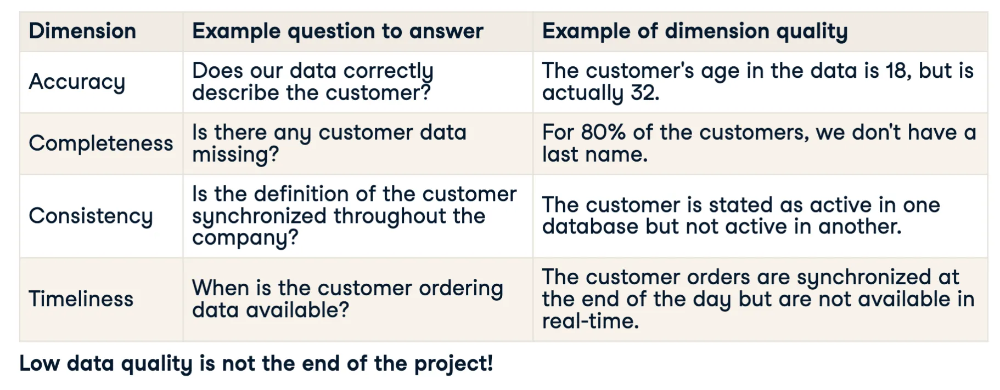

### 2.2.2. Challenges in Data Definition

### i. Why Data Definition Is Difficult

Defining consistent data labels is challenging due to subjective interpretations, especially in ambiguous cases. For example, in detecting iguanas in images, three labelers might use different conventions for bounding boxes:

  - **Convention 1**: Tight bounding box around the iguana’s body.
  - **Convention 2**: Slightly larger box including the tail.
  - **Convention 3**: Broad box encompassing the entire scene.

While any single convention may be acceptable (with the first two preferred), inconsistency—where each labeler uses a different convention—confuses the ML algorithm, reducing performance.

Similarly, in smartphone defect detection, labelers might identify “significant defects” differently:

  - **Labeler 1**: Marks only the most prominent scratch.
  - **Labeler 2**: Marks multiple defects (e.g., a scratch and a pit mark).
  - **Labeler 3**: Marks a single box covering all defects.

The second approach (marking multiple defects) is often most effective, but ambiguous instructions lead to inconsistent labeling, undermining the model. Clear, standardized instructions are essential to mitigate this issue.

### ii. Label Ambiguity Examples

Ambiguity in labeling extends to other domains, such as audio transcription. For an audio clip of someone saying, “Nearest gas station” on a busy roadside with a car passing by, labelers might transcribe it in various ways:

  - “Um… nearest gas station” (with ellipsis).
  - “Um, nearest gas station” (with a comma).
  - “Nearest gas station \[unintelligible\].”

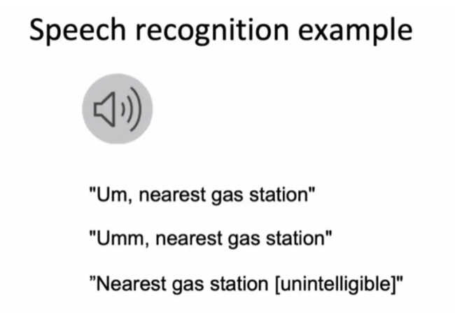

These variations—differing in punctuation, spelling, or annotations—introduce noise. Standardizing one convention enhances the consistency of speech recognition data.

### iii. Impact of Data Preparation

Many ML practitioners initially use pre-prepared datasets from the internet, which is a valid starting point. However, for practical applications, how you prepare and define your dataset significantly impacts project success. Tailoring data to your specific problem, with clear inputs (x) and consistent labels (y), is crucial.

### iv. Major Types of Data Problems

### User ID Merging

User ID merging is a common challenge in large companies, where multiple data records may correspond to the same person. For example, an online job listing website might have a user record with email, name, and address. After acquiring a mobile app for resume advice, the company faces a new database with potentially overlapping users.

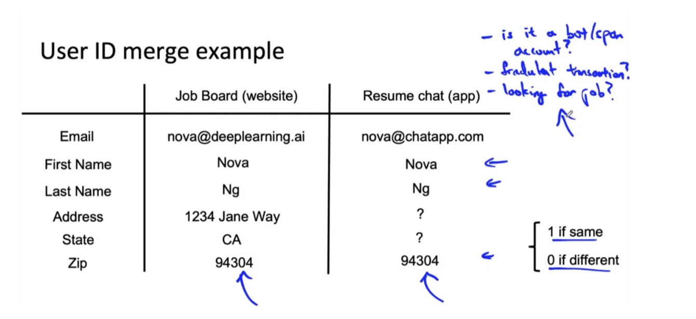

A supervised learning algorithm can predict whether two records represent the same person (output: 1 for same, 0 for different). Ground truth can be obtained if users explicitly link accounts, providing labeled examples. Without such data, companies often rely on human labelers (e.g., product managers) to manually compare records with similar names or ZIP codes. However, human judgment can be ambiguous, as records may or may not refer to the same person. Consistent labeling, even in ambiguous cases, improves algorithm performance.

**Ethical Note**: User ID merging must respect user privacy and comply with data usage permissions.

### Other Structured Data Challenges

Structured data problems often involve ambiguity in ground truth. Examples include:

  - **Bot/Spam Detection**: Predicting whether a user account is a bot or spam based on activity patterns.
  - **Fraud Detection**: Identifying fraudulent online transactions.

In these tasks, ground truth can be unclear, and inconsistent labeling exacerbates noise. Clear labeling instructions that minimize randomness enhance model performance.

### 2.2.3. Best Practices for Data Definition

### i. Defining Inputs (x)

The quality of input data (x) is critical. For example, in smartphone defect detection:

  - **Image Quality**: Ensure adequate lighting, contrast, and resolution. Dark images where defects are invisible to humans are unsuitable, as even accurate labels can’t compensate for poor inputs.
  - **Action**: If inputs are inadequate (e.g., dark images), improve the data collection process, such as requesting better lighting in the factory, before labeling.

For structured data, selecting predictive features is key. In user ID merging, including rough GPS location (with user permission) can help determine if two accounts belong to the same person.

### ii. Defining Labels (y)

Consistent labels (y) are essential. Ambiguous labeling instructions lead to inconsistent data, as seen in the iguana and smartphone examples. Strategies to ensure consistency are discussed below.

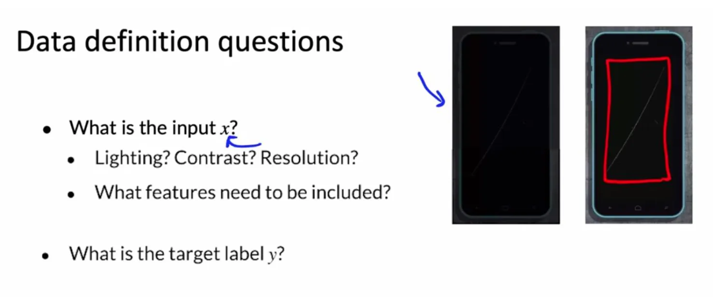

### iii. Data Types and Sizes

Best practices vary based on data type (unstructured vs. structured) and dataset size (small vs. large, using a rough threshold of 10,000 examples):

  - **Unstructured Data**: Includes images, audio, and text. Humans excel at processing these, making human-level performance (HLP) a useful baseline. Data augmentation (e.g., generating synthetic images or audio) is effective.
  - **Structured Data**: Includes database records (e.g., user profiles). Humans are less adept at these tasks, and HLP is less relevant. Data augmentation is challenging, as synthesizing new users is impractical.
  - **Small Datasets (\<10,000 examples)**: Clean, consistent labels are critical, as a single mislabeled example can significantly impact performance (e.g., 1% of a 100-example dataset). Manual review is feasible.
  - **Large Datasets (\>10,000 examples)**: Manual review is impractical, so focus on robust data processes, clear labeling instructions, and scalable labeling teams.

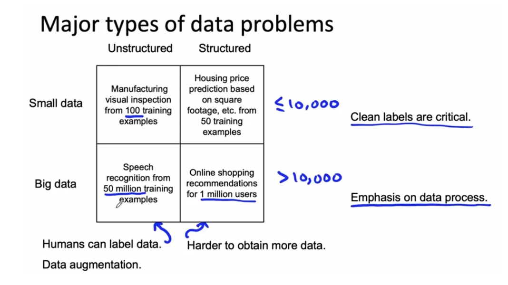

**Examples**:

  - **Small Unstructured**: Training visual inspection with 100 smartphone images.
  - **Small Structured**: Predicting housing prices with 52 examples.
  - **Large Unstructured**: Speech recognition with 50 million audio clips.
  - **Large Structured**: Online shopping recommendations with 1 million users.

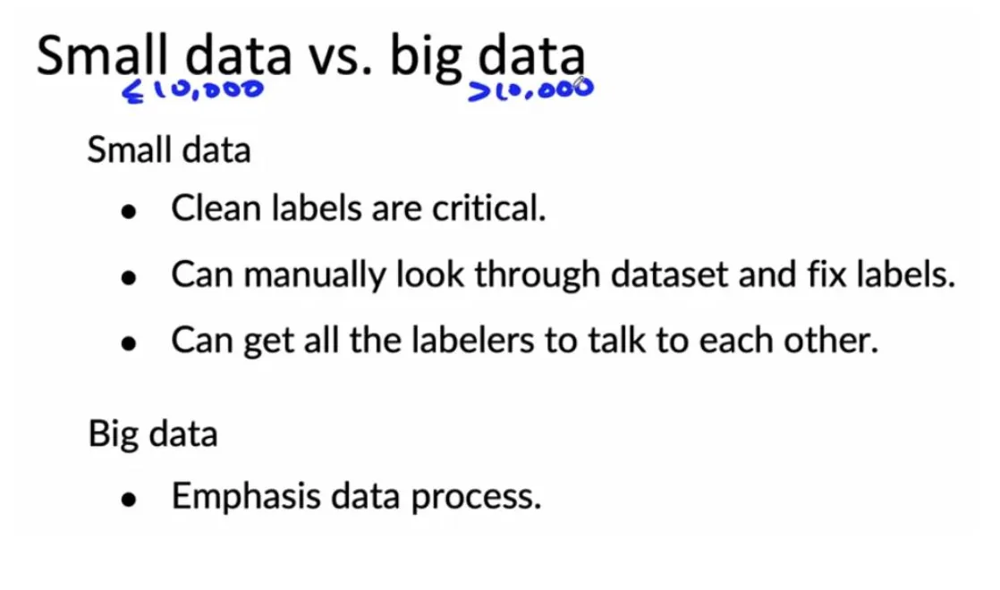

For unstructured data, abundant unlabeled data (e.g., thousands of unlabeled smartphone images) can be labeled by humans or augmented. Structured data is harder to expand, as user bases are finite, and human labeling is often ambiguous.

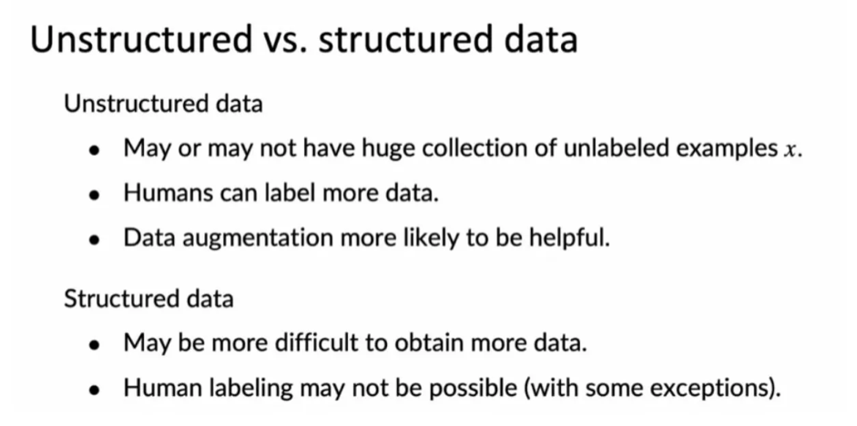

### iv. Importance of Clean Labels

In small datasets, label consistency is paramount. For example, in a project to predict helicopter rotor speed from motor voltage, a small dataset of five noisy examples makes it difficult to determine the correct function (linear or curved). With clean, consistent labels, even five examples can yield a reliable model. Similarly, computer vision systems can perform well with just 30 consistently labeled images.

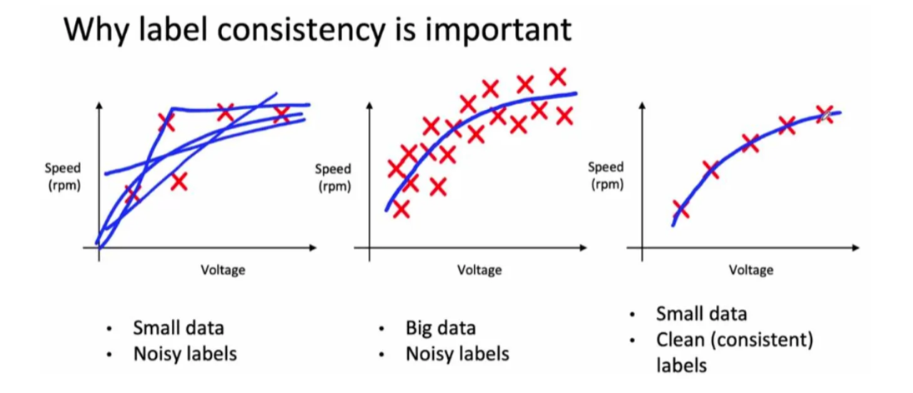

Large datasets can face small data challenges in the “long tail” of rare events:

  - **Web Search**: Large search engines have vast query datasets, but rare queries have limited clickstream data.
  - **Self-Driving Cars**: Companies collect millions of driving hours, but rare events (e.g., a child running across a highway) have few examples.
  - **Product Recommendations**: With millions of products, niche items have limited interaction data.

Consistent labeling of these rare cases improves model performance, even in large datasets.

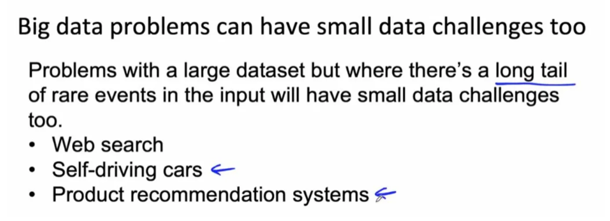

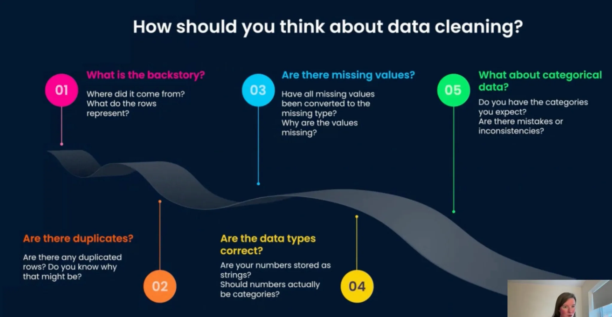

### 2.2.4. Improving Label Consistency

To enhance label consistency:

1.  **Multi-Labeler Comparison**: Have multiple labelers annotate the same examples. Compare results to identify inconsistencies.
2.  **Self-Consistency Check**: Ask a labeler to re-label an example after a break to assess their consistency.
3.  **Discussion and Agreement**: When disagreements arise, convene labelers to discuss and agree on a consistent labeling convention. Document this agreement as updated labeling instructions.
4.  **Iterative Refinement**: Apply the new instructions to label more data. Repeat the comparison and discussion process if inconsistencies persist.
5.  **Input Quality Check**: If labelers indicate that inputs (x) lack sufficient information (e.g., dark images), improve the data collection process (e.g., enhance lighting).

### i. Standardizing Labels

Standardizing on a single convention (e.g., one transcription format for audio clips) reduces noise. For example, choosing “Um… nearest gas station” as the standard transcription ensures consistency.

### ii. Merging Classes

When distinguishing between classes is ambiguous (e.g., deep vs. shallow scratches), merging them into a single class (e.g., “scratch”) eliminates inconsistencies, simplifying the task for the algorithm. This is effective when the distinction isn’t critical.

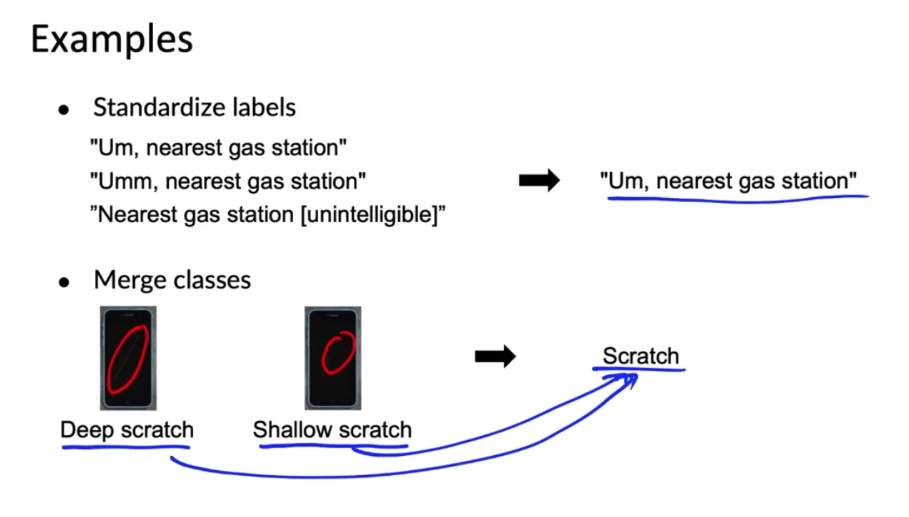

### iii. Creating Uncertainty Classes

For ambiguous cases, introduce a new label to capture uncertainty:

  - **Smartphone Defects**: Label scratches as “defective,” “non-defective,” or “borderline” for ambiguous cases (e.g., medium-length scratches).
  - **Speech Recognition**: Use an “unintelligible” tag for unclear audio clips (e.g., “Nearest gas station \[unintelligible\]” instead of guessing “Nearly go” or “Nearest grocery”).

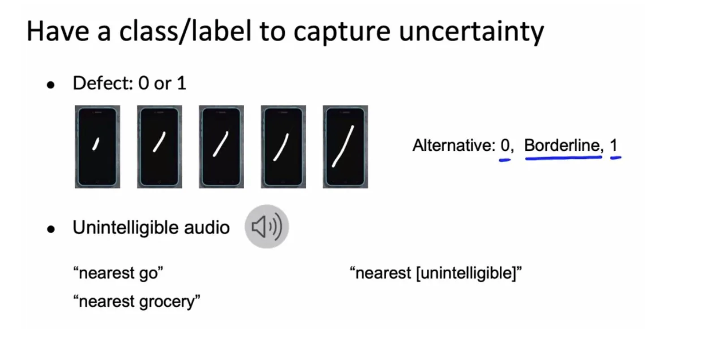

This approach improves consistency by allowing labelers to flag ambiguity explicitly.

### iv. Small vs. Large Datasets

  - **Small Datasets**: With few labelers, convene them to discuss and agree on conventions for specific examples. This is feasible due to the small team size.
  - **Large Datasets**: Establish consistent definitions with a small group, then distribute detailed instructions to a larger labeling team. Coordination is harder with many labelers.

### v. Adding Over-reliance on Voting

Consensus labeling (voting by multiple labelers) can improve accuracy but is overused. Instead of relying on voting to resolve inconsistent labels, prioritize clear labeling instructions to reduce noise initially. Voting should be a last resort, as it’s less efficient than standardizing conventions upfront.

### 2.2.5. Human-level Performance (HLP)

### i. Role of HLP

HLP is a valuable benchmark for unstructured data tasks, estimating Bayes error (irreducible error) and aiding in error analysis and prioritization. For example, in visual inspection, if a business demands 99% accuracy but human inspectors achieve only 66.7% on a dataset (e.g., correctly labeling 4/6 examples), HLP sets a realistic baseline, showing that 99% may be unattainable.

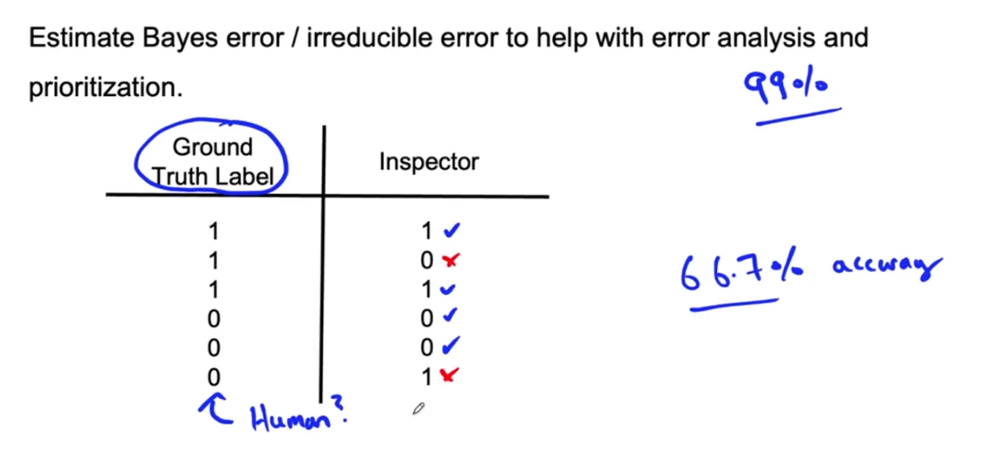

### ii. Defining Ground Truth

HLP’s interpretation depends on the ground truth:

  - **External Ground Truth**: In medical imaging, if ground truth comes from a biopsy, HLP measures how well a doctor predicts the biopsy outcome, providing a clear baseline for algorithm performance.
  - **Human-Defined Ground Truth**: In visual inspection, where ground truth is another human’s label, HLP measures agreement between humans, not absolute accuracy.

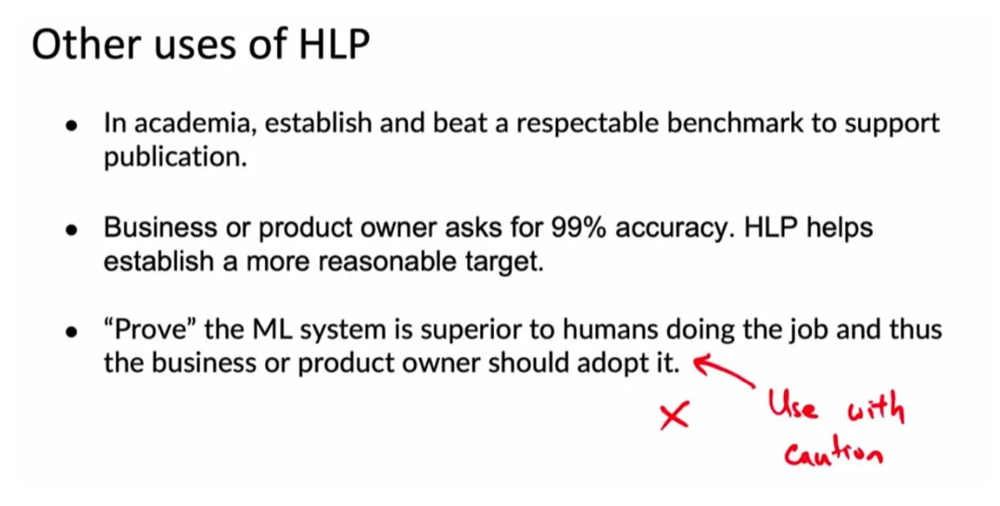

### iii. Limitations of HLP

HLP can be misleading due to inconsistent labeling. For example, in speech recognition, if 70% of labelers transcribe “Um… nearest gas station” (ellipsis) and 30% use “Um, nearest gas station” (comma), the chance of two labelers agreeing is:

\[ 0.7^2 + 0.3^2 = 0.49 + 0.09 = 0.58 \]

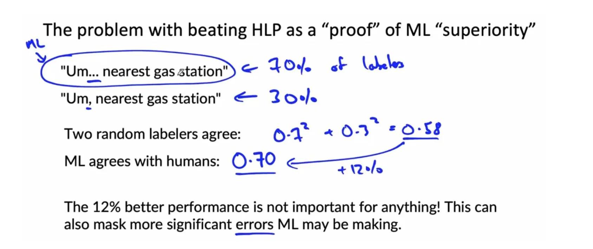

Thus, HLP is calculated as 58%, reflecting labeler agreement rather than true performance. An algorithm consistently choosing the ellipsis convention achieves 70% agreement with humans, appearing to “outperform” HLP by 12%. However, this improvement is trivial, as both conventions are equally valid, and it may mask significant errors in other areas, creating a false impression of superiority.

### iv. Raising HLP

Improving label consistency can raise HLP, benefiting the model. In the visual inspection example, if inspectors agree on a 0.3mm threshold for defects, re-evaluating a dataset might correct mislabels (e.g., a 0.2mm scratch labeled as non-defective), raising HLP from 66.7% to 100%. While this makes beating HLP impossible, it provides cleaner data, ultimately improving model performance.

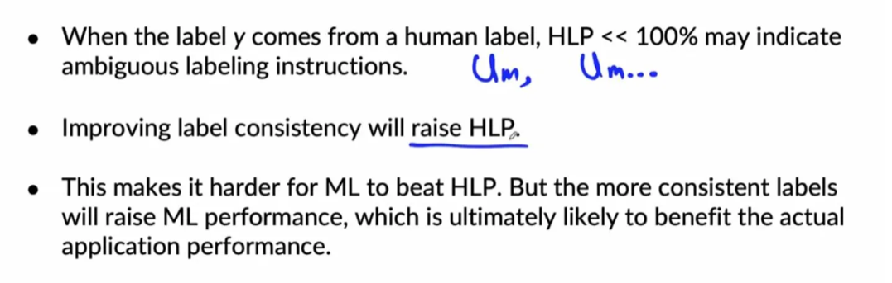

### v. Structured Data and HLP

HLP is less common in structured data due to the difficulty of human labeling. Exceptions include:

  - **User ID Merging**: Humans label whether two records represent the same person.
  - **Network Security**: IT experts label network traffic as hacked or not.
  - **Fraud Detection**: Humans assess transaction legitimacy.

In these cases, low HLP often indicates inconsistent labeling. Improving labeling standards raises HLP and provides cleaner data, enhancing model performance.

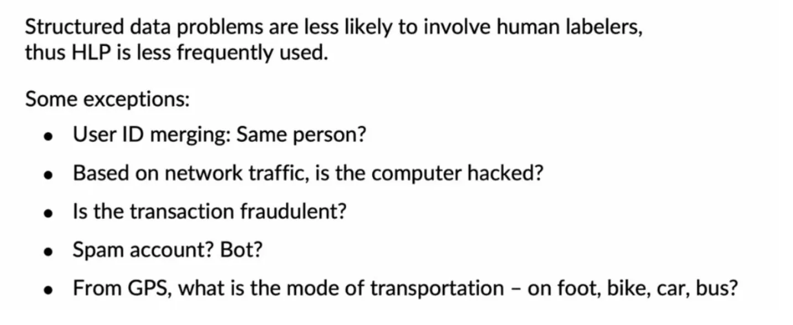

### 2.2.6. Obtaining Data

### i. Balancing Data Collection Time

ML development is iterative, involving model selection, hyperparameter tuning, training, and error analysis. If training and error analysis each take a few days, spending 30 days collecting data delays iteration unnecessarily. Instead:

  - **Quick Start**: Aim to collect an initial dataset in a short time (e.g., 2–7 days) to enter the iteration loop quickly. For example, a week-long data collection sprint can yield creative solutions.
  - **Iterative Expansion**: After training and error analysis, collect more data as needed.

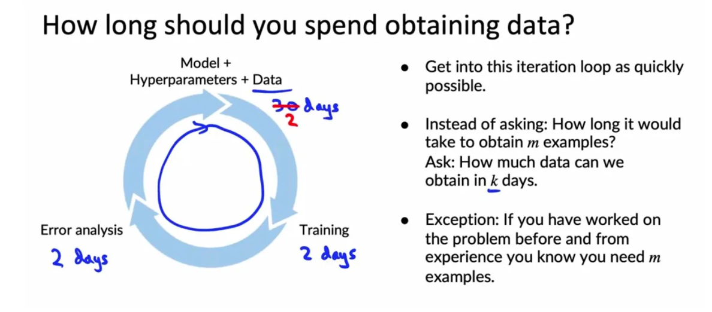

Exception: If prior experience indicates a minimum dataset size (e.g., hours of speech data for recognition), invest upfront to meet that threshold. For new problems, start small, train, and use error analysis to guide further collection.

### ii. Data Source Inventory

Brainstorm potential data sources and evaluate their costs and timelines. For speech recognition:

  - **Owned Data**: 100 hours of transcribed audio (cost: $0, time: immediate).
  - **Crowdsourced Reading**: Pay people to read text aloud, creating transcribed audio (cost: moderate, time: \~2 weeks for setup and integration).
  - **Crowdsourced Transcription**: Pay to transcribe unlabeled audio, yielding natural speech (cost: higher, time: \~1–2 weeks for management).
  - **Purchased Data**: Buy audio from commercial providers (cost: high, time: fast).

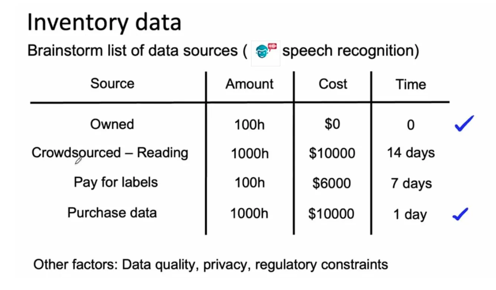

Consider data quality, privacy, and regulatory constraints alongside financial and time costs. This inventory ensures informed decisions.

### iii. Labeling Methods

Common labeling approaches include:

  - **In-House**: Your team labels data. Costly for ML engineers but builds intuition. Spending a few hours or days labeling is valuable for new projects.
  - **Outsourced**: Hire specialized companies for efficient labeling, especially for niche tasks.
  - **Crowdsourced**: Use platforms to engage large groups, suitable for general tasks like audio transcription.

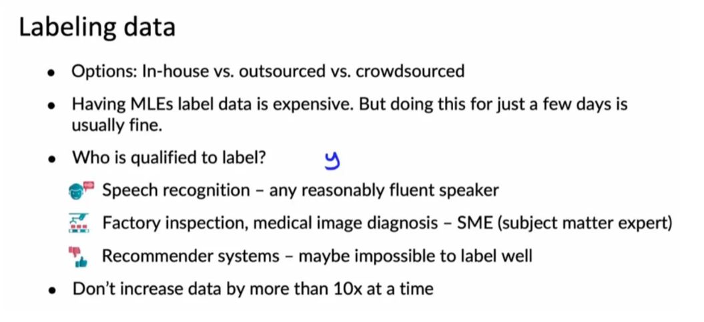

For specialized tasks (e.g., medical imaging, factory inspection), subject matter experts (SMEs) are often required, as typical labelers lack the expertise to diagnose X-rays or identify defects accurately.

### iv. Challenges in Labeling

Some tasks are inherently difficult to label:

**Product Recommendations**: Even close friends struggle to recommend products as well as algorithms. Purchase data may serve as labels instead of human judgments.

Identifying the right labelers (e.g., SMEs for specialized tasks, fluent speakers for transcription) ensures high-quality labels.

### v. Dataset Size Scaling

When expanding a dataset (e.g., from 1,000 examples), avoid increasing by more than 10x at once (e.g., to 3,000–10,000 examples). Train a model on the expanded set, perform error analysis, and then decide if further increases are warranted. Large jumps (e.g., 100x) introduce unpredictability and risk over-investment.

### 2.2.7. Data Pipelines

A data pipeline processes raw data into a format suitable for ML. For example, to predict if a user is job-hunting based on their data, preprocessing steps like spam cleanup and user ID merging are necessary. These steps can be scripted or use ML algorithms, though scripting is simpler to manage.

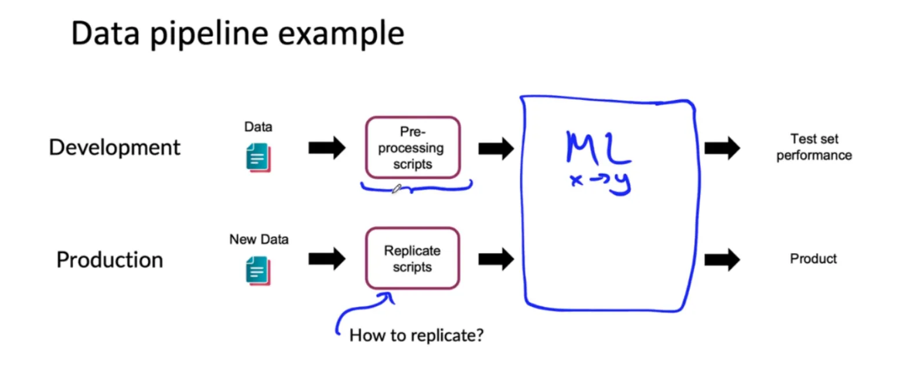

### i. Replicability Challenges

During development, preprocessing scripts can be ad hoc, involving manual steps or files shared across team members’ computers. This creates replicability issues in production, where the input distribution must match the development data. The effort to ensure replicability depends on the project phase:

  - **Proof of Concept (POC) Phase**: Focus on validating the application’s feasibility. Manual preprocessing is acceptable, but take detailed notes and comment scripts to aid future replication. Avoid heavy process investment at this stage.
  - **Production Phase**: Prioritize replicability using tools like **TensorFlow Transform**, **Apache Beam**, or **Airflow** to create a robust, reproducible pipeline.

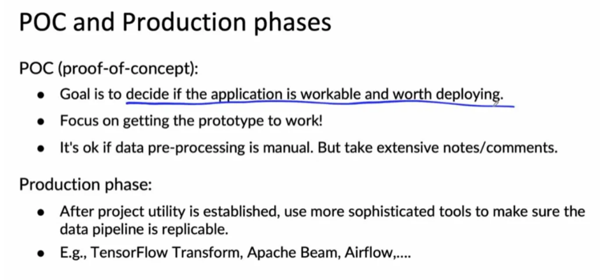

### ii. Complex Pipelines

Consider a pipeline for job-hunting prediction:

1.  **Spam Detection**: Start with a spam dataset (e.g., known spam accounts, blacklisted IPs). Apply a spam detection model to produce de-spammed user data.
2.  **User ID Merging**: Use labeled data (e.g., confirmed same-person accounts) to train an ID merge model. Apply it to de-spammed data to produce cleaned user data.
3.  **Job-Hunting Prediction**: Train a model on cleaned data to predict job-hunting behavior.

If errors are found (e.g., incorrect IP blacklists), updating the pipeline is challenging, especially if scripts are scattered across team members’ systems. **Data provenance** (data source) and **lineage** (processing steps) are critical for maintenance. Extensive documentation or tools like TensorFlow Transform help, though ML tools for provenance and lineage remain immature (TensorFlow, 2021).

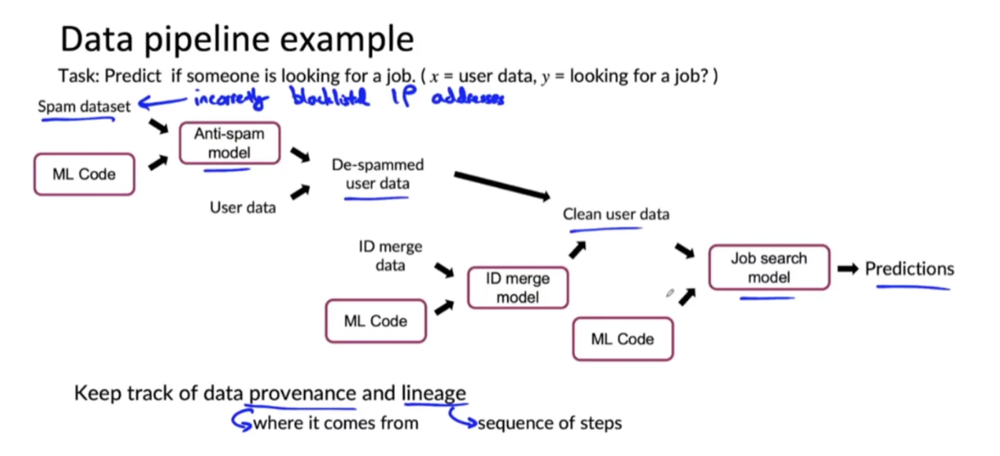

### iii. Metadata

**Metadata** (data about data) enhances error analysis. For example:

  - **Visual Inspection**: Metadata includes photo timestamp, factory, line number, camera settings (e.g., exposure, aperture), and inspector ID. If certain samples produce errors, metadata helps identify patterns (e.g., specific factory lines).
  - **Speech Recognition**: Metadata like smartphone brand or voice activity detection model can reveal error sources.

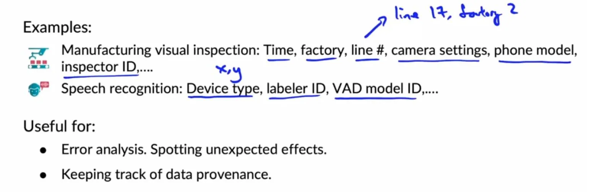

Storing metadata in MLOps frameworks (e.g., MLflow) facilitates analysis and improves algorithm performance, similar to commenting code (TensorFlow, 2021).

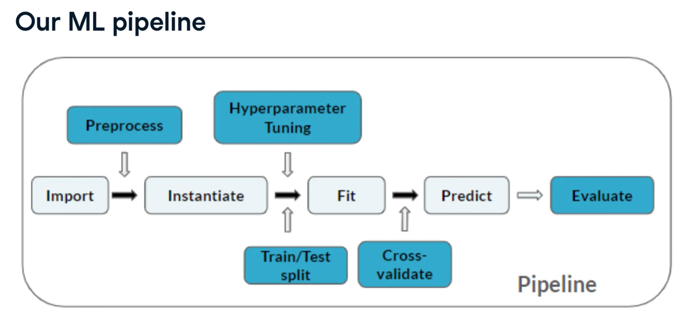

### 2.2.8. Balanced T/D/T Splits

For small datasets, balanced splits ensure representative train, development (dev), and test sets. In a visual inspection dataset with 100 images (30 defective, 70 non-defective), a 60/20/20 split might yield:

  - **Unbalanced Split**: Train (21 defective, 35% defective), Dev (2 defective, 10% defective), Test (7 defective, 35% defective).
  - **Balanced Split**: Train (18 defective, 30%), Dev (6 defective, 30%), Test (6 defective, 30%).

Balanced splits maintain the dataset’s true distribution (30% defective), improving model evaluation. For large datasets, random splits are typically representative, making balancing less critical.

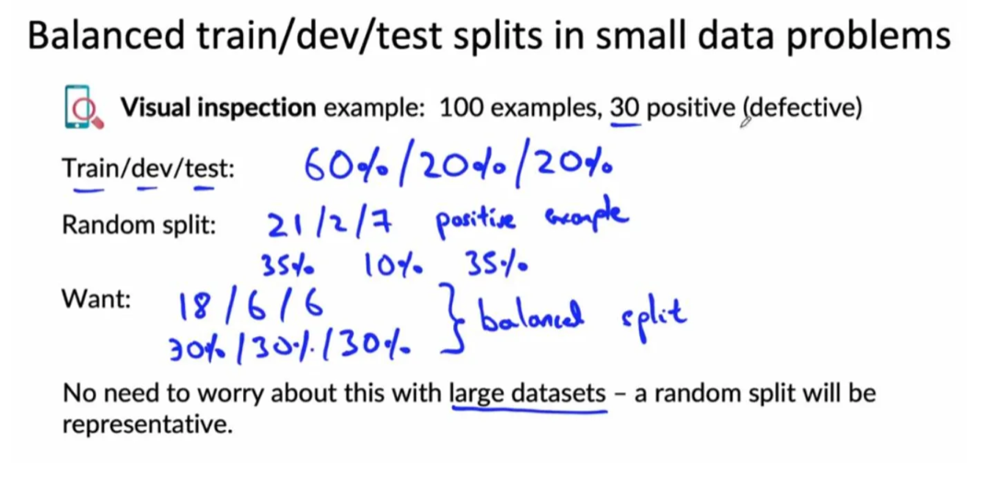

### i. Testing and Validating

Split the data into training set and test set (typically 80-20%; if it’s big data then 90-10%). The error rate on new cases is called the *generalization error.* If the training error is low but the generalization error is high, it means that your model is overfitting the training data.

### **Hyperparameter Tuning and Model Selection**

Evaluating a model is simple enough but what if you are hesitating between two types of models? Train both and compare how well they generalize using the test set. Now suppose model A performs better and now you want to apply some regularization to avoid overfitting. How do you choose the value of the regularization hyperparameter? Can’t use the test set multiple times because it will overfit. A solution to this problem is creating a validation set (aka dev set): you hold out part of the training set to evaluate several candidate models and select the best one. More specifically, you train multiple models with various hyperparameters on the reduced training set (training set - dev set) and select the model that performs best on the dev set. After that, you train the best model on the full training set and this gives you the final model. Lastly, you evaluate this final model on the test set to get an estimate of the generalization error. Use cross-validation on the dev set.

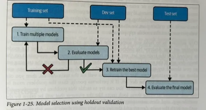

An important rule to remember is that both the validation set and the test set must be as representative as possible of the data you expect to use in production.

Which Splitting Strategy Should You Use?

  - **Is there a time component in my data where the future shouldn't influence the past?**

      - **YES:** You **must** use a **Time-Based Split**. Stratification is secondary and can be more complex to implement with time splits, but the time-based separation is non-negotiable.
      - **NO:** Proceed to the next question.
  - **Is this a classification problem?**

      - **YES:** You **should** use a **Stratified Split** (stratify=y). It prevents "bad luck" splits and is crucial for imbalanced datasets. It's good practice even for balanced datasets.
      - **NO (e.g., a regression problem):** A standard **Random Split** is usually fine.
