# 3. Development

## 3.1. Modeling Overview

Machine learning development often revolves around two philosophies: model-centric and data-centric AI.

### i. Model-centric and Data-centric AI

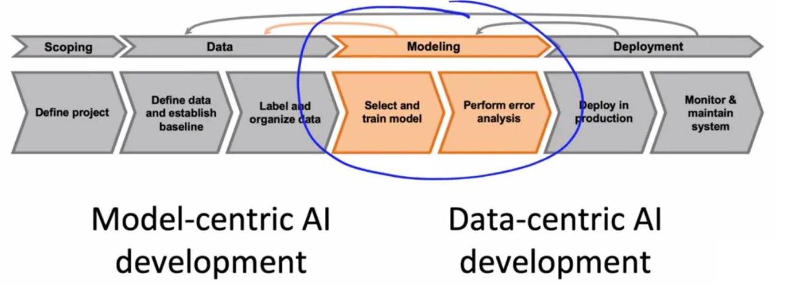

1.  In a **model-centric** approach, the emphasis is on crafting the perfect algorithm. Imagine you’re tuning a car’s engine—researchers might spend months designing a sophisticated neural network, tweaking its layers and connections, all while using a fixed dataset like a standard image collection. Historically, this has been the dominant method in AI research, with the focus on building ever-better models to outshine competitors on the same data.
2.  By contrast, a **data-centric** approach shifts the spotlight to the data itself. Here, the idea is to feed a solid but simpler model with high-quality, carefully curated data. It’s like ensuring the car runs on premium fuel rather than tinkering endlessly with the engine. In practice, this might mean cleaning up messy data, adding new examples, or enhancing what you already have. For many real-world projects, this method proves more efficient—great data can lift a basic model to impressive heights, often faster than perfecting a complex algorithm. For example, improving a dataset of customer reviews by removing duplicates and clarifying labels might boost a sentiment analysis model more than redesigning its architecture.

### ii. Key Challenges

Building a machine learning system is a balancing act between three core elements:

  - **Code**: The algorithm or model you write.
  - **Data**: The examples your model learns from.
  - **Hyperparameters**: Settings like how fast the model learns that guide its training.

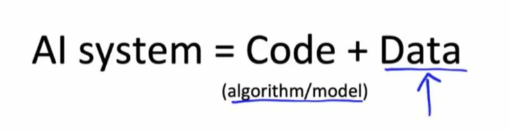

These pieces don’t come together in a straight line—it’s an iterative process. You start by training a model, test how it performs, spot where it goes wrong, and then adjust one of those three components. Maybe the code needs a bug fix, the data needs more variety, or the hyperparameters need fine-tuning. Then you try again. This cycle is normal and even valuable; each mistake teaches you something about what your system needs.

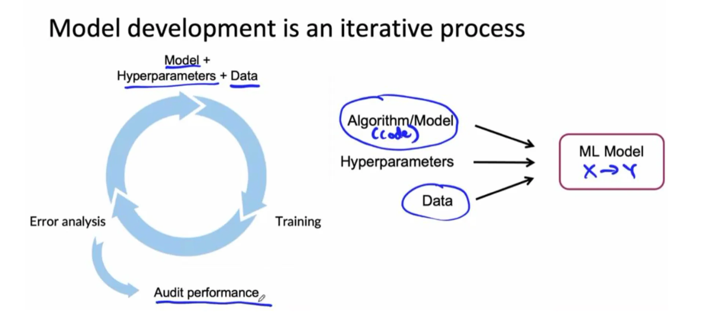

A key part of this process is figuring out *why* the model fails, which is where error analysis comes in. Suppose you’re building a speech recognition system, and it stumbles on clips with background noise. By studying those failures, you might realize the data lacks enough noisy examples, prompting you to add more. This interplay between code, data, and settings is what drives progress, making patience and curiosity essential traits for an ML developer.

### iii. Milestones in Training a Model

To gauge whether your model is on the right track, you need to measure its performance at three distinct stages:

1.  **Training Set Performance**: How well does the model learn the examples it’s been given? (e.g., predicting house prices from sizes it’s seen.)
2.  **Development (Dev) Set Performance**: Can it handle new, unseen data?
3.  **Test Set Performance**: Does it work well on a final, separate dataset?

But numbers alone don’t tell the whole story. A model might ace these metrics yet still fall short of your project’s needs. Take a loan approval system: even with high accuracy, it could unfairly reject certain applicants due to biased data. Success isn’t just about hitting a target score—it’s about meeting practical goals like fairness or reliability.

### iv. Feature Engineering

Goal is to enhance model performance. Tools and techniques help to process, select, and maintain features:

  - Feature selection

      - Domain-specific knowledge
      - Correlation
      - Feature importances
      - Other methods: univariate selection, Principal Component Analysis (PCA), Recursive Feature Elimination (RFE)
  - Feature store - only relevant for large teams working on multiple projects that use the same features

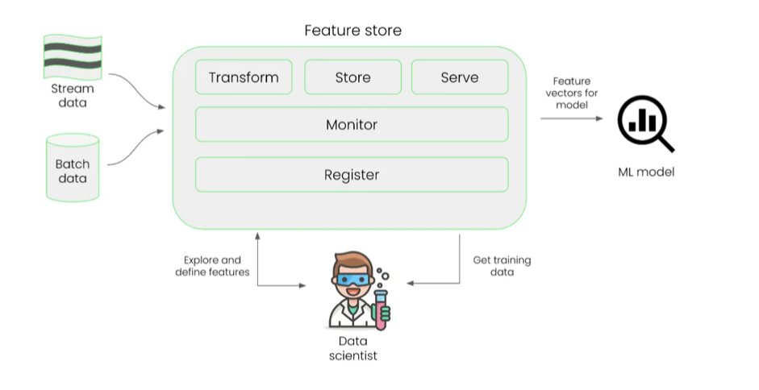

  - Data version control

      - Tracking dataset changes
      - Maintaining consistency

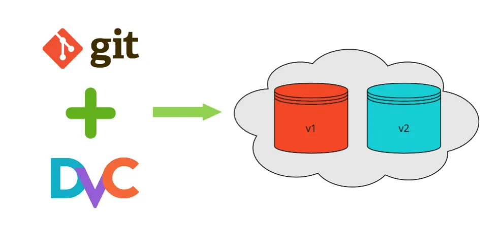

## 3.2. Model Baseline

### i. Getting Started

Launching an ML project can feel daunting, but you don’t need to nail everything on day one. Begin by spending a few hours researching—read a blog or paper to pick a reasonable algorithm, like a standard neural network, rather than chasing the latest cutting-edge option. Then, test your setup with a tiny dataset—say, five examples. Train the model and see if it can overfit, meaning it perfectly memorizes those few cases. If it can’t, something’s off with your code or configuration, and you’ve caught it early.

This approach gets you moving fast. You’ll learn more from tweaking and testing than from agonizing over the “best” starting point. Speed matters more than perfection at the outset.

### ii. Why Low Average Error Isn’t Always Enough

A model with a low average error might seem like a winner, but that number can hide serious flaws. Imagine a web search model that’s 99% accurate but fails to rank "[Google.com](http://google.com/)" correctly for a search on "Google"—that’s a critical miss, even if rare. Or consider a medical diagnosis model trained on data where 99% of patients are healthy. It could predict "healthy" every time, scoring 99% accuracy, yet miss every sick patient. That’s not just misleading—it’s dangerous.

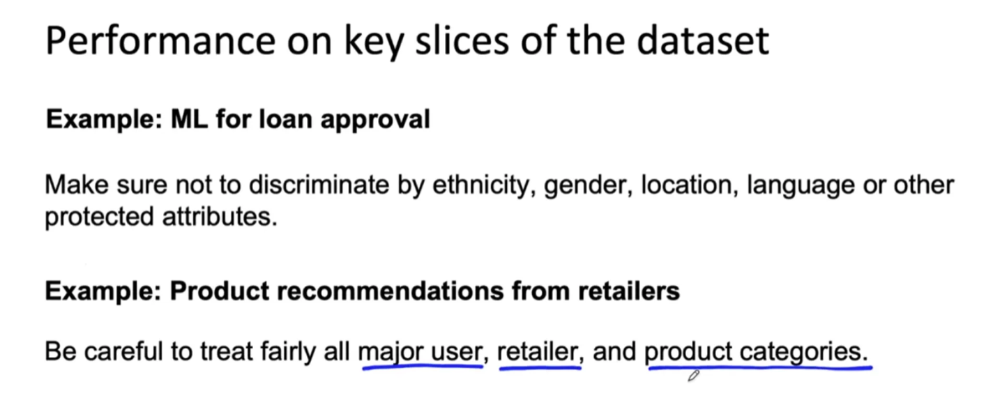

The problem often stems from skewed data or overlooking rare but vital cases. Average error smooths over these issues, so you need to dig deeper. Check how the model handles the tough stuff—the edge cases or the minority classes that matter most to your application.

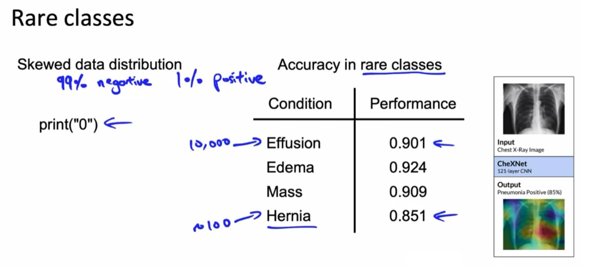

### iii. Setting a Baseline

Every ML project needs a starting point, or baseline, to measure progress against. Here are a few ways to set one:

  - **Human-Level Performance (HLP)**: How well do humans do? Great for tasks like image recognition.
  - **Literature Search**: Check what others have achieved on similar problems.
  - **Quick Model**: Build a simple model fast to see what’s possible.
  - **Previous System Performance**: If you already have a machine learning system in place, its performance can serve as a baseline for improvement.

**Example: Speech Recognition Categories**

Suppose you’ve identified four major speech categories in your dataset, with your model achieving accuracies of 94%, 89%, 87%, and 70%, respectively. You might initially focus on improving the lowest-performing category (e.g., low-bandwidth audio at 70%). However, before prioritizing, it’s critical to establish a baseline for all categories.

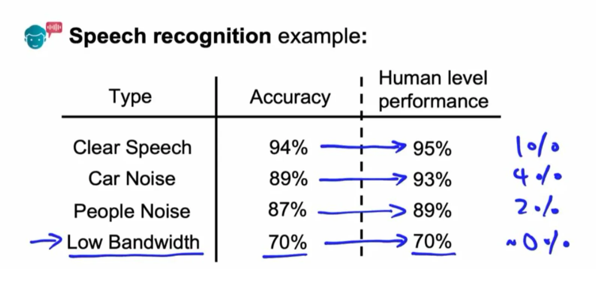

To do this, have human transcriptionists label the data and measure their accuracy. This establishes the **human-level performance (HLP)** for each category. For instance, you might find that improving performance on clear speech to HLP could yield a 1% gain, while improving performance on audio with background car noise could yield a 4% gain. For low-bandwidth audio, however, the improvement might be negligible (0%).

This analysis reveals that low-bandwidth audio may be too garbled for even humans to transcribe accurately, suggesting it’s not a fruitful area for improvement. Instead, focusing on speech recognition with background car noise could be more productive. HLP provides a valuable baseline to guide your efforts toward high-impact areas, such as car noise data, rather than less promising ones like low-bandwidth audio.

**Baselines for Unstructured vs. Structured Data**

Best practices for establishing baselines vary depending on whether you’re working with **unstructured** or **structured** data.

  - **Unstructured data** includes datasets like images (e.g., pictures of cats), audio (e.g., speech recognition), or natural language. Humans excel at interpreting unstructured data, so measuring HLP is often an effective way to establish a baseline for these tasks.
  - **Structured data**, such as large databases from an e-commerce website (e.g., user purchases, timestamps, and prices), is less intuitive for humans. We didn’t evolve to analyze massive spreadsheets, so HLP is typically less useful as a baseline for structured data applications.

Given these differences, the approach to establishing baselines depends on the data type.

**Understanding Irreducible Error**

For unstructured data, HLP can help estimate the **irreducible error** or **Bayes error**—the theoretical best performance possible. For example, you might determine that low-bandwidth audio is so degraded that exceeding 70% accuracy is impossible, even for humans.

**Avoiding Unrealistic Expectations**

Some business teams may pressure machine learning teams to guarantee high accuracy (e.g., 80% or 99%) before a baseline is established. This puts the team in a challenging position. If faced with such demands, consider pushing back and requesting time to establish a rough baseline. This allows for a more informed prediction of the system’s potential accuracy.

## 3.3. Error Analysis

Training a machine learning algorithm rarely yields perfect results on the first attempt. Error analysis is central to the development process, helping you identify and address model shortcomings systematically.

To understand errors in a system, such as a speech recognition model, follow this process:

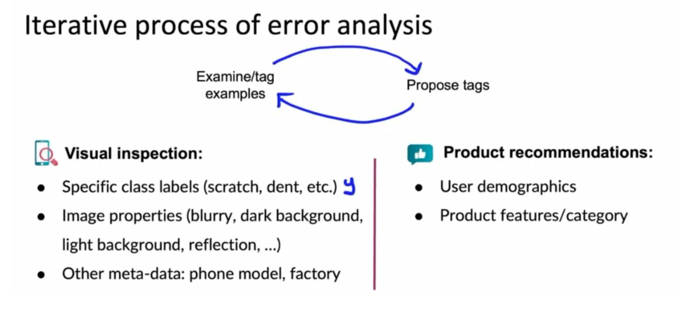

  - **Examine Misclassified Examples**: Select a sample from your development set, such as 100 mislabeled audio clips. Listen to each clip and annotate relevant characteristics in a spreadsheet (e.g., Google Sheets, Excel, or Numbers). For instance, note if an audio clip contains background car noise.
  - **Purpose**: This process reveals which categories or tags (e.g., car noise) contribute significantly to errors, helping you prioritize areas for improvement.

Error analysis has traditionally been manual, often performed in tools like Jupyter Notebooks or spreadsheets. While this approach remains effective, emerging MLOps tools streamline the process.

### i. Key Metrics for Error Analysis

As you analyze tagged data, track these metrics to guide prioritization:

1.  **Fraction of Errors with a Tag**: For example, if 12% of 100 audio clips have the "car noise" tag, addressing car noise could improve performance by up to 12%—a significant gain.
2.  **Misclassification Rate for a Tag**: Calculate the fraction of data with a specific tag that is misclassified. For instance, if 18% of car noise clips are incorrectly transcribed, this indicates the difficulty of that category and its accuracy ceiling.
3.  **Prevalence of a Tag**: Determine what fraction of the entire dataset has a specific tag. This shows the tag’s overall relevance.
4.  **Room for Improvement**: Assess the potential for improvement by comparing your model’s performance to human-level performance (HLP) for a given tag. This helps estimate the achievable gains.

## 3.4. Prioritizing Improvements

Deciding where to focus your efforts in a machine learning project requires a strategic approach. Beyond assessing the gap to human-level performance (HLP), consider the prevalence of each data category and other practical factors to maximize impact.

### i. Analyzing Data Distributions

The distribution of data across categories significantly influences prioritization. For example, suppose your speech recognition dataset is distributed as follows:

  - Clean speech: 60%
  - Car noise: 4%
  - People noise: 30%
  - Low-bandwidth audio: 6%

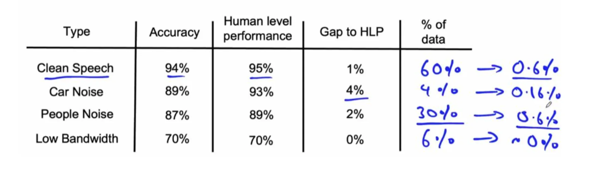

Improving accuracy on clean speech from 94% to 95% (a 1% gain) across 60% of the data would increase overall system accuracy by 0.6% (1% × 60%). In contrast, improving car noise performance by 4% across 4% of the data yields only a 0.16% overall improvement (4% × 4%).

This analysis highlights that clean speech and people noise, due to their larger share of the dataset, offer greater potential for overall performance gains compared to car noise, despite the latter’s larger gap to HLP.

### ii. Factors for Prioritization

When deciding which categories to prioritize, evaluate the following:

1.  **Room for Improvement**: Compare current performance to a baseline, such as HLP, to estimate potential gains.
2.  **Category Prevalence**: Assess how frequently a category appears in the dataset. Categories with higher prevalence can yield larger overall improvements.
3.  **Ease of Improvement**: Consider how feasible it is to enhance accuracy in a category, factoring in data availability and algorithmic complexity.
4.  **Category Importance**: Evaluate the practical significance of improving a category. For instance, enhancing speech recognition with car noise may be critical for hands-free map searches while driving, where user safety and convenience are paramount.

No mathematical formula dictates the optimal choice, but weighing these factors enables informed, impactful decisions.

### iii. Targeted Data Collection and Augmentation

Once you identify priority categories, focus on improving performance by enhancing the data for those categories:

  - **Collect More Data**: If car noise is a priority, gather additional audio samples with car noise. Targeted data collection is more efficient than collecting generic data, which can be time-consuming and costly.
  - **Use Data Augmentation**: Apply techniques to generate synthetic data for the target category, such as simulating car noise in existing audio samples. This can boost performance without extensive data collection.

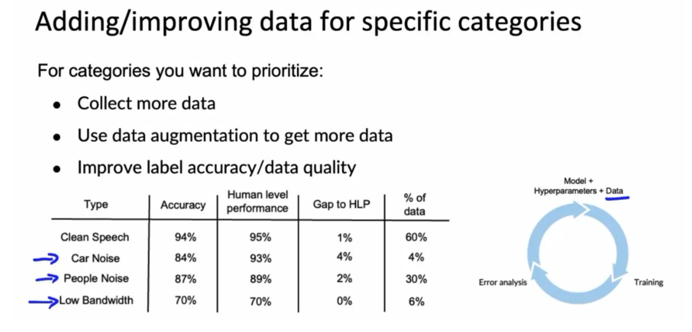

For example, rather than broadly collecting data from low-bandwidth cell phone connections, focus on acquiring or augmenting data specifically for car noise or people noise. This precision ensures resources are used effectively to improve algorithm performance where it matters most.

## 3.5. Skewed Datasets

Skewed datasets, where one class significantly outnumbers another, pose challenges for evaluating machine learning models. Accuracy alone is often misleading in such cases, and alternative metrics like precision, recall, and the F1 score provide a clearer picture of performance.

### i. Challenges of Skewed Datasets

In skewed datasets, the majority class dominates, making high accuracy achievable with simplistic models that fail to detect the minority class. Consider these examples:

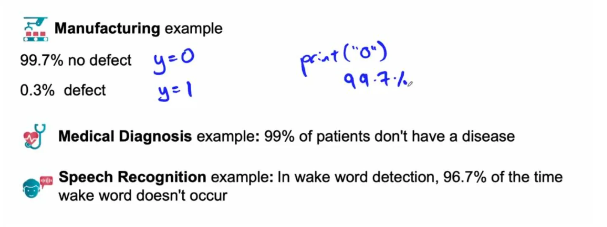

  - **Manufacturing Smartphones**: If 99.7% of smartphones have no defects (labeled y=0) and only 0.3% are defective (y=1), an algorithm that always predicts "no defect" achieves 99.7% accuracy, despite being ineffective at identifying defects.
  - **Medical Diagnosis**: If 99% of patients don’t have a disease, predicting "no disease" for everyone yields 99% accuracy, yet fails to identify any actual cases.
  - **Wake Word Detection**: In systems detecting wake words (e.g., "Hey Siri"), the wake word is rarely spoken. One dataset I worked with had 96.7% negative examples (no wake word) and 3.3% positive examples, making accuracy a poor metric.

In such cases, always predicting the majority class produces high accuracy but misses critical minority class instances, rendering the model practically useless.

### ii. Using a Confusion Matrix

For skewed datasets, a confusion matrix is a more effective evaluation tool. It organizes predictions against actual labels, with one axis representing ground truth (y=0 or y=1) and the other representing predictions. For a dataset with 1,000 examples (914 negative, 86 positive, i.e., 91.4% negative, 8.6% positive), a confusion matrix reveals how well the model handles both classes.

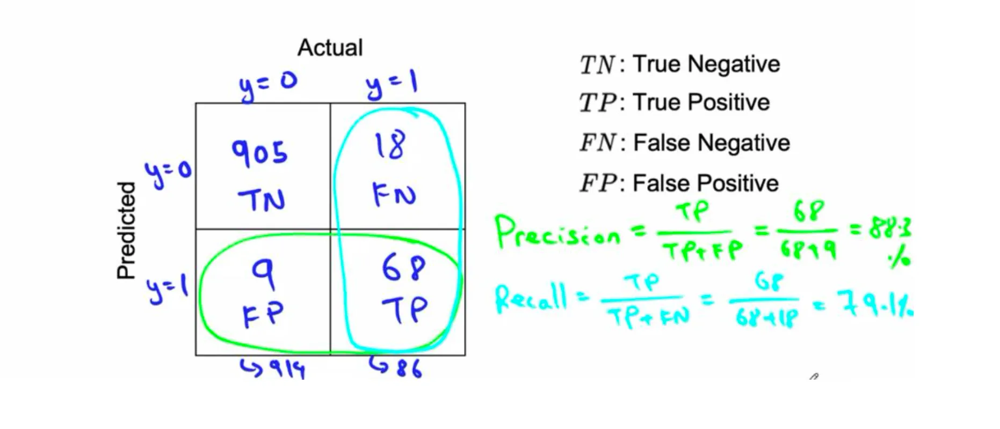

### iii. Precision and Recall

**Precision** and **recall** are key metrics for skewed datasets, offering deeper insights than accuracy:

  - **Precision**: The proportion of positive predictions that are correct.
  - **Recall**: The proportion of actual positive cases correctly identified.

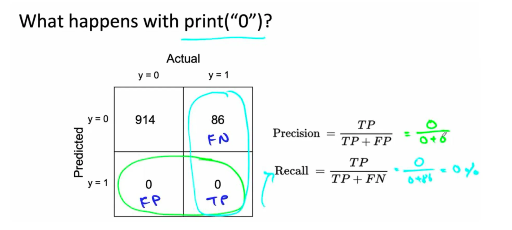

For the example dataset (914 negative, 86 positive), an algorithm that always predicts "negative" achieves:

  - **0% recall**, as it fails to detect any positive examples.
  - **High precision** (if it never predicts positive, precision is undefined or trivially high), but this is meaningless given the low recall.

Low recall flags the algorithm’s failure to identify the minority class, making precision and recall more informative than accuracy.

### iv. Comparing Models with the F1 Score

When comparing models with different precision and recall values, the F1 score provides a single, balanced metric. The F1 score is the harmonic mean of precision and recall, emphasizing the lower of the two values to ensure both are reasonably high. Mathematically:

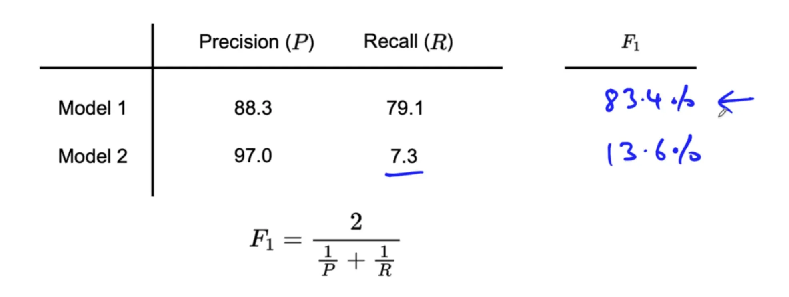

While the F1 score is widely used, you may adjust the weighting of precision and recall based on your application’s needs. For instance, some scenarios may prioritize recall over precision or vice versa.

### v. Multi-class Classification with Skewed Data

### Skewed datasets are also common in **multi-class classification** problems, such as detecting multiple rare defect types in smartphone manufacturing (e.g., scratches, dents, pit marks, or LCD discoloration). Since each defect type may be rare, accuracy is misleading, as a model could achieve high accuracy by ignoring all defects.

### Instead, evaluate **precision and recall for each defect type** individually. For example:

  - ### **High Recall Preference**: Manufacturing often prioritizes high recall to minimize defective phones reaching customers. Slightly lower precision is tolerable, as human inspectors can verify flagged phones to filter out false positives.
  - ### **F1 Score for Comparison**: Compute the F1 score for each defect type to obtain a single metric for performance across all classes. This helps benchmark against human-level performance and prioritize which defect type to address next.

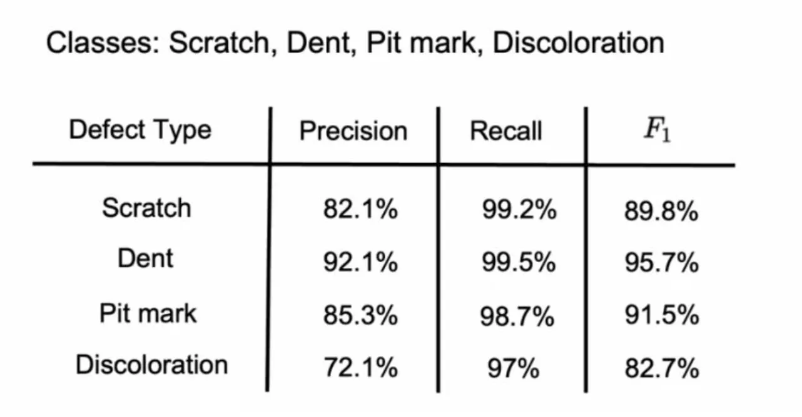

Using the F1 score avoids the pitfalls of accuracy, which remains high even if the algorithm misses rare defects. It also guides prioritization by highlighting the most impactful defect types to improve.

## 3.6. Performance Auditing

Even when a machine learning model performs well on metrics like accuracy or F1 score, conducting a final performance audit before deployment is critical. This step can prevent significant post-deployment issues by identifying potential problems in accuracy, fairness, bias, and other areas.

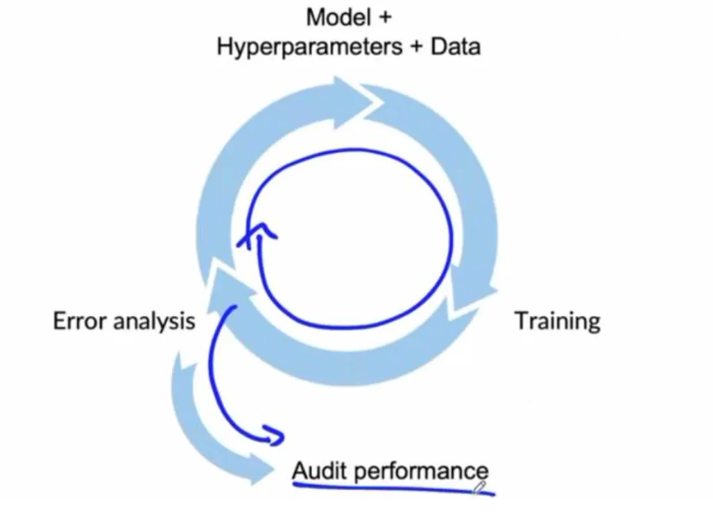

After multiple iterations of model development, a performance audit serves as a final check to ensure the system is robust and equitable. It helps uncover issues that might not be evident from standard metrics, safeguarding against real-world failures.

### i. Auditing Framework

In skewed datasets, the majority class dominates, making high accuracy achievable with simplistic models that fail to detect the minority class. Consider these examples:

Follow this structured approach to audit your machine learning system:

#### Step 1: Brainstorm Potential Failure Modes

Identify ways the system might fail by considering its performance across various dimensions:

  - **Subgroup Performance**: Does the algorithm perform equally well across different demographic groups, such as individuals of varying ethnicities or genders?
  - **Error Types**: Are there specific patterns in false positives or false negatives? How does the model handle rare but critical cases?
  - **Context-Specific Issues**: For example, in speech recognition, consider:

      - Accuracy across different genders, ethnicities, or perceived accents.
      - Performance on various devices, as microphone quality can vary.
      - Mistranscriptions, especially those producing offensive or inappropriate outputs.

**Example**: In[ DeepLearning.AI](http://deeplearning.ai)’s courses, an instructor discussing **GANs** (generative adversarial networks) was mistranscribed as referencing "guns" and "gangs" due to the rarity of the term in English. This highlights the need to monitor for problematic mistranscriptions, such as swear words or offensive terms, that could misrepresent the speaker’s intent.

#### Step 2: Establish Metrics for Evaluation

Define metrics to assess performance against identified risks, focusing on **data slices**—subsets of the dataset representing specific groups or conditions. Examples include:

  - Accuracy for different genders, accents, or devices in a speech recognition system.
  - Frequency of offensive or incorrect transcriptions (e.g., rude words or misinterpretations like "GANs" to "guns").
  - Precision and recall for rare defect types in manufacturing.

**MLOps Tools**: Tools like **TensorFlow Model Analysis (TFMA)** can automate the computation of detailed metrics across data slices, streamlining the auditing process for each model iteration.

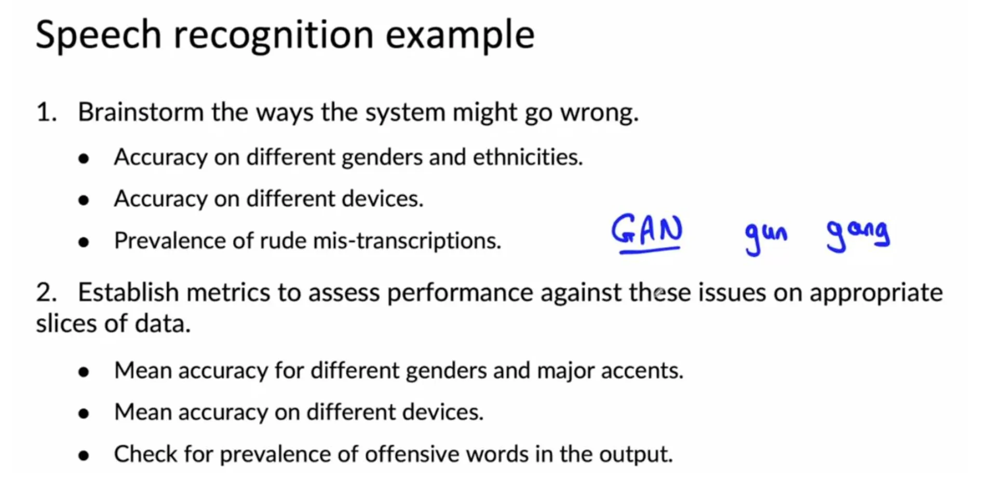

#### Step 3: Secure Stakeholder Buy-in

Engage business or product owners to validate the identified risks and metrics. Ensure they agree that these are the most relevant issues to address and that the chosen metrics effectively evaluate potential problems. This alignment fosters trust and ensures the audit addresses business priorities.

### ii. Industry-specific Considerations

The ways a system might fail are highly **problem-dependent**, and standards for fairness and bias vary across industries. These standards are still evolving in AI and specific sectors. To stay compliant and ethical:

  - **Research Industry Standards**: Investigate acceptable practices for your industry, keeping up with evolving guidelines on fairness and bias.
  - **Leverage Expertise**: Involve your team or external advisors to brainstorm potential issues, reducing the risk of overlooking critical failure modes.

## 3.7. Data-centric AI Development

Traditional AI development often adopts a model-centric approach, focusing on optimizing models for fixed datasets. However, a data-centric approach, which prioritizes improving data quality, is increasingly valuable for many applications. This shift, combined with strategic feature engineering for structured data, can significantly enhance machine learning performance.

### i. Model-Centric vs. Data-Centric AI Development

**Model-Centric Approach**

In model-centric development, the dataset is fixed, and efforts focus on iteratively improving the model or code to maximize performance. This approach is common in academic research, where researchers download benchmark datasets and aim to achieve the best results on these fixed sets.

**Data-Centric Approach**

In contrast, data-centric development emphasizes data quality. Instead of refining the model while keeping the data constant, you maintain a relatively stable model and iteratively enhance the data using techniques like error analysis and data augmentation. For many applications, high-quality data enables multiple models to perform adequately, reducing the need for cutting-edge algorithms.

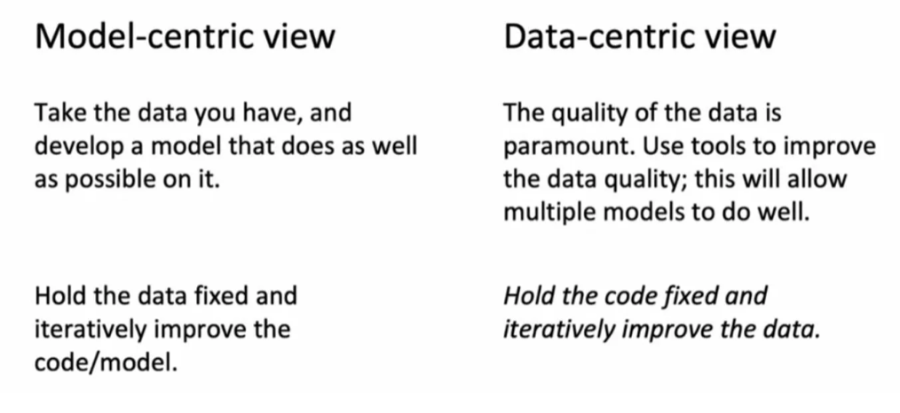

Both approaches are valuable, but if you’re accustomed to model-centric thinking, adopting a data-centric perspective can complement your workflow and accelerate performance improvements.

### ii. Data Augmentation

Imagine a graph where:

  - The **vertical axis** represents model performance (e.g., accuracy).
  - The **horizontal axis** conceptually represents the space of possible inputs (e.g., speech with background noises like car, plane, train, cafe, library, or food court).

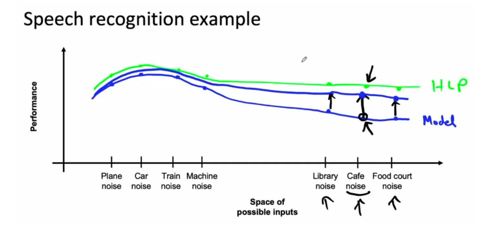

**Mechanical noises** (car, plane, train) are similar to each other, as are **human-related noises** (cafe, library, food court). A model’s performance varies across these inputs, forming a curve (visualized as a blue rubber band) that reflects accuracy for each input type. Human-level performance (HLP) forms a separate curve (green line), and the gap between the two curves indicates opportunities for improvement.

Data augmentation targets underperforming inputs (e.g., cafe noise). By adding augmented data, you “pull up” the blue curve at that point, improving performance. This often lifts nearby points (e.g., library or food court noise) as well, with diminishing effects on distant points (e.g., mechanical noises). For unstructured data, improving one area rarely degrades performance elsewhere, making data augmentation highly effective.

**Error Analysis Role**: Error analysis identifies the largest gaps to HLP, guiding where to collect or augment data to maximize performance gains.

**Data Augmentation for Unstructured Data**

Data augmentation efficiently generates additional training examples for unstructured data problems (e.g., images, audio, text). However, it requires careful designHannah design to ensure the augmented data is useful. Key decisions include selecting augmentation parameters, such as the type and intensity of background noise in audio.

**Example: Speech Recognition**

To augment an audio clip, you might add background cafe noise by summing the waveforms of the speech and noise. Decisions include:

  - **Type of Noise**: Cafe, car, or other relevant sounds.
  - **Noise Volume**: The loudness relative to the speech.

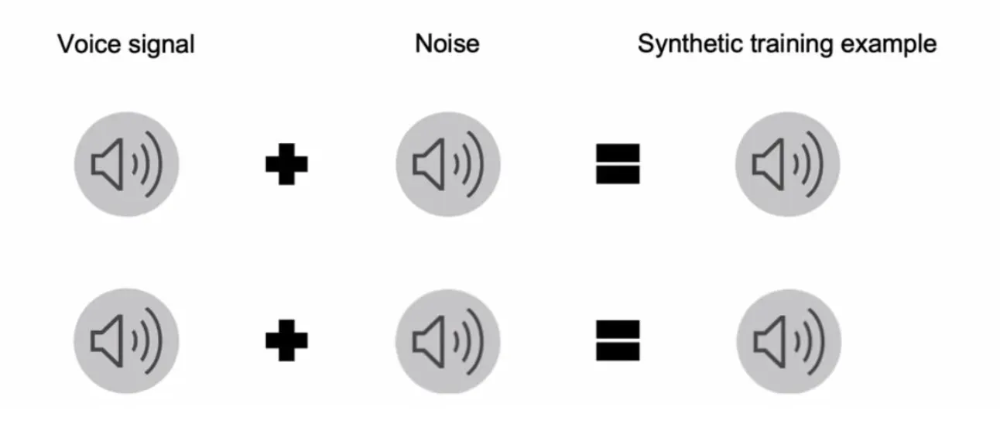

**
****Framework for Effective Data Augmentation**

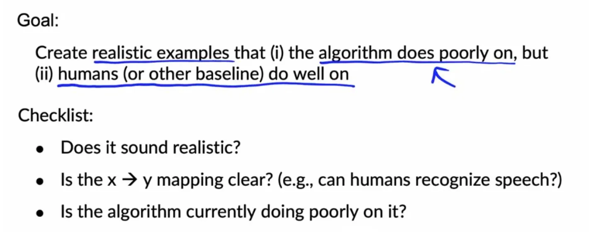

**Create augmented examples that are:**

1.  Realistic: Resemble real-world scenarios (e.g., audio that sounds like a noisy cafe).
2.  Challenging for the Algorithm: The algorithm should perform poorly on these examples, indicating room for learning.
3.  Solvable by Humans: The input-to-output mapping (e.g., speech to transcription) should remain clear to humans or a baseline model. Avoid overly noisy examples where content is indiscernible.

**Validation Checklist**

Before training on augmented data, verify:

1.  Realism: Does the augmented audio sound plausible for the target scenario?
2.  Clear Mapping: Can humans understand the content (e.g., recognize spoken words)?
3.  Algorithm Weakness: Does the algorithm struggle with this data, confirming its potential to drive improvement?

This checklist ensures augmented data is effective without requiring lengthy retraining to validate parameter changes.

**Example: Image Augmentation**

For a small dataset of smartphone images with scratches, augmentation techniques include:

  - Horizontal Flipping: Creates a realistic image with the scratch repositioned.
  - Contrast Adjustment: Brightens the image to highlight the scratch, remaining realistic and human-interpretable.
  - Avoid Over-Augmentation: Darkening an image excessively may obscure the scratch, failing the checklist as humans can’t identify it.

Advanced methods, like using Photoshop to draw synthetic scratches or GANs to generate them, can work but are often unnecessary. Simpler techniques are typically faster and equally effective.

**Data Iteration Loop**

In data-centric AI, adopt a data iteration loop:

1.  Train the model on the current dataset.
2.  Perform error analysis to identify underperforming areas.
3.  Add or augment data to address these weaknesses.
4.  Retrain and repeat.

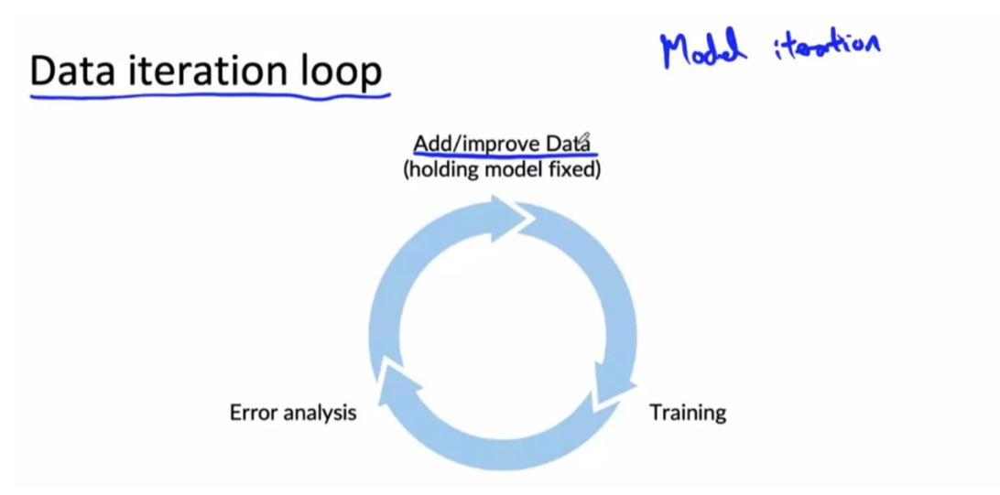

This approach, combined with robust hyperparameter tuning, often outperforms model iteration (repeatedly refining the model) for practical applications.

**Does Adding Data Hurt Performance?**

Data augmentation can alter the training set’s distribution. For example, if cafe noise initially comprises 20% of the data but augmentation increases it to 50%, the training set may diverge from the development and test sets. Does this harm performance?

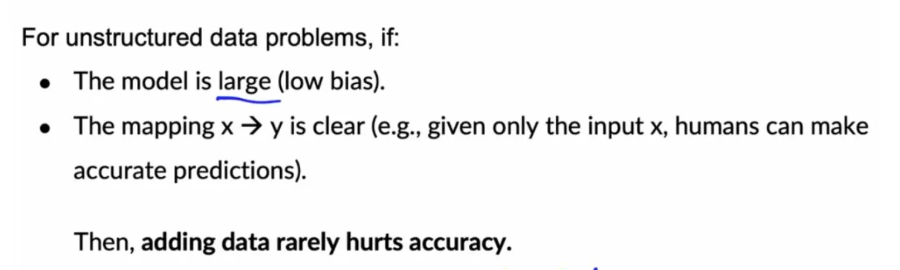

### Unstructured Data

For unstructured data problems, adding data rarely hurts performance if:

  - **The Model Is Large**: A high-capacity model (e.g., a large neural network with low bias) can handle distribution shifts without overfitting to augmented data.
  - **The Mapping Is Clear**: If the input-to-output mapping (e.g., audio to transcription) is unambiguous and humans can accurately label the data, additional data typically improves or maintains performance.

In such cases, augmenting cafe noise data enhances performance on cafe noise without degrading performance on other noise types.

**Potential Risks**

Performance may degrade in rare cases:

  - **Small Models**: A low-capacity model may overemphasize augmented data (e.g., cafe noise), reducing performance on other inputs (e.g., non-cafe noise).
  - **Ambiguous Mappings**: If the input-to-output mapping is unclear, augmented data can mislead the model. For example, in a Google Street View project to read house numbers, distinguishing between the digit “1” and the letter “I” was challenging. House numbers rarely include “I,” so “1” is a safer guess. Augmenting with ambiguous “I” examples skewed the dataset, causing the model to misclassify ambiguous cases as “I” more often, hurting performance.

This scenario is uncommon, especially in problems like speech recognition where mappings are typically clear. As long as the model is sufficiently large and labels are accurate, data augmentation is unlikely to harm performance.

### Structured Data

For structured data problems (e.g., databases with user or product features), creating new training examples is challenging due to fixed datasets (e.g., a set number of users or products). Instead, feature engineering—adding or enriching features to existing examples—is a powerful strategy.

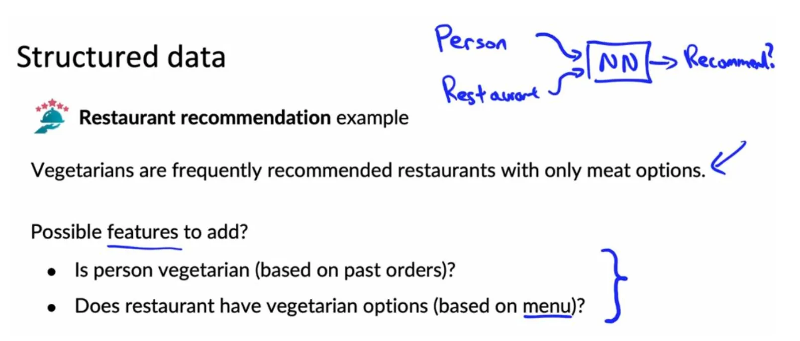

**Example: Restaurant Recommendations**

In a restaurant recommendation system, error analysis revealed that vegetarians were frequently recommended meat-only restaurants, degrading user experience. Creating new users or restaurants wasn’t feasible, so feature engineering was used:

  - **User Features**: Add a feature indicating vegetarian preference, such as the percentage of vegetarian meals ordered or a score estimating vegetarian likelihood.
  - **Restaurant Features**: Include a feature noting whether the restaurant offers vegetarian options.

These features could be hand-coded or derived algorithmically (e.g., a model that classifies menu items as vegetarian).

**Example: Food Delivery**

In a food delivery system, some users consistently ordered only tea/coffee, while others ordered only pizza. To improve recommendations, add features like:

  - A flag or score indicating tea/coffee-only users.
  - A flag or score for pizza-only users.

These features help the model tailor recommendations to user preferences.

**Content-Based vs. Collaborative Filtering**

Recent trends in recommendation systems favor **content-based filtering** over **collaborative filtering**:

  - **Collaborative Filtering**: Recommends items based on what similar users like, requiring sufficient user interactions. It struggles with the **cold start problem**—recommending new items with few interactions.
  - **Content-Based Filtering**: Uses features of users and items (e.g., user preferences, restaurant menus) to make recommendations. It excels with new items, as it relies on item descriptions rather than user interactions.

For example, a new restaurant can be recommended based on its menu, even if few users have interacted with it. Capturing robust features is critical for content-based filtering success.

**Data Iteration for Structured Data**

The data iteration loop for structured data involves:

1.  Training the model on the current dataset.
2.  Conducting error analysis, user feedback, or competitor benchmarking to identify weaknesses.
3.  Adding or enriching features to address these issues.
4.  Retraining and repeating.

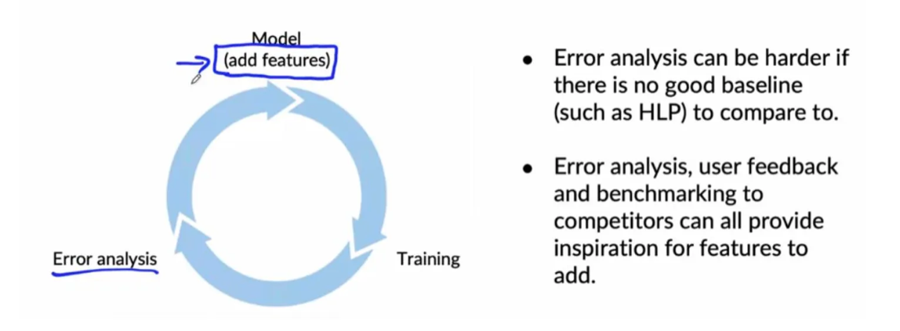

Unlike unstructured data, where human-level performance provides a clear baseline, structured data lacks such a reference, as humans struggle with tasks like recommending restaurants from raw data. Error analysis, user feedback, and competitor comparisons are thus critical for identifying improvement opportunities.

**Role of Feature Engineering in Deep Learning**

Before deep learning, feature engineering was essential for machine learning. While deep learning reduces the need for hand-crafted features in unstructured data problems—especially with large datasets—feature engineering remains vital for structured data, particularly when datasets are small or medium-sized. Thoughtfully designed features can significantly boost performance in these scenarios.

## 3.8. Experiment Tracking

Efficient machine learning development requires robust experiment tracking and a focus on high-quality data. These practices ensure systematic improvements and reliable model performance, especially in applications where massive datasets are unavailable.

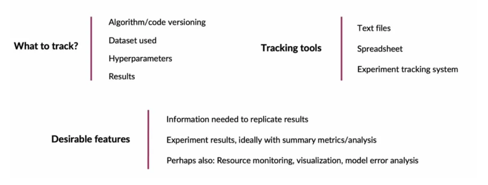

### i. What to Track

Record the following for each experiment:

1.  **Algorithm and Code Version**: Note the algorithm used and its code version to ensure replicability.
2.  **Dataset**: Document the dataset used, including any preprocessing steps.
3.  **Hyperparameters**: Log all hyperparameter settings.
4.  **Results**: Save high-level metrics (e.g., accuracy, F1 score) and, if possible, a copy of the trained model.

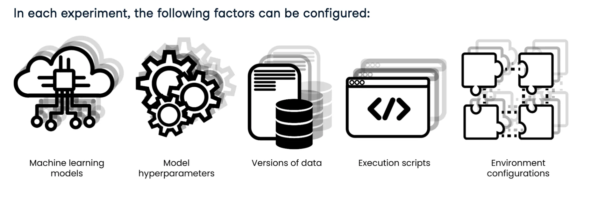

### ii. Tracking Tools

Choose a tracking method based on your needs and scale:

  - **Text Files**: Suitable for small, individual experiments. Jot down a few lines per experiment to note key details. This approach doesn’t scale well but is simple for initial tests.
  - **Spreadsheets**: Shared spreadsheets (e.g., Google Sheets) support collaboration and scale better, allowing multiple team members to review and update experiment records.
  - **Formal Experiment Tracking Systems**: Tools like Weights & Biases, Comet, MLflow, SageMaker Studio, or LandingAI’s computer vision-focused tool offer advanced features. These systems are evolving rapidly and cater to larger teams or complex projects.

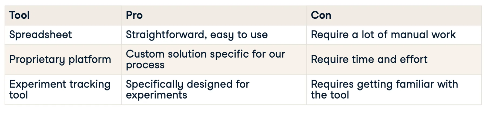

### iii. Key Features

When selecting a tracking tool, prioritize:

1.  **Replicability**: Ensure the tool captures enough information to replicate results. Be cautious with algorithms that pull data from the internet, as changing online data can reduce replicability unless carefully managed.
2.  **Result Insights**: Choose tools that provide clear summaries of experimental results, including metrics and, ideally, in-depth analysis.
3.  **Additional Features**: Consider resource monitoring (e.g., CPU/GPU usage), model visualization, or support for detailed error analysis.

The most important takeaway is to use *some* tracking system—whether a text file, spreadsheet, or advanced tool—and include as much relevant information as practical. This ensures you can revisit and build upon past experiments efficiently.

**The Process**

1.  Formulate a hypothesis: "We expect that..."
2.  Gather images and labels
3.  Define experiments, e.g., types of models, hyperparameters, datasets
4.  Setup experiment tracking
    Train the machine learning model(s)
5.  Test the models on a hold-out test set
6.  Register the most suitable model
7.  Visualize and report back to team and stakeholders, and determine next steps
