# 4. Deployment

## 4.1. Key Challenges in Deployment

Development environment is different from Production environment, and this poses a few challenges.

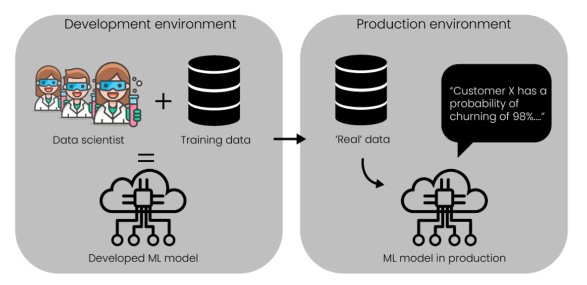

  - Model object + deployment resources = model deployment package
  - Putting our model in use = deployment

Deployment involves two primary challenge categories:

### i. Machine Learning Challenges

In this scenario, a machine learning model is trained to detect defects in smartphone images. The training data includes:

  - Images of defect-free phones (e.g., a "good phone" on the left).
  - Images of phones with defects, such as a big scratch across the middle, with bounding boxes drawn around the defects.

The model is designed to classify images like the defect-free phone as "okay" while identifying and localizing defects in images with scratches or other imperfections. However, when deployed in a factory setting, the model encounters images that are significantly darker (e.g., an image on the right) due to changes in lighting conditions compared to when the training set was collected. This discrepancy between the training and deployment environments poses a challenge to the model's performance.

The issue described is an example of **concept drift** or **data drift**:

  - **Concept Drift**: Occurs when the relationship between the input data (images) and the target variable (defect presence) changes over time. In this case, altered lighting conditions affect how defects appear in images, impacting the model's ability to detect them accurately.
  - **Data Drift**: Refers to changes in the distribution of the input data itself. Here, the darker images represent a shift in the data distribution from what the model was trained on.

Both phenomena can lead to a decline in model performance if not addressed, as the model may not generalize well to the new conditions. A critical task in deployment is detecting and addressing concept and data drift. This involves monitoring the system to identify changes in data distribution and updating the model as needed to maintain performance. Changes can be gradual or sudden, and you need to be alerted of both.

**Practical implications**

This scenario highlights a common challenge in machine learning deployment: the gap between the development environment (where the model is trained and tested) and the production environment (where it is applied). Key points include:

  - Even if a model performs well on a holdout test set, it may struggle in real-world conditions due to unforeseen changes like lighting variations.
  - Addressing such issues often requires additional work beyond initial model development, including:

      - Collecting new data that reflects current factory conditions.
      - Retraining the model with updated data.
      - Implementing mechanisms to monitor and adapt to changes over time.
  - Many projects achieve success in development but require months of additional effort (e.g., six months) to ensure practical deployment success.

### ii. Software Engineering Challenges

When implementing a prediction service that takes queries (X) and outputs predictions (Y), several software engineering decisions must be made. Below is a checklist to guide these choices:

1.  **Real-Time vs. Batch Predictions**:

      - **Real-Time**: Applications like speech recognition require rapid responses (e.g., within 500 milliseconds for a voice search query). This demands low-latency software capable of processing queries instantly.
      - **Batch**: Some systems, such as those analyzing hospital patient records, can use overnight batch processing to evaluate electronic health records. The choice between real-time and batch processing significantly impacts software design.
2.  **Deployment Location**:

      - **Cloud**: Many speech recognition systems run in the cloud to leverage powerful computational resources, enabling higher accuracy.
      - **Edge**: Systems like in-car speech recognition or mobile apps often run on edge devices to function offline or ensure reliability. For example, visual inspection systems in factories typically run at the edge to avoid disruptions from unstable internet connections.
      - **Web Browser**: Modern browsers increasingly support deploying ML models directly, offering new deployment options.
3.  **Resource Constraints**:

     Computational resources (CPU, GPU, memory) available for deployment often differ from those used during training. For instance, I’ve trained neural networks on powerful GPUs only to find that deployment required less powerful hardware, necessitating model compression or simplification. Understanding resource constraints helps select an appropriate software architecture.

4.  **Latency and Throughput**:

      - **Latency**: For real-time applications like speech recognition, strict latency requirements (e.g., 300 milliseconds for transcription within a 500-millisecond budget) must be met.
      - **Throughput**: Measured as queries per second (QPS), throughput determines how many requests the system can handle. For example, a system designed for 1,000 QPS requires sufficient computational resources to meet this demand.
5.  **Logging**:

     Comprehensive logging of data is essential for post-deployment analysis, performance review, and collecting additional data for retraining. Logging supports ongoing system improvement.

6.  **Security and Privacy**:

     Requirements vary by application. For instance, when working with electronic health records, stringent security and privacy measures are critical due to the sensitive nature of patient data. Other applications may have less rigorous requirements.

Saving this checklist and reviewing it during software design can help ensure informed decisions when building a prediction service.

**Summary**

Deploying an ML system involves two key sets of tasks:

1.  **Software Development**: Writing software to deploy the system in production.
2.  **Monitoring and Maintenance**: Continuously tracking system performance and addressing issues like concept and data drift.

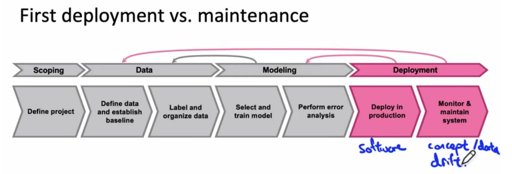

The practices for initial deployments differ significantly from those for updating or maintaining an already-deployed system. While some engineers view deployment as the finish line, it often marks only the halfway point. Post-deployment work—such as feeding new data back into the system, updating the model, and maintaining performance amid changing data—is equally critical to ensuring long-term success.

## 4.2. Deployment Architecture

### i. Runtime Environment

A runtime environment refers to the specific configuration of software and hardware where an application, particularly a machine learning model, executes. It encompasses the operating system, libraries, dependencies, and execution engine necessary for the application to function correctly.

#### Containerization

Containerization is a lightweight, portable, and self-sufficient software package that bundles an application and all its dependencies (libraries, configuration files, and other required assets) into a single, isolated unit.

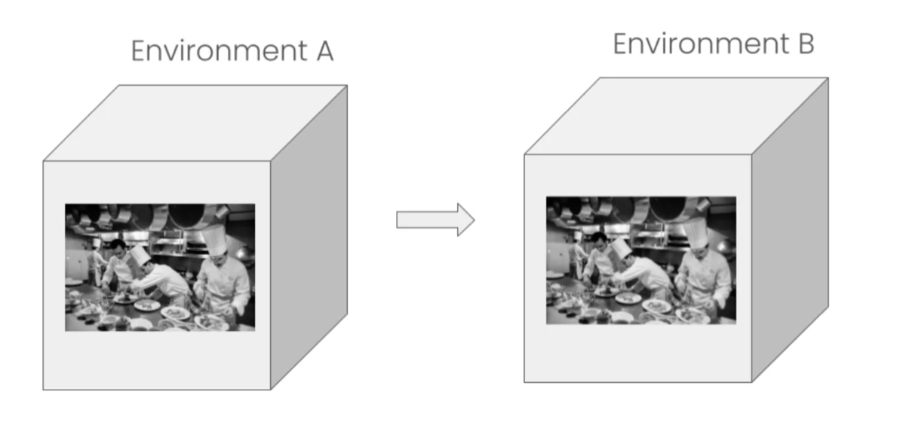

There are many benefits of containerization:

  - **Easier to Maintain:**

      - **Dependency Management:** Containers encapsulate all dependencies, eliminating "it works on my machine" problems. This simplifies debugging and ensures consistent behavior.
      - **Version Control:** You can version control container images, making it easy to roll back to previous stable versions if issues arise.
      - **Resource Isolation:** Containers provide process and resource isolation, preventing conflicts between different applications running on the same host.
  - **Portable:**

      - **"Build Once, Run Anywhere":** A container image built on one machine can run identically on any other machine that has a container runtime (like Docker or containerd). This applies across development, testing, staging, and production environments, regardless of the underlying infrastructure (on-premises, cloud, hybrid).
      - **Cloud Agnostic:** Facilitates deployment to various cloud providers (AWS, Azure, GCP, etc.) without significant reconfigurations.
  - **Fast to Start Up:**

      - **Lightweight:** Unlike virtual machines, containers share the host OS kernel, making them much lighter and faster to boot. They only contain the application and its specific dependencies, not an entire operating system.
      - **Efficient Resource Utilization:** Their lightweight nature means they consume fewer resources (CPU, RAM) compared to VMs, allowing for higher density of applications on the same hardware.

**Key Technologies:**

  - **Docker:** The most popular platform for building, sharing, and running containers.
  - **Kubernetes (K8s):** An open-source system for automating deployment, scaling, and management of containerized applications. It orchestrates containers across a cluster of machines.

### ii. Microservices Architecture

**Microservices architecture** is an architectural style that structures an application as a collection of loosely coupled, independently deployable services. Each service represents a specific business capability and can be developed, deployed, and scaled independently.

Monolithic vs. Microservices architecture

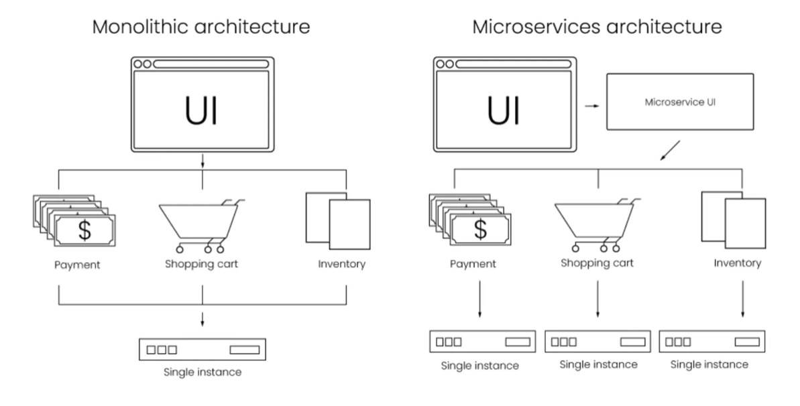

#### Inferencing

**Inferencing (or Prediction)** is the process in which we send new, unseen input data to a trained machine learning model and receive an output or prediction from the model. This is the "production" phase where the model's learned patterns are applied to solve real-world problems.

  - **Input Data:** Can be diverse, e.g., an image for an object detection model, text for a sentiment analysis model, or tabular data for a fraud detection model.
  - **Model Execution:** The trained model's internal logic and parameters are applied to the input data.
  - **Output:** The model generates a prediction, classification, regression value, or other relevant output based on its training.

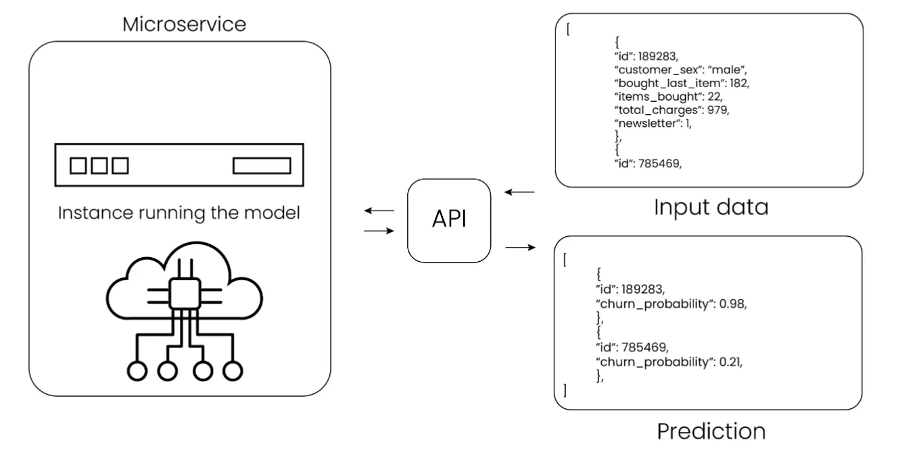

**Example:**

  - Sending an image of a cat to a trained image classification model and receiving "cat" as the output.
  - Inputting customer demographics to a churn prediction model to get a probability of churn.

#### APIs

An API (Application Programming Interface) is a set of rules and protocols that allows different software applications to communicate and interact with each other. In the context of machine learning in production, APIs are crucial for exposing trained models so that other applications or services can consume their predictions.

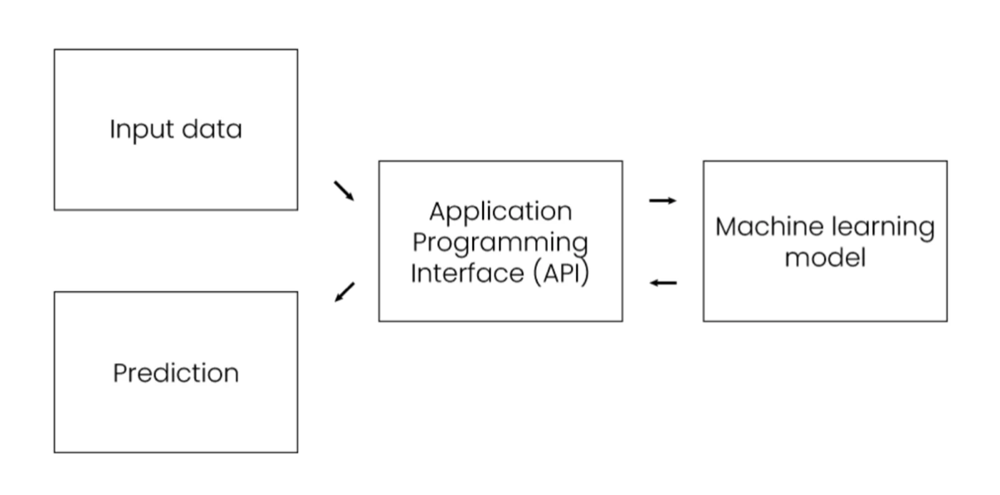

**Key Aspects of APIs for ML Models:**

  - **Standardized Access:** APIs provide a defined contract (endpoints, request/response formats, authentication) for interacting with the model, abstracting away the underlying complexity of the model's implementation.
  - **Integration:** They enable seamless integration of ML models into existing applications, websites, mobile apps, or other backend systems.
  - **RESTful APIs (Representational State Transfer):** The most common type of web API for ML model serving. They use standard HTTP methods (GET, POST, PUT, DELETE) to perform operations.

      - For ML inferencing, a common pattern is to use a POST request to send input data to an endpoint and receive the prediction in the response body (often JSON format).
  - **RPC (Remote Procedure Call):** Another API style where a client executes a function or procedure in a different address space (e.g., on a server) as if it were a local call. gRPC is a popular RPC framework often used for high-performance ML inference.
  - **API Gateway:** Often used in production to manage, secure, and monitor API calls to various microservices, including ML models. It can handle authentication, rate limiting, logging, and routing.

By using APIs, data scientists can focus on building and training models, while software engineers can easily integrate these models into user-facing applications without needing deep knowledge of the ML model's internal workings.

## 4.3. Common Deployment Patterns

When deploying a machine learning (ML) model, several common patterns emerge based on the context and goals of the project. These patterns often incorporate gradual rollouts, monitoring, and rollback mechanisms to ensure reliability.

### i. Deployment Cases

There are 3 common deployment cases overall:

#### New Product or Capability

This deployment scenario applies when introducing a product or capability not previously offered. For example, launching a new speech recognition service might involve starting with a small amount of traffic and gradually increasing it as performance is validated.

#### Automating or Assisting Human Task

This use case involves tasks currently performed by humans that you aim to automate or assist using a learning algorithm. For instance, if factory workers inspect smartphones for scratches, a learning algorithm could assist or fully automate this process. Since humans already perform the task, additional deployment options, such as shadow mode, become viable.

#### Upgrading an Existing ML System

This scenario occurs when replacing an existing ML system with an improved version. The goal is to transition smoothly to the new system while maintaining or enhancing performance.

At the same time, there are two recurring themes in these deployment cases:

  - **Gradual Ramp-Up with Monitoring**: Instead of directing all traffic to an unproven algorithm, start with a small percentage of traffic, monitor performance, and incrementally increase the load as confidence grows.
  - **Rollback Capability**: If the new system underperforms, the ability to revert to the previous system ensures minimal disruption.

### ii. Deployment Types

There are 3 common deployment types overall:

#### Shadow Mode Deployment

When humans initially perform a task, shadow mode is a common deployment strategy. In this approach, the ML algorithm runs in parallel with the human inspector, but its outputs do not influence decisions. For example, in smartphone inspection:

  - For a phone with no defects, both the human and algorithm might agree it is fine.
  - For a phone with a large scratch, both might agree it is defective.
  - For a phone with a small scratch, the human might label it defective, but the algorithm could mistakenly classify it as fine.

Shadow mode allows you to collect data on the algorithm’s performance compared to human judgment, enabling you to assess its accuracy before allowing it to make real decisions. This approach is highly effective for validating an algorithm’s reliability.

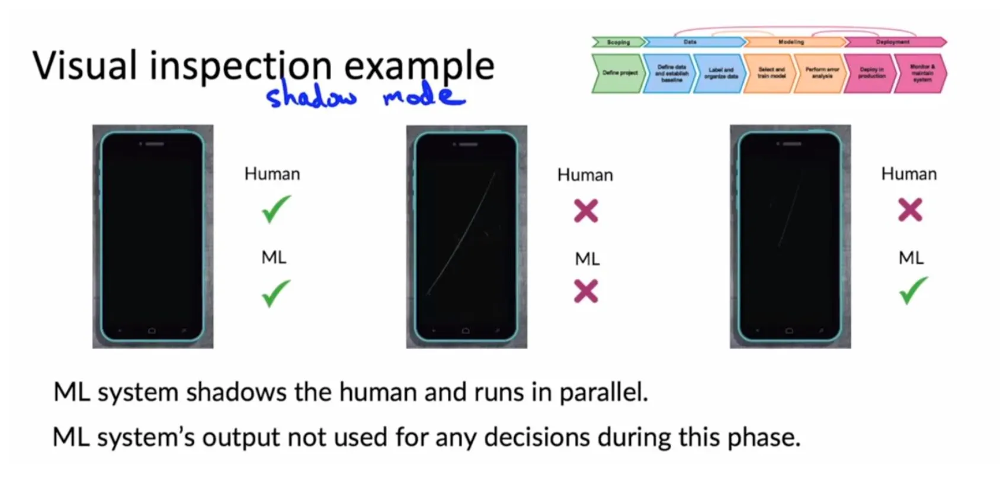

#### Canary Deployment

In a canary deployment, the algorithm is rolled out to a small fraction of traffic (e.g., 5% or less) to make real decisions. By limiting the scope, any errors affect only a small portion of users, allowing for close monitoring. Traffic is gradually increased as confidence in the algorithm’s performance grows.

The term “canary deployment” draws from the English idiom referencing coal miners using canaries to detect gas leaks, emphasizing early problem detection to avoid significant issues in the deployment context (e.g., a factory).

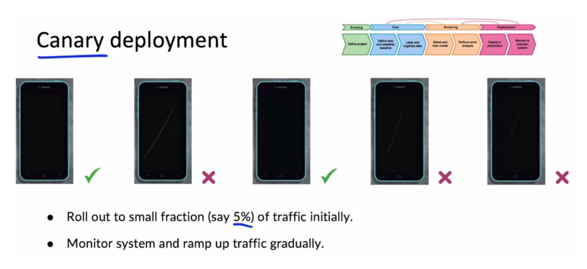

#### Blue-Green Deployment

Blue-green deployment is used when transitioning from an old system (blue) to a new one (green). For example, in a factory using camera software to collect smartphone images for visual inspection, the old software (blue) processes images initially. When ready, a router redirects traffic to the new software (green).

Typically, blue-green deployment involves switching all traffic to the green version at once, but a gradual transition is also possible. The key advantage is easy rollback: if issues arise, the router can quickly revert traffic to the blue version, provided it remains operational.

This approach ensures minimal downtime and a straightforward recovery mechanism.

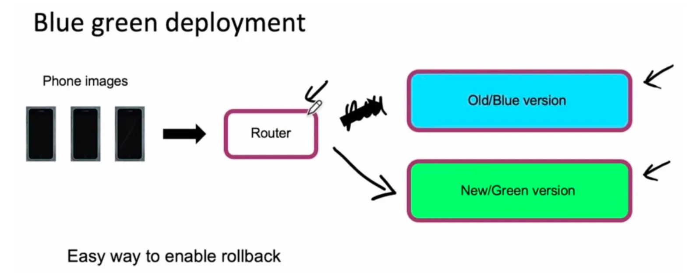

### iii. Degree of Automation Framework

Rather than viewing deployment as a binary choice (deploy or not), consider it as a spectrum of automation levels, tailored to the system’s performance and application needs. For example, in smartphone visual inspection:

  - **No Automation (Human-Only)**: Humans perform all inspections without ML involvement.
  - **Shadow Mode**: The algorithm runs in parallel, providing predictions that are not used for decisions, allowing performance evaluation.
  - **AI Assistance**: A human inspector makes final decisions, but the AI highlights potential issues (e.g., scratches) via a user interface, aiding human judgment. Effective UI design is critical for this approach.
  - **Partial Automation**: The algorithm makes decisions when highly confident (e.g., a phone is clearly fine or defective). If confidence is low, the case is escalated to a human. Human judgments in these cases provide valuable data for further training.
  - **Full Automation**: The algorithm makes all decisions without human intervention.

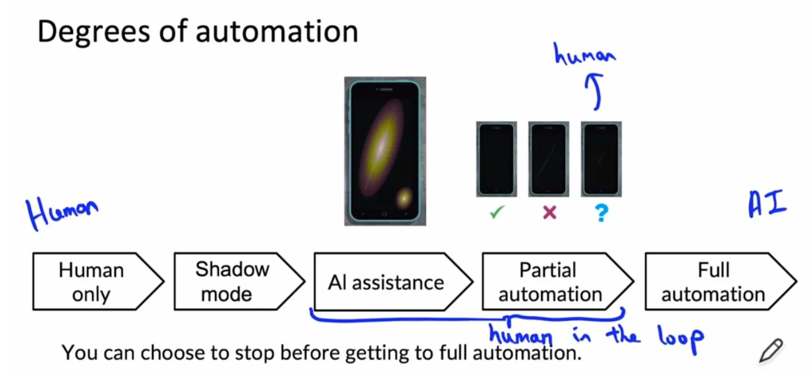

This spectrum ranges from fully human-driven to fully automated systems. Many deployments start with lower automation (e.g., shadow mode or AI assistance) and progress toward greater automation as the algorithm’s reliability improves. However, full automation is not always necessary—AI assistance or partial automation may be optimal for some applications, depending on performance and requirements.

Both AI assistance and partial automation are examples of **human-in-the-loop deployments**. While consumer internet applications (e.g., web or product searches) often require full automation due to scale, other contexts, such as factory inspections, may benefit from human-in-the-loop approaches, balancing accuracy with human expertise.

This framework of deployment patterns and automation levels provides a structured approach to designing and implementing ML systems, ensuring they are robust, adaptable, and aligned with operational goals.

### iv. Transparency and Reproducibility

This image humorously illustrates a common challenge in machine learning development. One person, holding a "gift-wrapped" model, enthusiastically requests "deploy, pls\!" from another who appears skeptical. The second person's thought bubble highlights critical questions and concerns that arise before deployment: infrastructure compatibility, transparency, reproducibility, data validation, monitoring, and debugging. This emphasizes the gap between developing a model and successfully integrating it into a production environment, underscoring the importance of addressing operational concerns early in the ML lifecycle.

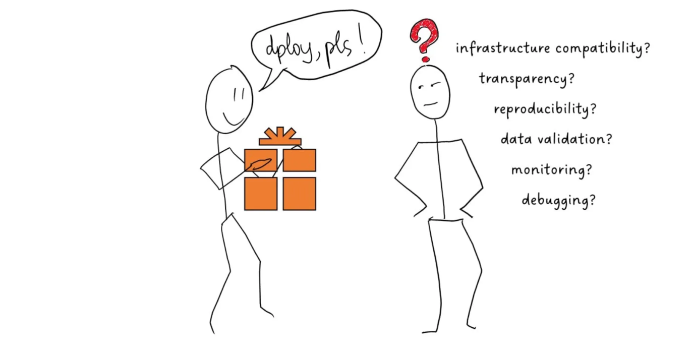

This highlights the necessity of meticulously tracking the origins and parameters of a model to ensure accountability, auditability, and the ability to reproduce results or troubleshoot issues.

The "bonus points: log experiments in metadata store" further reinforces that documenting experimental details is key to achieving both transparency and reproducibility, leading to more robust and reliable ML systems.

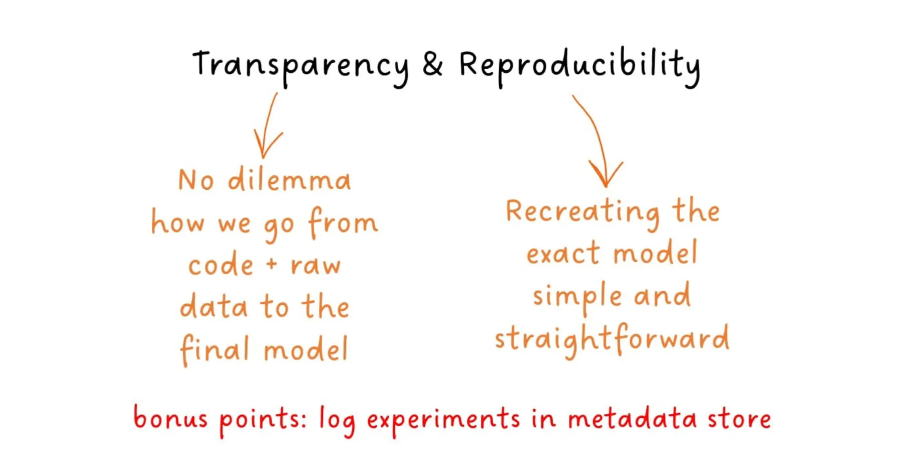

There can be a few concerns when putting a model in production, namely:

  - Input data validation - data profiles (aka data expectations)

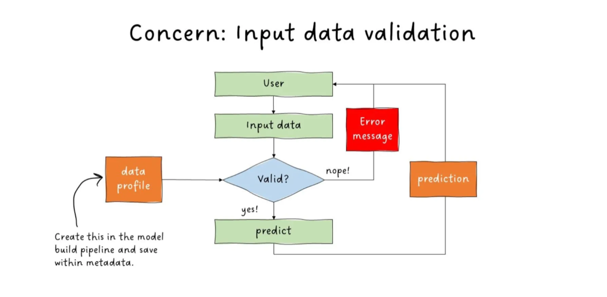

  - Performance deterioration

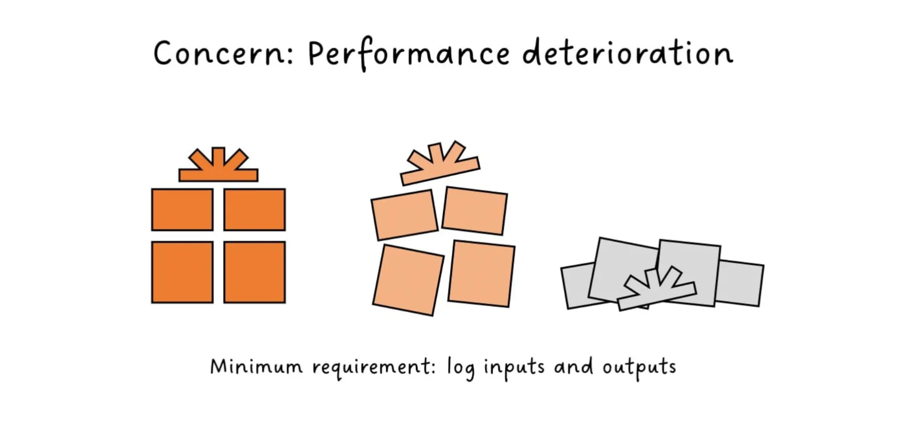

  - Debugging

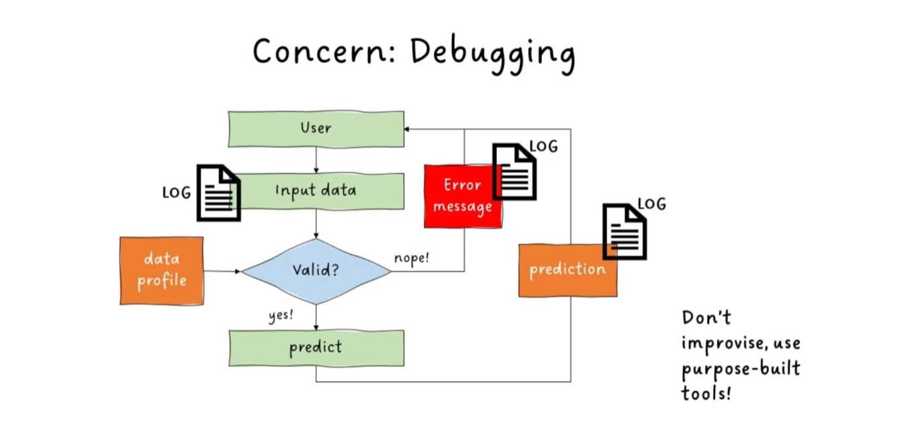

  - Testing

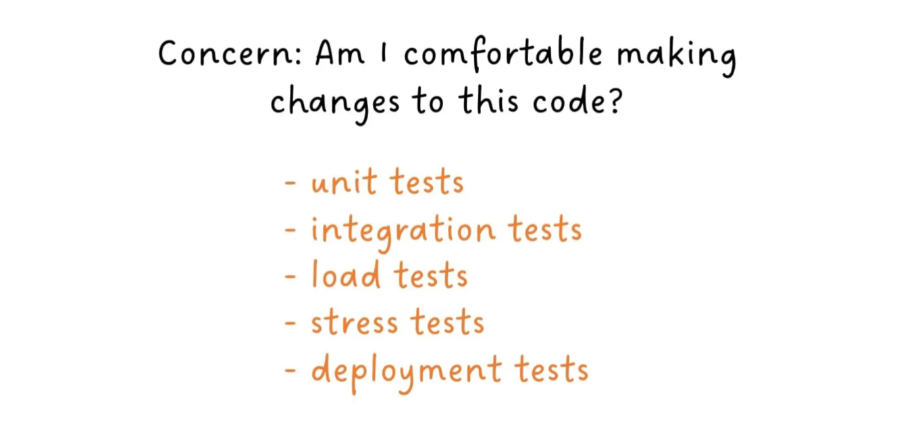

### v. Profiling, Versioning, and Feature Stores

#### Data Profiling

Automated data analysis and creation of high-level summaries (a.k.a. data profiles, expectations), used for validating and monitoring data in production.

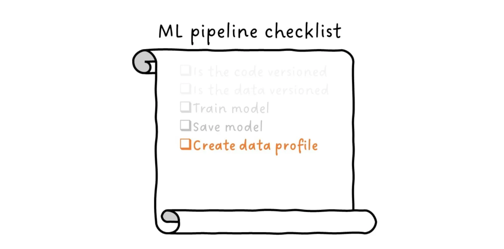

Risks of **not** using data profiles:

  - Clients complaining, although they submitted erroneous inputs to the model
  - No way to identify that data has drifted and our model is no longer valid

This image illustrates a typical ML training pipeline workflow, where raw data from a **Data Store** (like a data lake or warehouse) and model definitions from a **Code Repository** feed into an **ML Training Pipeline**. This pipeline, which should also incorporate metadata about train/test splits for better reproducibility, then generates a trained **Model** that is stored in a **Model Registry**. Crucially, it also populates a **Metadata Store** with vital information such as the dataset version and a unique "fingerprint" for verification, ensuring comprehensive lineage tracking and enabling the recreation of exact model builds.

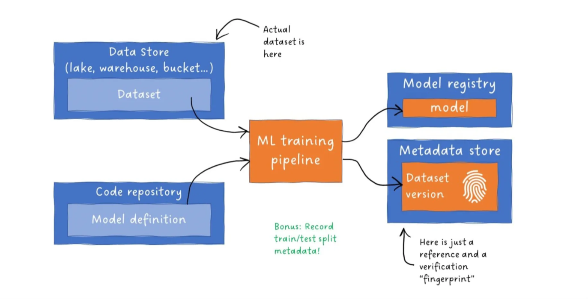

A popular tool for data profiling is great\_expectations.

#### Versioning

Versioning in machine learning engineering is the practice of systematically tracking and managing changes to all components of an ML project, including code, data, models, and hyperparameters, over time. Unlike traditional software development where Git excels at versioning code, ML projects involve large datasets and model artifacts that Git cannot efficiently handle.

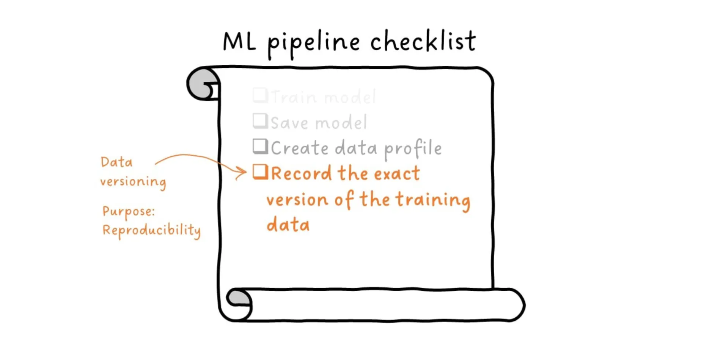

Tools like DVC (Data Version Control) extend Git's capabilities by providing a lightweight mechanism to version large files and directories by storing their metadata (like checksums) in Git, while the actual data resides in external storage (e.g., cloud storage, local drives). This allows teams to precisely reproduce past experiments, revert to previous states, track data lineage, and ensure that a specific model was trained with an exact version of data and code, which is crucial for collaboration, debugging, and maintaining reliable production systems.

#### Feature Stores

A feature store in machine learning engineering is a centralized repository that standardizes the management, storage, and serving of features for both model training and real-time inference. It acts as a bridge between data engineering and data science, allowing for the consistent definition, computation, and reuse of features across different models and teams, thereby preventing training-serving skew (where features used for training differ from those used in production). Typically, a feature store includes an offline store for historical, large-volume data used in training and an online store optimized for low-latency, single-record retrieval during live predictions, significantly streamlining the MLOps lifecycle by improving efficiency, reproducibility, and model reliability.

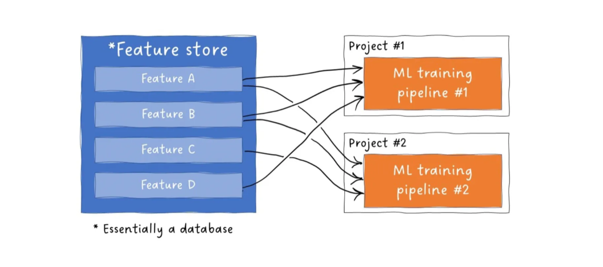

This diagram illustrates a conceptual framework for a dual database approach, commonly seen in the context of feature stores, to optimize both training and prediction phases of machine learning. During "Training time," data is sourced from "DB1: Large-volume optimized," which is designed for efficient processing of vast quantities of data by "ML training pipeline \#1" to build a model. Conversely, during "Prediction time" (also known as scoring or inference), the trained "Model" retrieves features from "DB2: Single-record optimized," which is tailored for low-latency retrieval of individual data points required for real-time predictions. This split architecture allows for specialized databases to handle the distinct data access patterns and performance requirements of ML model training and serving, effectively representing the two primary components of a feature store: an offline store for batch training and an online store for real-time inference.

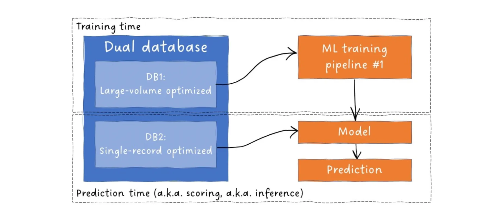

Some of its benefits include reusability and consistency.

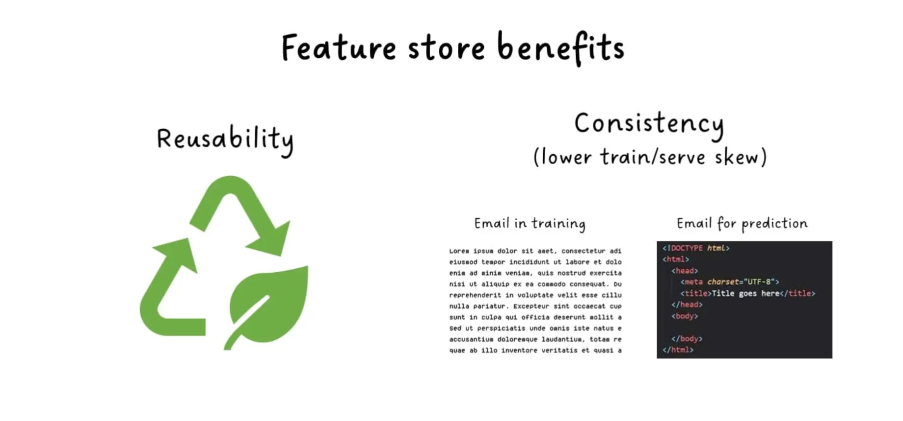

### vi. CI/CD

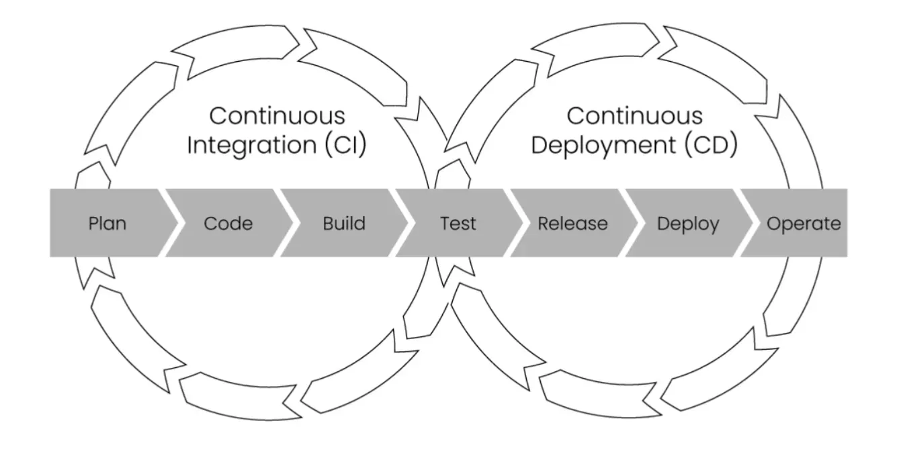

#### Model Build Pipeline

This diagram differentiates between two critical components within an MLOps framework: the "MODEL pipeline" and the "model BUILD pipeline”. This clear separation highlights that while the top section defines *what* the model does, the bottom section describes *how* the model is systematically created and saved, a crucial aspect for integration into CI/CD systems.

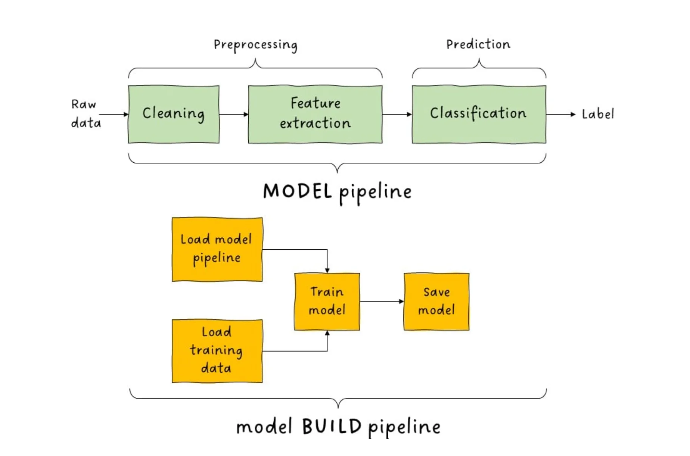

This detailed diagram expands on the "model BUILD pipeline," illustrating how it integrates with versioning and data management to create a robust "Model package" suitable for CI/CD. The pipeline loads both the model definition (from a code repository, with "code versioning" ensuring traceability) and training data (from a data store, with "data versioning" and "data profiles" ensuring data lineage and quality). After training and saving the model, the resulting "Model package" encompasses the model itself along with crucial metadata for "deployment," "reproducibility," and "monitoring." This holistic view emphasizes that a successful model build pipeline in CI/CD is not just about training, but also about meticulously packaging all necessary components and metadata to enable reliable and repeatable operations.

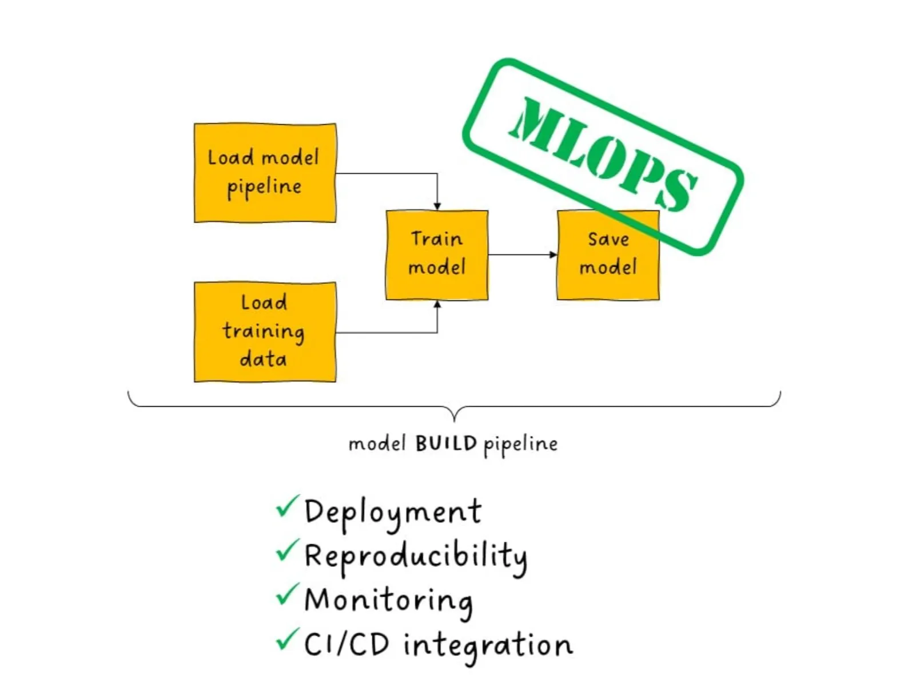

This image succinctly introduces the "model BUILD pipeline" as a fundamental component under the umbrella of "MLOPS," signifying its importance in operationalizing machine learning. The pipeline's core steps involve loading the model definition, loading training data, training the model, and finally saving the trained model. Crucially, the image highlights the key benefits and objectives enabled by such a pipeline within a CI/CD framework: automated "Deployment," ensuring "Reproducibility" of results, enabling continuous "Monitoring" of model performance, and seamless "CI/CD integration." This demonstrates that a well-structured model build pipeline is essential for achieving the automation, reliability, and governance required for effective MLOps.

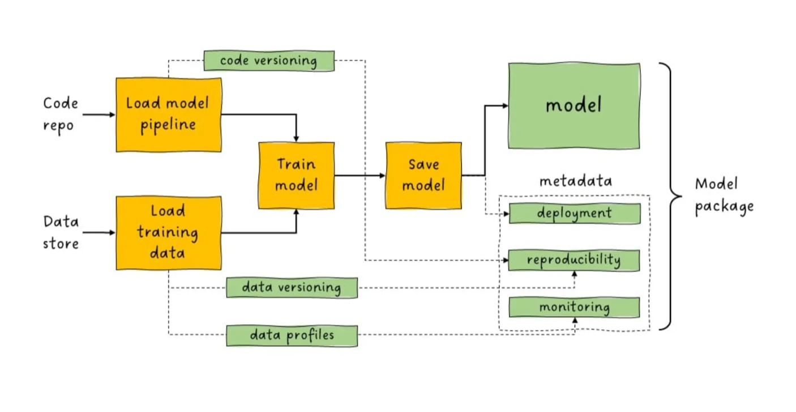

This image provides a high-level overview of the inputs and outputs of a "model BUILD pipeline" within a CI/CD context. The pipeline centrally orchestrates the process by drawing "code" from a central code repository, "raw data" from various data stores, and pre-engineered features from a "feature store." Once the build process is complete, the pipeline's outputs are a trained "model," which is then registered in a dedicated "model registry," and comprehensive "metadata" that is stored in a metadata store. This structured flow ensures that all necessary components are systematically gathered and that the resulting model and its associated build information are properly managed for deployment and future reference within an automated CI/CD environment.

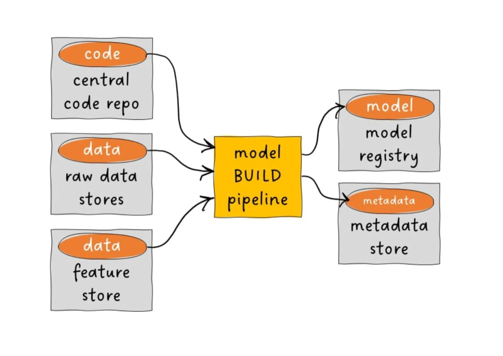

#### APIs

An API

### v. Five

## 4.4. Monitoring

To ensure a machine learning (ML) system meets performance expectations, continuous monitoring is essential. The most common approach is to use dashboards to track key metrics over time, providing insights into system health and performance.

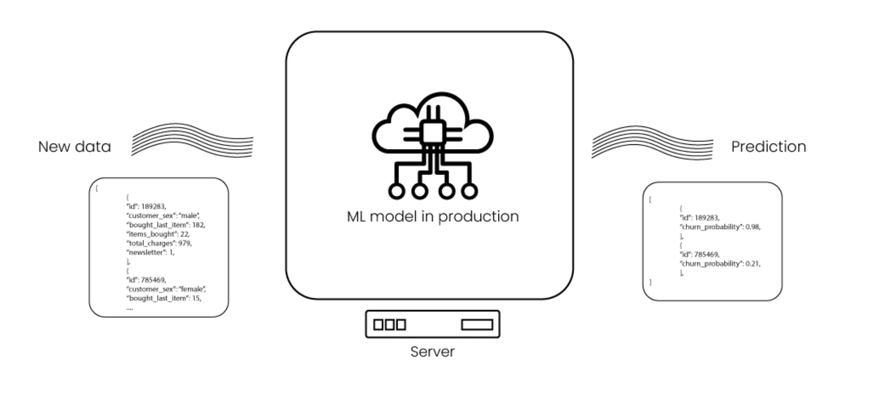

  - Is the model server running?
  - Are the model inputs and outputs as expected?
  - Also known as post-deployment monitoring

### i. Dashboard Monitoring

Dashboards should be tailored to the specific application, tracking metrics relevant to its operation. Examples include:

  - **Server Load**: Monitors computational resource usage to detect overloading.
  - **Fraction of Non-Null Outputs**: For a speech recognition system, a null output occurs when no speech is detected. A significant change in the frequency of null outputs may signal an issue.
  - **Fraction of Missing Inputs**: Common in structured data tasks, this metric tracks incomplete or missing input data, which could indicate data quality issues.

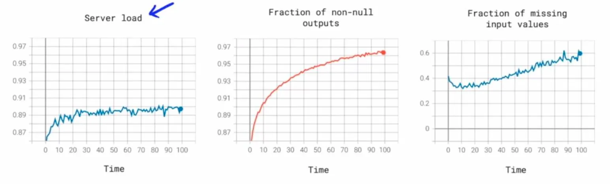

To determine what to monitor, follow these steps:

1.  **Brainstorm Potential Issues**: Collaborate with your team to identify everything that could go wrong with the system.
2.  **Design Metrics**: For each potential issue, define statistics or metrics to detect it. For example, if you’re concerned about traffic spikes overloading the service, track server load as a key metric.

### ii. Types of Monitoring

A. **Statistical Monitoring:** focuses on the input and output data, including predictions. Examples: customer X has a 72% probability of churning, customer Y has a 31% probability of not churning.

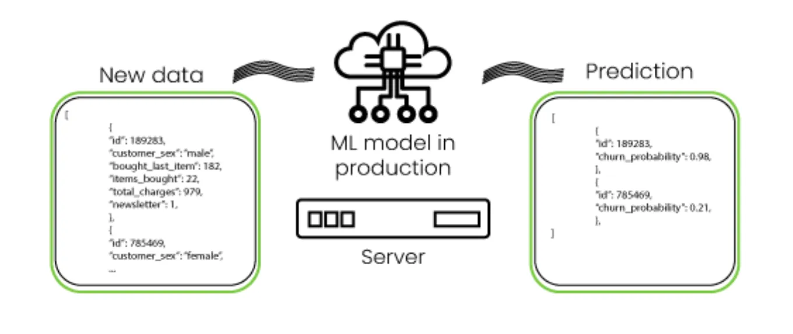

B. **Computational Monitoring:** Focuses on technical metrics. Examples: server CPU usage, number of incoming requests, number of predictions, downtime of server.

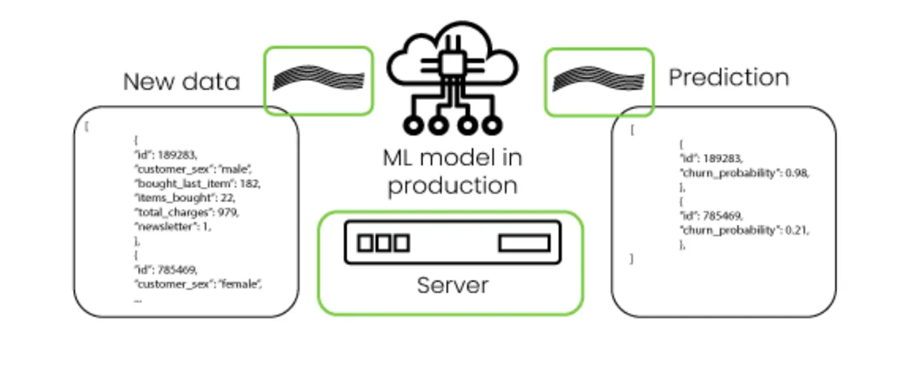

**Feedback Loop:** The process through which the ground truth is used to improve the machine learning model.

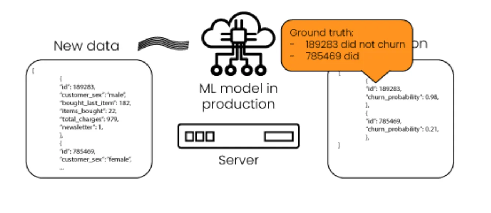

### iii. Types of Metrics

Metrics fall into two broad categories:

1.  **Software Metrics**: These assess the health of the software implementation, including:

      - Memory usage
      - Compute resources
      - Latency
      - Throughput
      - Server load Many MLOps tools automatically track these metrics.
2.  **Statistical Metrics**: These evaluate the learning algorithm’s performance and are divided into:

      - **Input Metrics**: Monitor changes in the input distribution (X). For example:

          - In a speech recognition system, track the average length of audio clips. A shift in this metric could indicate a change in user behavior or hardware (e.g., new microphones) that might affect performance.
          - For structured data, monitor the percentage of missing values.
          - In manufacturing visual inspection, track average image brightness to detect changes in lighting conditions.
      - **Output Metrics**: Assess the algorithm’s outputs to gauge performance. For example:

          - In speech recognition, monitor the frequency of null outputs (e.g., when no speech is detected).
          - For voice-based web search, track how often users repeat similar searches in quick succession, which may indicate misrecognition of the initial query.
          - Monitor instances where users switch from voice to typing, suggesting frustration or degraded performance.

Since input and output metrics are application-specific, MLOps tools typically require custom configuration to track them effectively.

### iv. Iterative Monitoring Process

Like ML modeling, deployment is an iterative process. Initial dashboards and metrics are a starting point, but real-world data from live traffic enables performance analysis and system refinement. Key considerations:

  - **Evolving Metrics**: It’s common to deploy a system with an initial set of metrics, only to discover new issues after weeks of operation. You may need to add new metrics to address unforeseen problems or remove metrics that prove uninformative.
  - **Thresholds and Alarms**: Set thresholds for metrics to trigger alerts. For example, if server load exceeds 0.91, an alarm could notify the team to investigate and potentially scale up resources. Adjust thresholds over time to focus on the most relevant issues.
  - **Responding to Issues**:

      - **Software Issues**: High server load may require changes to the software implementation.
      - **Performance Issues**: Accuracy or statistical problems may necessitate model updates or retraining.
  - **Retraining**: Models often require periodic maintenance. Retraining can be:

      - **Manual**: Engineers manually retrain the model, which is more common.
      - **Automatic**: Some systems, particularly in consumer internet applications, support automatic retraining, though this is less common due to concerns about fully autonomous updates.
      - **How often to retrain?**

          - Business environment: how volatile is the data?
          - Cost: how much does it cost to retrain?
          - Business requirements: what is the required model performance?

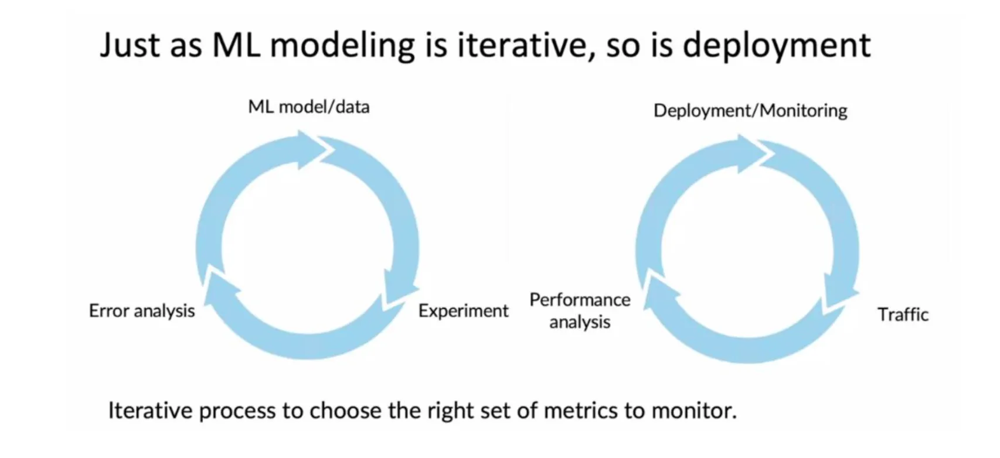

Monitoring enables early detection of issues, prompting deeper error analysis or data collection to update the model and maintain or improve performance.

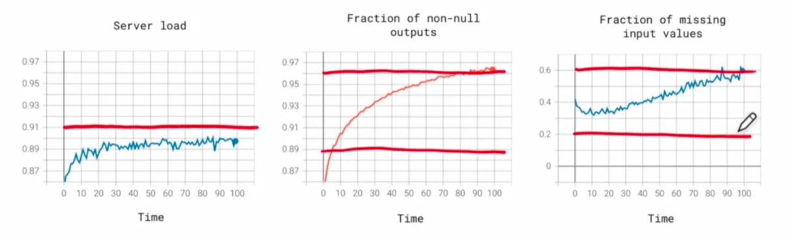

### v. Pipeline Monitoring

Many AI systems involve complex pipelines with multiple components, not just a single ML model. For example, a speech recognition system typically includes:

  - **Voice Activity Detection (VAD) Module**: Identifies when someone is speaking, clipping audio to include only relevant segments before streaming to the cloud. This reduces bandwidth usage.
  - **Speech Recognition Module**: Generates the text transcript from the clipped audio.

Changes in one component can impact downstream performance. For instance, if a new smartphone microphone alters audio characteristics, the VAD module might clip audio differently (e.g., including more or less silence). This changes the input to the speech recognition module, potentially degrading its performance.

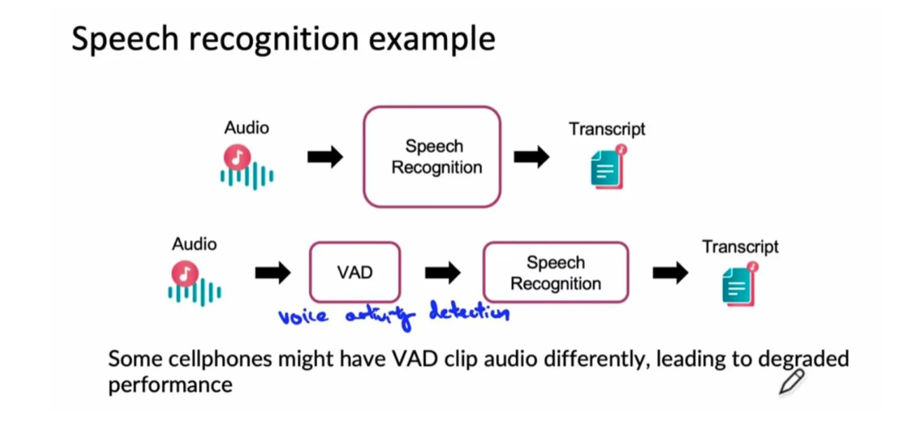

Another example involves user profiles:

  - A system uses clickstream data to build user profiles, predicting attributes like whether a user owns a car to inform decisions (e.g., offering car insurance).
  - These profiles feed into a recommender system that generates product recommendations.
  - If the clickstream data changes (e.g., due to shifts in user behavior), the user profile’s accuracy may decline, increasing “unknown” labels for attributes like car ownership. This altered input can degrade the recommender system’s performance.

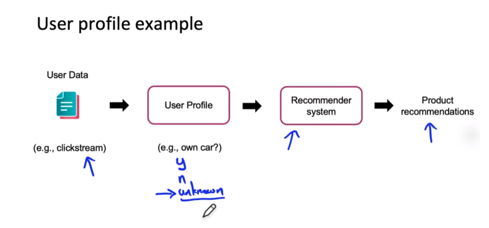

**Monitoring Complex Pipelines**

To monitor complex pipelines (≥ 2) effectively:

  - **Brainstorm Metrics for Each Component**: Identify potential issues for each pipeline stage, including concept drift (changes in the X-to-Y mapping) and data drift (changes in X distribution). Design metrics to detect these issues.
  - **Track Software and Statistical Metrics**:

      - Monitor software metrics (e.g., memory, latency) for individual components or the entire pipeline.
      - Track input and output metrics for each component to detect changes in data or performance.
  - **Apply the Brainstorming Principle**: As with single-model systems, brainstorm everything that could go wrong across the pipeline and design metrics to track those risks.

### vi. Rate of Data Change

The speed at which data changes varies by application:

  - **Slow Changes**: In face recognition, people’s appearances evolve gradually due to fashion or aging. Higher-resolution cameras may improve image quality over time, but these shifts are typically slow.
  - **Rapid Changes**: In manufacturing, a factory switching to a new material for smartphones can instantly alter their appearance, requiring immediate model updates.
  - **General Trends**:

      - **Consumer Data**: In consumer-facing businesses with large user bases, data tends to change slowly. It’s rare for millions of users to alter their behavior simultaneously, though exceptions like COVID-19 (which shifted online shopping patterns) can cause rapid changes.
      - **B2B/Enterprise Data**: Business data can shift quickly. For example, a factory adopting a new phone coating or a CEO changing operational strategies can abruptly alter the dataset.

While these are general observations with exceptions, they provide a framework for anticipating the rate of data change in your application.

## 4.5. Case Study: Defect Inspection in Manufacturing

Automated visual defect inspection is a widely adopted process in modern manufacturing, particularly in the production of smartphones. This system utilizes advanced software and machine learning models to ensure product quality and reliability during the manufacturing process.

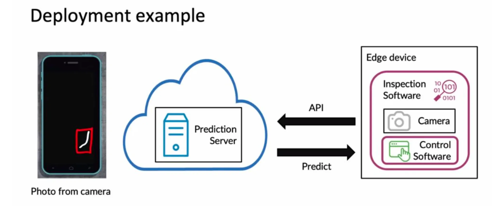

### **Process Overview**

The inspection process is initiated by specialized software that controls a camera stationed along the manufacturing line. As smartphones are assembled, the camera captures high-resolution images of each device. These images are subsequently transmitted to a prediction server through an Application Programming Interface (API) call. The prediction server, equipped with a machine learning model trained to detect defects, analyzes the images and assesses whether each smartphone meets established quality standards.

### **Prediction Server Functionality**

The prediction server is a central component of the system. It receives images from the manufacturing line via API calls, processes them using the machine learning model, and returns a prediction indicating whether a smartphone is defective. Depending on the manufacturing environment's requirements, the server may be hosted in the cloud, offering scalability and accessibility, or deployed at the edge—operating locally within the factory. Edge deployment is frequently utilized in manufacturing settings due to its ability to maintain functionality during interruptions in internet connectivity, ensuring uninterrupted operation.

### **Decision Making and Control**

Upon receiving the prediction from the server, the inspection control software evaluates the result and makes real-time decisions regarding the manufacturing process. If a smartphone is identified as defective, the software may initiate actions such as diverting the device from the production line or marking it for additional review. This automated decision-making capability enhances operational efficiency and minimizes the potential for human error.

## 4.6. Automation and Scaling

### i. Design

**Project Design**

  - Project design remains a manual process
  - Use templates to automate and scale

**Data acquisition**

  - Can be automated
  - Enables high data quality

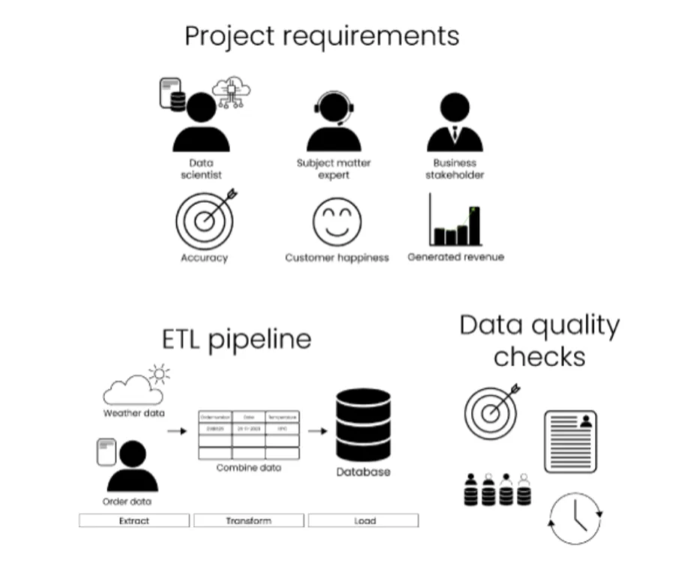

### ii. Development

**Feature Store**

  - Saves time building the same features
  - Helps to scale

**Experiment tracking**

  - Automates tracking
  - Ensures reproducibility

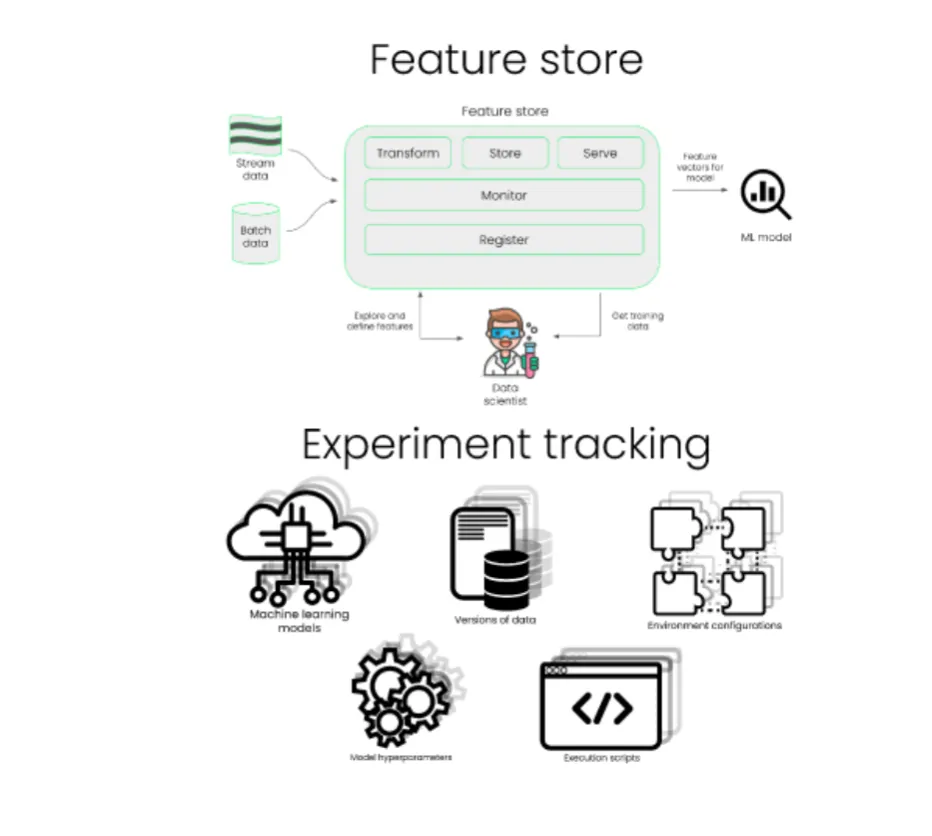

### iii. Deployment

**Containerization**

  - Easy to start up copies of the same application
  - Improves scalability

**CI/CD pipeline**

  - Automates development and deployment
  - Increases velocity of processes

**Microservices architecture**

  - Improves scalability
  - Independent development and deployment

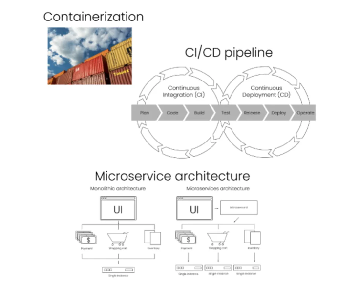
