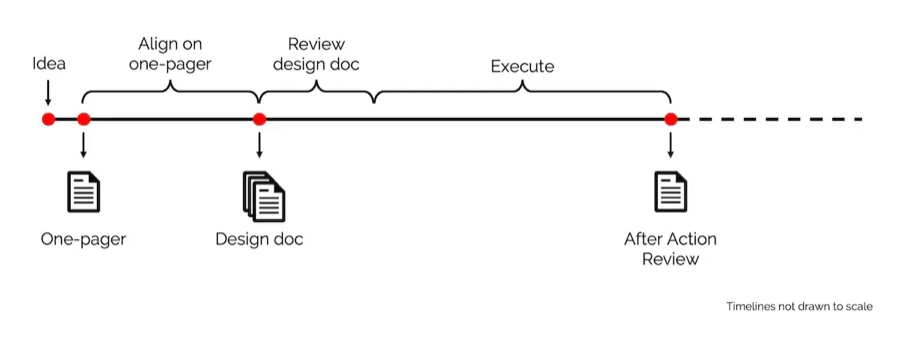
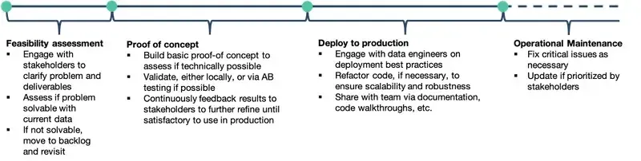

# 5. Templates

Write three types of documents when building/operating a system. The first two help to get alignment and feedback; the last is used to reflect—all three assist with thinking deeply and improving outcomes.

**One-pagers:** I use these to achieve alignment with business/product stakeholders. Also used as background memos for quarterly/yearly prioritization. In a single page, they should allow readers to quickly understand the problem, expected outcomes, proposed solution, and high-level approach. Extremely useful to reference when you’re deep in the weeds of a project, or encounter scope creep.

**Design docs:** I use these to get feedback from fellow scientists and engineers. They help identify design issues early in the process. Furthermore, you can iterate on design docs more rapidly than on systems, especially if said systems are already in production. It usually covers methodology and system design, and includes experiment results and technical benchmarks (if available).

Design docs are more commonly seen in engineering projects; not so much for data science/machine learning. Nonetheless, I’ve found it invaluable for building better ML systems and products.

**After-action reviews:** I use these to reflect after shipping a project, or after a major error. If it’s a project review, we cover what went well (and not so well), follow-up actions, and how to do better next time. It’s like a [scrum retrospective](https://eugeneyan.com/writing/what-i-love-about-scrum-for-data-science/#retrospectives-feedback-loop-for-improvement), except with more time to think and written as a document. The knowledge can then be shared with other teams.

If it’s an error review (e.g., the system goes down), we diagnose the root cause and identify follow-up actions to prevent reoccurrence. Nowhere do we blame individuals. The intent is to discuss what we can do better and share the (sometimes painful) lessons with the greater organization. Amazon calls these [Correction of Errors](https://wa.aws.amazon.com/wat.concept.coe.en.html); here’s how it [looks like](https://github.com/JDHarris007/coe/blob/master/CoE.md).

Usually, we start with a **feasibility assessment**. With our existing data and technology, are we able to solve the problem? If so, to what extent? In this stage, we aim for a quick and dirty investigation. I usually time-box this at 1-2 weeks.

After determining feasibility, we proceed with a **proof of concept** (POC). In this stage, we *hack* together a prototype to assess if our solution is technically achievable. Ideally, we also test the integration points with upstream data providers and downstream consumers. Can we meet the technical constraints (e.g., latency, throughput)? Is model performance satisfactory? This usually takes a month or two.

If all goes well, we then **develop for production**. We’ll want to time-box this too. An overly generous timeline can lead to non-essential features being squeezed in and never-ending development—without actually deploying it, no one benefits from it. This usually takes 3-6 months, including infra, job orchestration, testing, monitoring, documentation, etc.
