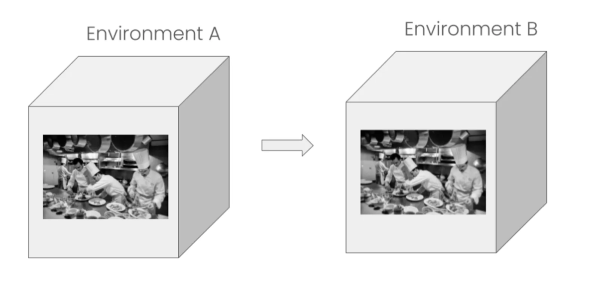
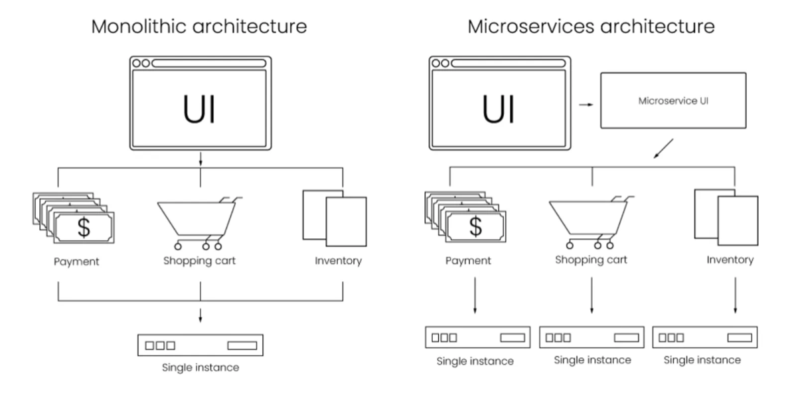
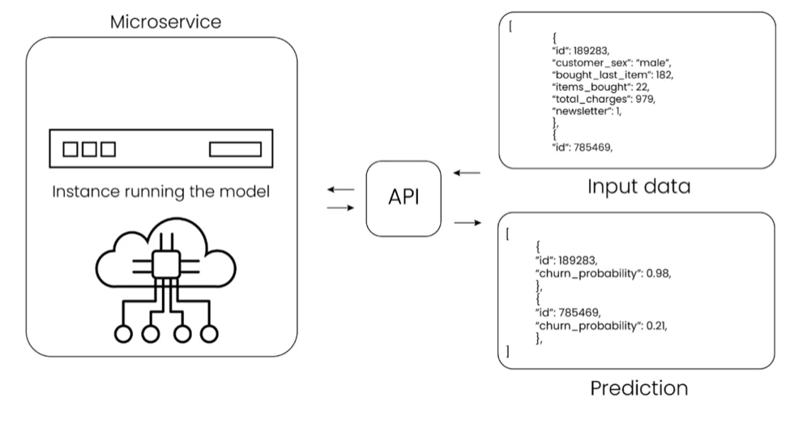
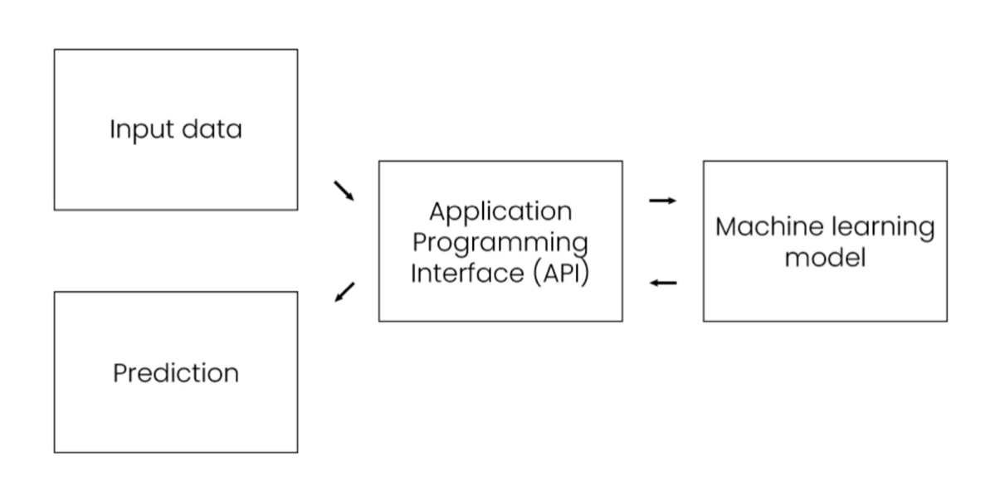

# 4.2 Deployment Architecture

## i. Runtime Environment

A runtime environment refers to the specific configuration of software and hardware where an application, particularly a machine learning model, executes. It encompasses the operating system, libraries, dependencies, and execution engine necessary for the application to function correctly.

### Containerization

Containerization is a lightweight, portable, and self-sufficient software package that bundles an application and all its dependencies (libraries, configuration files, and other required assets) into a single, isolated unit.

There are many benefits of containerization:

  - **Easier to Maintain:**

      - **Dependency Management:** Containers encapsulate all dependencies, eliminating "it works on my machine" problems. This simplifies debugging and ensures consistent behavior.
      - **Version Control:** You can version control container images, making it easy to roll back to previous stable versions if issues arise.
      - **Resource Isolation:** Containers provide process and resource isolation, preventing conflicts between different applications running on the same host.
  - **Portable:**

      - **"Build Once, Run Anywhere":** A container image built on one machine can run identically on any other machine that has a container runtime (like Docker or containerd). This applies across development, testing, staging, and production environments, regardless of the underlying infrastructure (on-premises, cloud, hybrid).
      - **Cloud Agnostic:** Facilitates deployment to various cloud providers (AWS, Azure, GCP, etc.) without significant reconfigurations.
  - **Fast to Start Up:**

      - **Lightweight:** Unlike virtual machines, containers share the host OS kernel, making them much lighter and faster to boot. They only contain the application and its specific dependencies, not an entire operating system.
      - **Efficient Resource Utilization:** Their lightweight nature means they consume fewer resources (CPU, RAM) compared to VMs, allowing for higher density of applications on the same hardware.

**Key Technologies:**

  - **Docker:** The most popular platform for building, sharing, and running containers.
  - **Kubernetes (K8s):** An open-source system for automating deployment, scaling, and management of containerized applications. It orchestrates containers across a cluster of machines.

## ii. Microservices Architecture

**Microservices architecture** is an architectural style that structures an application as a collection of loosely coupled, independently deployable services. Each service represents a specific business capability and can be developed, deployed, and scaled independently.

Monolithic vs. Microservices architecture

### Inferencing

**Inferencing (or Prediction)** is the process in which we send new, unseen input data to a trained machine learning model and receive an output or prediction from the model. This is the "production" phase where the model's learned patterns are applied to solve real-world problems.

  - **Input Data:** Can be diverse, e.g., an image for an object detection model, text for a sentiment analysis model, or tabular data for a fraud detection model.
  - **Model Execution:** The trained model's internal logic and parameters are applied to the input data.
  - **Output:** The model generates a prediction, classification, regression value, or other relevant output based on its training.

**Example:**

  - Sending an image of a cat to a trained image classification model and receiving "cat" as the output.
  - Inputting customer demographics to a churn prediction model to get a probability of churn.

### APIs

An API (Application Programming Interface) is a set of rules and protocols that allows different software applications to communicate and interact with each other. In the context of machine learning in production, APIs are crucial for exposing trained models so that other applications or services can consume their predictions.

**Key Aspects of APIs for ML Models:**

  - **Standardized Access:** APIs provide a defined contract (endpoints, request/response formats, authentication) for interacting with the model, abstracting away the underlying complexity of the model's implementation.
  - **Integration:** They enable seamless integration of ML models into existing applications, websites, mobile apps, or other backend systems.
  - **RESTful APIs (Representational State Transfer):** The most common type of web API for ML model serving. They use standard HTTP methods (GET, POST, PUT, DELETE) to perform operations.

      - For ML inferencing, a common pattern is to use a POST request to send input data to an endpoint and receive the prediction in the response body (often JSON format).
  - **RPC (Remote Procedure Call):** Another API style where a client executes a function or procedure in a different address space (e.g., on a server) as if it were a local call. gRPC is a popular RPC framework often used for high-performance ML inference.
  - **API Gateway:** Often used in production to manage, secure, and monitor API calls to various microservices, including ML models. It can handle authentication, rate limiting, logging, and routing.

By using APIs, data scientists can focus on building and training models, while software engineers can easily integrate these models into user-facing applications without needing deep knowledge of the ML model's internal workings.
