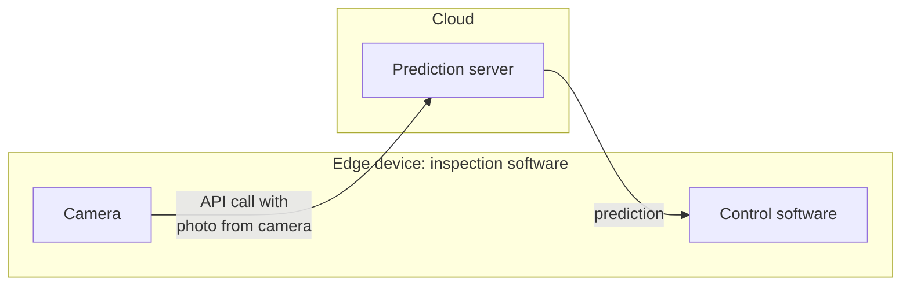

# 4.6 Case Study: Defect Inspection in Manufacturing

Automated visual defect inspection is a widely adopted process in modern manufacturing, particularly in the production of smartphones. This system utilizes advanced software and machine learning models to ensure product quality and reliability during the manufacturing process.

*The inspection software on the edge device sends each photo to the prediction server through an API and acts on the prediction it gets back. Adapted from DeepLearning.AI, MLOps Specialization.*

## Process Overview

The inspection process is initiated by specialized software that controls a camera stationed along the manufacturing line. As smartphones are assembled, the camera captures high-resolution images of each device. These images are subsequently transmitted to a prediction server through an Application Programming Interface (API) call. The prediction server, equipped with a machine learning model trained to detect defects, analyzes the images and assesses whether each smartphone meets established quality standards.

## Prediction Server Functionality

The prediction server is a central component of the system. It receives images from the manufacturing line via API calls, processes them using the machine learning model, and returns a prediction indicating whether a smartphone is defective. Depending on the manufacturing environment's requirements, the server may be hosted in the cloud, offering scalability and accessibility, or deployed at the edge—operating locally within the factory. Edge deployment is frequently utilized in manufacturing settings due to its ability to maintain functionality during interruptions in internet connectivity, ensuring uninterrupted operation.

## Decision Making and Control

Upon receiving the prediction from the server, the inspection control software evaluates the result and makes real-time decisions regarding the manufacturing process. If a smartphone is identified as defective, the software may initiate actions such as diverting the device from the production line or marking it for additional review. This automated decision-making capability enhances operational efficiency and minimizes the potential for human error.
