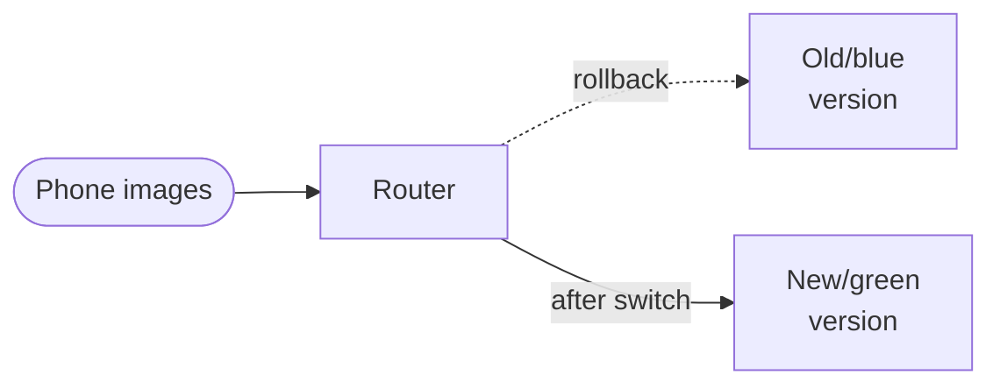
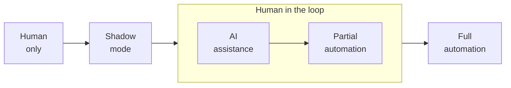

# 4.3 Common Deployment Patterns

When deploying a machine learning (ML) model, several common patterns emerge based on the context and goals of the project. These patterns often incorporate gradual rollouts, monitoring, and rollback mechanisms to ensure reliability.

## i. Deployment Cases

There are 3 common deployment cases overall:

### New Product or Capability

This deployment scenario applies when introducing a product or capability not previously offered. For example, launching a new speech recognition service might involve starting with a small amount of traffic and gradually increasing it as performance is validated.

### Automating or Assisting Human Task

This use case involves tasks currently performed by humans that you aim to automate or assist using a learning algorithm. For instance, if factory workers inspect smartphones for scratches, a learning algorithm could assist or fully automate this process. Since humans already perform the task, additional deployment options, such as shadow mode, become viable.

### Upgrading an Existing ML System

This scenario occurs when replacing an existing ML system with an improved version. The goal is to transition smoothly to the new system while maintaining or enhancing performance.

At the same time, there are two recurring themes in these deployment cases:

  - **Gradual Ramp-Up with Monitoring**: Instead of directing all traffic to an unproven algorithm, start with a small percentage of traffic, monitor performance, and incrementally increase the load as confidence grows.
  - **Rollback Capability**: If the new system underperforms, the ability to revert to the previous system ensures minimal disruption.

## ii. Deployment Types

There are 3 common deployment types overall:

### Shadow Mode Deployment

When humans initially perform a task, shadow mode is a common deployment strategy. In this approach, the ML algorithm runs in parallel with the human inspector, but its outputs do not influence decisions. For example, in smartphone inspection:

  - For a phone with no defects, both the human and algorithm might agree it is fine.
  - For a phone with a large scratch, both might agree it is defective.
  - For a phone with a small scratch, the human might label it defective, but the algorithm could mistakenly classify it as fine.

Shadow mode allows you to collect data on the algorithm’s performance compared to human judgment, enabling you to assess its accuracy before allowing it to make real decisions. This approach is highly effective for validating an algorithm’s reliability.

### Canary Deployment

In a canary deployment, the algorithm is rolled out to a small fraction of traffic (e.g., 5% or less) to make real decisions. By limiting the scope, any errors affect only a small portion of users, allowing for close monitoring. Traffic is gradually increased as confidence in the algorithm’s performance grows.

The term “canary deployment” draws from the English idiom referencing coal miners using canaries to detect gas leaks, emphasizing early problem detection to avoid significant issues in the deployment context (e.g., a factory).

### Blue-Green Deployment

Blue-green deployment is used when transitioning from an old system (blue) to a new one (green). For example, in a factory using camera software to collect smartphone images for visual inspection, the old software (blue) processes images initially. When ready, a router redirects traffic to the new software (green).

Typically, blue-green deployment involves switching all traffic to the green version at once, but a gradual transition is also possible. The key advantage is easy rollback: if issues arise, the router can quickly revert traffic to the blue version, provided it remains operational.

This approach ensures minimal downtime and a straightforward recovery mechanism.

*The router sends traffic to the new (green) version; switching it back to the old (blue) version is an easy rollback. Adapted from DeepLearning.AI, MLOps Specialization.*

## iii. Degree of Automation Framework

Rather than viewing deployment as a binary choice (deploy or not), consider it as a spectrum of automation levels, tailored to the system’s performance and application needs. For example, in smartphone visual inspection:

  - **No Automation (Human-Only)**: Humans perform all inspections without ML involvement.
  - **Shadow Mode**: The algorithm runs in parallel, providing predictions that are not used for decisions, allowing performance evaluation.
  - **AI Assistance**: A human inspector makes final decisions, but the AI highlights potential issues (e.g., scratches) via a user interface, aiding human judgment. Effective UI design is critical for this approach.
  - **Partial Automation**: The algorithm makes decisions when highly confident (e.g., a phone is clearly fine or defective). If confidence is low, the case is escalated to a human. Human judgments in these cases provide valuable data for further training.
  - **Full Automation**: The algorithm makes all decisions without human intervention.

*Degrees of automation, from human to AI. In partial automation, cases the model is unsure about go to a human. You can choose to stop before full automation. Adapted from DeepLearning.AI, MLOps Specialization.*

This spectrum ranges from fully human-driven to fully automated systems. Many deployments start with lower automation (e.g., shadow mode or AI assistance) and progress toward greater automation as the algorithm’s reliability improves. However, full automation is not always necessary—AI assistance or partial automation may be optimal for some applications, depending on performance and requirements.

Both AI assistance and partial automation are examples of **human-in-the-loop deployments**. While consumer internet applications (e.g., web or product searches) often require full automation due to scale, other contexts, such as factory inspections, may benefit from human-in-the-loop approaches, balancing accuracy with human expertise.

This framework of deployment patterns and automation levels provides a structured approach to designing and implementing ML systems, ensuring they are robust, adaptable, and aligned with operational goals.

## iv. Launch Decisions

A gradual rollout limits the damage while you check the new system. Whether to keep it is a separate decision, usually made with an A/B test against the current system:

  - Before the test, measure how different the new model's outputs are from production's ([3.7 iii](../development/performance-auditing.md#iii-comparing-against-production)).
  - During the test, compare the metrics you instrumented before building the model ([2.1.4 ii](../design/scoping.md#ii-instrument-metrics-before-building-the-model)), not only the objective the model optimizes.
  - The decision weighs several metrics at once, each a proxy for long-term goals. If a simple heuristic beats the model on every metric, ship the heuristic ([2.1.5 iv](../design/scoping.md#iv-launch-decisions-are-proxies-for-long-term-goals)).
  - Keep rollback ready until the decision is made.
