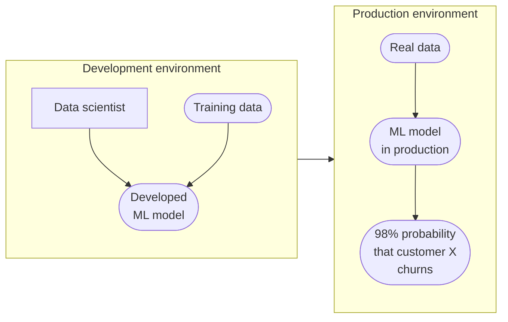
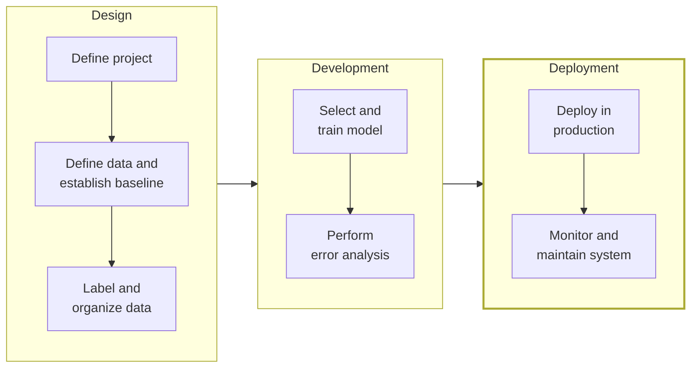

# 4.1 Key Challenges in Deployment

Development environment is different from Production environment, and this poses a few challenges.

*A data scientist builds the model from training data; in production the same model runs on real data and returns predictions.*

The trained model plus everything it needs to run (code, dependencies, configuration) makes up the **deployment package**; putting that package to use is **deployment**.

Deployment involves two primary challenge categories:

## i. Machine Learning Challenges

In this scenario, a machine learning model is trained to detect defects in smartphone images. The training data includes:

  - Images of defect-free phones.
  - Images of phones with defects, such as a big scratch across the middle, with bounding boxes drawn around the defects.

The model is designed to classify images like the defect-free phone as "okay" while identifying and localizing defects in images with scratches or other imperfections. However, when deployed in a factory setting, the model encounters images that are significantly darker due to changes in lighting conditions compared to when the training set was collected. This discrepancy between the training and deployment environments poses a challenge to the model's performance.

The issue described is an example of **concept drift** or **data drift**:

  - **Concept Drift**: Occurs when the relationship between the input data (images) and the target variable (defect presence) changes over time. In this case, altered lighting conditions affect how defects appear in images, impacting the model's ability to detect them accurately.
  - **Data Drift**: Refers to changes in the distribution of the input data itself. Here, the darker images represent a shift in the data distribution from what the model was trained on.

Both phenomena can lead to a decline in model performance if not addressed, as the model may not generalize well to the new conditions. A critical task in deployment is detecting and addressing concept and data drift. This involves monitoring the system to identify changes in data distribution and updating the model as needed to maintain performance. Changes can be gradual or sudden, and you need to be alerted of both.

**Practical implications**

This scenario highlights a common challenge in machine learning deployment: the gap between the development environment (where the model is trained and tested) and the production environment (where it is applied). Key points include:

  - Even if a model performs well on a holdout test set, it may struggle in real-world conditions due to unforeseen changes like lighting variations.
  - Addressing such issues often requires additional work beyond initial model development, including:

      - Collecting new data that reflects current factory conditions.
      - Retraining the model with updated data.
      - Implementing mechanisms to monitor and adapt to changes over time.
  - Many projects achieve success in development but require months of additional effort (e.g., six months) to ensure practical deployment success.

## ii. Software Engineering Challenges

When implementing a prediction service that takes queries (X) and outputs predictions (Y), several software engineering decisions must be made. Below is a checklist to guide these choices:

1.  **Real-Time vs. Batch Predictions**:

      - **Real-Time**: Applications like speech recognition require rapid responses (e.g., within 500 milliseconds for a voice search query). This demands low-latency software capable of processing queries instantly.
      - **Batch**: Some systems, such as those analyzing hospital patient records, can use overnight batch processing to evaluate electronic health records. The choice between real-time and batch processing significantly impacts software design.
2.  **Deployment Location**:

      - **Cloud**: Many speech recognition systems run in the cloud to leverage powerful computational resources, enabling higher accuracy.
      - **Edge**: Systems like in-car speech recognition or mobile apps often run on edge devices to function offline or ensure reliability. For example, visual inspection systems in factories typically run at the edge to avoid disruptions from unstable internet connections.
      - **Web Browser**: Modern browsers increasingly support deploying ML models directly, offering new deployment options.
3.  **Resource Constraints**:

     Computational resources (CPU, GPU, memory) available for deployment often differ from those used during training. For instance, a neural network trained on powerful GPUs may have to run on less powerful hardware in deployment, which calls for model compression or simplification. Understanding resource constraints helps select an appropriate software architecture.

4.  **Latency and Throughput**:

      - **Latency**: For real-time applications like speech recognition, strict latency requirements (e.g., 300 milliseconds for transcription within a 500-millisecond budget) must be met.
      - **Throughput**: Measured as queries per second (QPS), throughput determines how many requests the system can handle. For example, a system designed for 1,000 QPS requires sufficient computational resources to meet this demand.
5.  **Logging**:

     Comprehensive logging of data is essential for post-deployment analysis, performance review, and collecting additional data for retraining. Logging supports ongoing system improvement.

6.  **Security and Privacy**:

     Requirements vary by application. For instance, when working with electronic health records, stringent security and privacy measures are critical due to the sensitive nature of patient data. Other applications may have less rigorous requirements.

Saving this checklist and reviewing it during software design can help ensure informed decisions when building a prediction service.

**Summary**

Deploying an ML system involves two key sets of tasks:

1.  **Software Development**: Writing software to deploy the system in production.
2.  **Monitoring and Maintenance**: Continuously tracking system performance and addressing issues like concept and data drift.

*Deployment within the ML project lifecycle (see [1.2](../overview/lifecycle.md)). Deploying in production is mostly software work; monitoring and maintenance deal with concept and data drift, and send you back to the data and modeling stages. Adapted from DeepLearning.AI, MLOps Specialization.*

The practices for initial deployments differ significantly from those for updating or maintaining an already-deployed system. While some engineers view deployment as the finish line, it often marks only the halfway point. Post-deployment work—such as feeding new data back into the system, updating the model, and maintaining performance amid changing data—is equally critical to ensuring long-term success.
