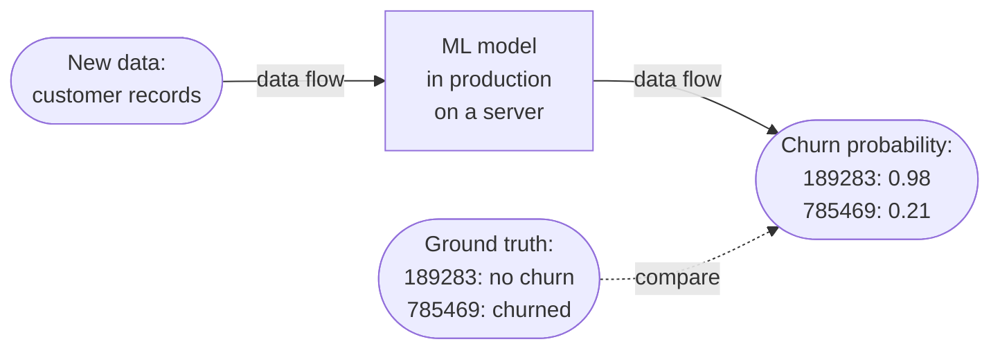
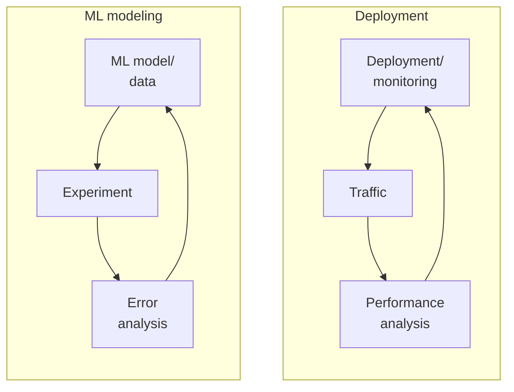
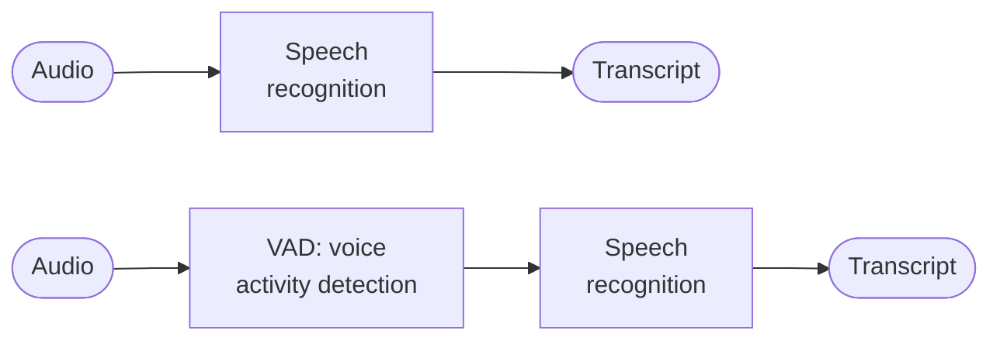
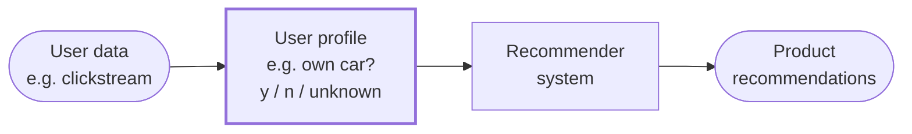

# 4.5 Monitoring

To ensure a machine learning (ML) system meets performance expectations, continuous monitoring is essential. The most common approach is to use dashboards to track key metrics over time, providing insights into system health and performance.

  - Is the model server running?
  - Are the model inputs and outputs as expected?
  - Also known as post-deployment monitoring

Practice good alerting hygiene: make every alert actionable and give the system a dashboard page. *(Rules of ML, Monitoring)*

## 4.5.1 Dashboard Monitoring

Dashboards should be tailored to the specific application, tracking metrics relevant to its operation. Examples include:

  - **Server Load**: Monitors computational resource usage to detect overloading.
  - **Fraction of Non-Null Outputs**: For a speech recognition system, a null output occurs when no speech is detected. A significant change in the frequency of null outputs may signal an issue.
  - **Fraction of Missing Inputs**: Common in structured data tasks, this metric tracks incomplete or missing input data, which could indicate data quality issues.

| Metric | Trend in the example (time 0 to 100) | Alarm threshold |
|---|---|---|
| Server load | Rises from about 0.86 and levels off near 0.90 | Above 0.91 |
| Fraction of non-null outputs | Climbs from about 0.86 to about 0.96 | Outside 0.89 to 0.96 |
| Fraction of missing input values | Dips to about 0.33, then climbs to about 0.6 | Outside 0.2 to 0.6 |

*Three example dashboard metrics and the thresholds set on them; the last two reach their upper threshold by the end of the period. Adapted from DeepLearning.AI, MLOps Specialization.*

To determine what to monitor, follow these steps:

1.  **Brainstorm Potential Issues**: Collaborate with your team to identify everything that could go wrong with the system.
2.  **Design Metrics**: For each potential issue, define statistics or metrics to detect it. For example, if you’re concerned about traffic spikes overloading the service, track server load as a key metric.

## 4.5.2 Types of Monitoring

A. **Statistical Monitoring:** focuses on the input and output data, including predictions. Examples: customer X has a 72% probability of churning, customer Y has a 31% probability of not churning.

B. **Computational Monitoring:** Focuses on technical metrics. Examples: server CPU usage, number of incoming requests, number of predictions, downtime of server.

**Feedback Loop:** The process through which the ground truth is used to improve the machine learning model.

*What each type of monitoring watches: statistical monitoring covers the new data and the predictions, computational monitoring covers the data flow and the server, and the feedback loop compares predictions with the ground truth.*

## 4.5.3 Types of Metrics

Metrics fall into two broad categories:

1.  **Software Metrics**: These assess the health of the software implementation, including:

      - Memory usage
      - Compute resources
      - Latency
      - Throughput
      - Server load

     Many MLOps tools automatically track these metrics.
2.  **Statistical Metrics**: These evaluate the learning algorithm’s performance and are divided into:

      - **Input Metrics**: Monitor changes in the input distribution (X). For example:

          - In a speech recognition system, track the average length of audio clips. A shift in this metric could indicate a change in user behavior or hardware (e.g., new microphones) that might affect performance.
          - For structured data, monitor the percentage of missing values.
          - In manufacturing visual inspection, track average image brightness to detect changes in lighting conditions.
      - **Output Metrics**: Assess the algorithm’s outputs to gauge performance. For example:

          - In speech recognition, monitor the frequency of null outputs (e.g., when no speech is detected).
          - For voice-based web search, track how often users repeat similar searches in quick succession, which may indicate misrecognition of the initial query.
          - Monitor instances where users switch from voice to typing, suggesting frustration or degraded performance.

Since input and output metrics are application-specific, MLOps tools typically require custom configuration to track them effectively.

## 4.5.4 Iterative Monitoring Process

Like ML modeling, deployment is an iterative process. Initial dashboards and metrics are a starting point, but real-world data from live traffic enables performance analysis and system refinement. Key considerations:

  - **Evolving Metrics**: It’s common to deploy a system with an initial set of metrics, only to discover new issues after weeks of operation. You may need to add new metrics to address unforeseen problems or remove metrics that prove uninformative.
  - **Thresholds and Alarms**: Set thresholds for metrics to trigger alerts. For example, if server load exceeds 0.91, an alarm could notify the team to investigate and potentially scale up resources. Adjust thresholds over time to focus on the most relevant issues.
  - **Responding to Issues**:

      - **Software Issues**: High server load may require changes to the software implementation.
      - **Performance Issues**: Accuracy or statistical problems may necessitate model updates or retraining.
  - **Retraining**: Models often require periodic maintenance. Retraining can be:

      - **Manual**: Engineers manually retrain the model, which is more common.
      - **Automatic**: Some systems, particularly in consumer internet applications, support automatic retraining, though this is less common due to concerns about fully autonomous updates.
      - **How often to retrain?**

          - Business environment: how volatile is the data?
          - Cost: how much does it cost to retrain?
          - Business requirements: what is the required model performance?
          - Freshness: how much does performance degrade when the model is a day, a week, or a quarter old? This sets monitoring priorities. Ad systems see new ads every day and must update daily; Google Play Search degrades within a month without updates. Freshness needs can change as feature columns are added or removed. *(Rules of ML #8)*

*Just as ML modeling is iterative, so is deployment: an iterative process to choose the right set of metrics to monitor. Adapted from DeepLearning.AI, MLOps Specialization.*

Monitoring enables early detection of issues, prompting deeper error analysis or data collection to update the model and maintain or improve performance.

## 4.5.5 Pipeline Monitoring

Many AI systems involve complex pipelines with multiple components, not just a single ML model. For example, a speech recognition system typically includes:

  - **Voice Activity Detection (VAD) Module**: Identifies when someone is speaking, clipping audio to include only relevant segments before streaming to the cloud. This reduces bandwidth usage.
  - **Speech Recognition Module**: Generates the text transcript from the clipped audio.

Changes in one component can impact downstream performance. For instance, if a new smartphone microphone alters audio characteristics, the VAD module might clip audio differently (e.g., including more or less silence). This changes the input to the speech recognition module, potentially degrading its performance.

*A speech pipeline without and with a voice activity detection (VAD) module. Some phones might have VAD clip audio differently, which degrades speech recognition downstream. Adapted from DeepLearning.AI, MLOps Specialization.*

Another example involves user profiles:

  - A system uses clickstream data to build user profiles, predicting attributes like whether a user owns a car to inform decisions (e.g., offering car insurance).
  - These profiles feed into a recommender system that generates product recommendations.
  - If the clickstream data changes (e.g., due to shifts in user behavior), the user profile’s accuracy may decline, increasing “unknown” labels for attributes like car ownership. This altered input can degrade the recommender system’s performance.

*Every stage can be monitored. A change in the clickstream data shows up first as more "unknown" values in the user profile, then as worse recommendations. Adapted from DeepLearning.AI, MLOps Specialization.*

**Monitoring Complex Pipelines**

To monitor pipelines with two or more components effectively:

  - **Brainstorm Metrics for Each Component**: Identify potential issues for each pipeline stage, including concept drift (changes in the X-to-Y mapping) and data drift (changes in X distribution). Design metrics to detect these issues.
  - **Track Software and Statistical Metrics**:

      - Monitor software metrics (e.g., memory, latency) for individual components or the entire pipeline.
      - Track input and output metrics for each component to detect changes in data or performance.
  - **Apply the Brainstorming Principle**: As with single-model systems, brainstorm everything that could go wrong across the pipeline and design metrics to track those risks.

## 4.5.6 Rate of Data Change

The speed at which data changes varies by application:

  - **Slow Changes**: In face recognition, people’s appearances evolve gradually due to fashion or aging. Higher-resolution cameras may improve image quality over time, but these shifts are typically slow.
  - **Rapid Changes**: In manufacturing, a factory switching to a new material for smartphones can instantly alter their appearance, requiring immediate model updates.
  - **General Trends**:

      - **Consumer Data**: In consumer-facing businesses with large user bases, data tends to change slowly. It’s rare for millions of users to alter their behavior simultaneously, though exceptions like COVID-19 (which shifted online shopping patterns) can cause rapid changes.
      - **B2B/Enterprise Data**: Business data can shift quickly. For example, a factory adopting a new phone coating or a CEO changing operational strategies can abruptly alter the dataset.

While these are general observations with exceptions, they provide a framework for anticipating the rate of data change in your application.

## 4.5.7 Silent Failures

ML systems fail in a way most software doesn't: they keep running and degrade gradually instead of crashing. If a joined table stops updating, the model adapts and stays "reasonably good" while getting worse. At Google Play, a table stale for 6 months was refreshed and install rate rose 2%, more than any other launch that quarter. Feature coverage can also shift with implementation changes, for example a column populated in 90% of examples that suddenly drops to 60%. Track data statistics (including per-feature coverage) and inspect the data by hand from time to time. *(Rules of ML #10)*

## 4.5.8 Training-Serving Skew

**Training-serving skew** is a gap between performance during training and performance during serving. It has three main causes *(Rules of ML)*:

  - Training and serving pipelines handle data differently.
  - The data changes between training time and serving time.
  - A feedback loop between the model and the algorithm.

The best defense is to monitor skew explicitly, so system and data changes don't introduce it unnoticed.

**Preventing skew**

  - **Log serving features and train on them** (#29): Save the features used at serving time and pipe them into training. Even logging a small fraction lets you verify consistency. When YouTube home page switched to logging features at serving time, quality improved and code got simpler.
  - **Beware of tables that change between training and serving** (#31): If features come from a joined table (e.g., comment counts per document), the values at serving time may differ from those at training time. Logging features at serving time avoids this; hourly or daily table snapshots get close, but not all the way.
  - **Share code between training and serving** (#32): Training is batch and serving is online, but both can build the same system-specific, human-readable object and then run one common function to convert it into model input. Avoid using two programming languages for the two pipelines, since that rules out sharing code.

**Feedback loops in ranking**

  - **Design for the skew ranking creates** (#35): A ranking change alters which results users see, and therefore the data the next model trains on. Ways to favor data the model has already seen: regularize broad features more than query-specific ones, allow only positive feature weights, and avoid document-only features (a popular app shouldn't appear for every query).
  - **Isolate positional features** (#36): Items in the first slot get clicked more regardless of quality. Train with positional features so the model attributes that effect to position, then serve with no positional feature (or one default value for all candidates), since items are scored before their order is known. Keep positional features separate from the rest of the model; don't cross them with document features.

**Measuring skew** (#37)

Break the gap into three parts:

1.  **Training vs. holdout**: Always present, and not necessarily bad.
2.  **Holdout vs. next-day data**: Also always present. Tune regularization to maximize next-day performance. A large drop suggests time-sensitive features.
3.  **Next-day vs. live data**: Should be zero. The same example must score the same in training and serving, so a gap here usually means an engineering bug.
