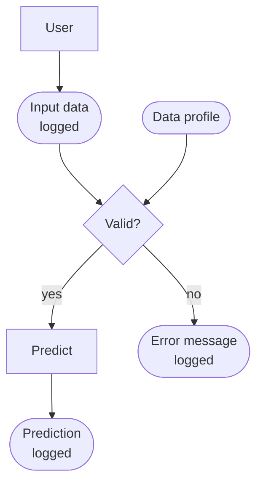
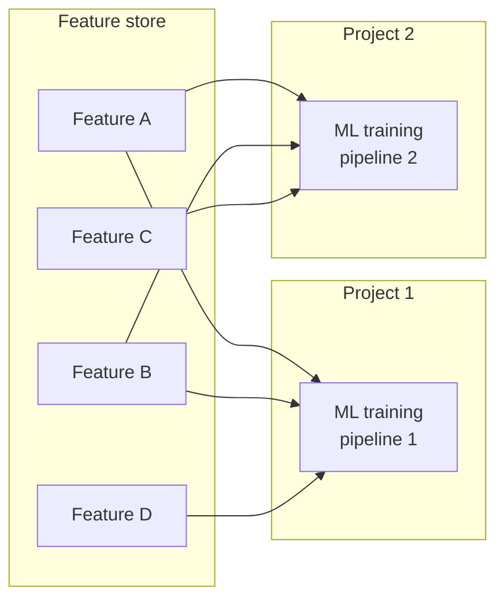
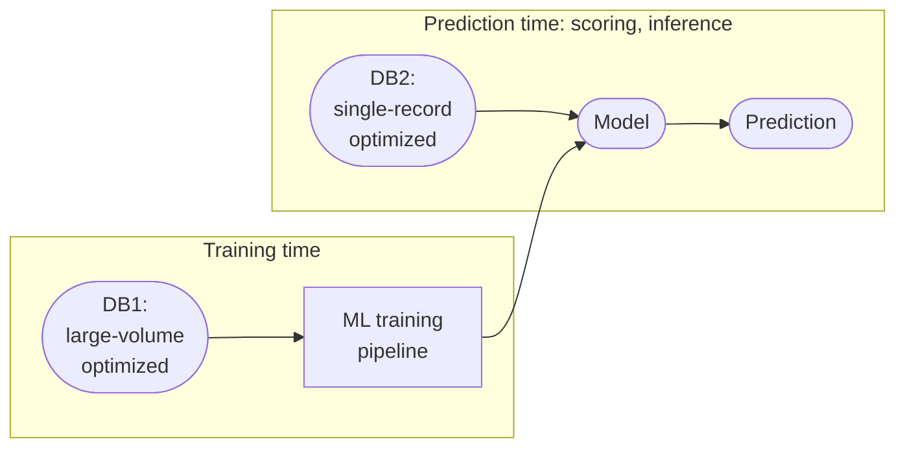
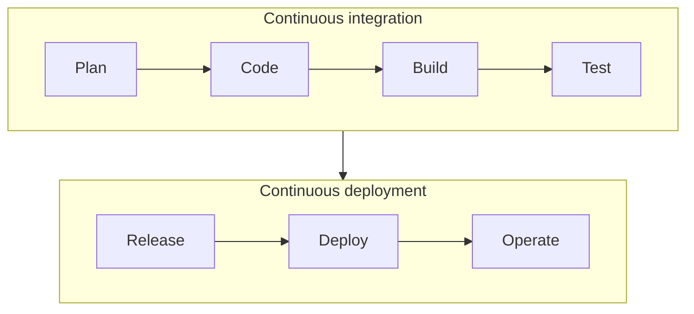
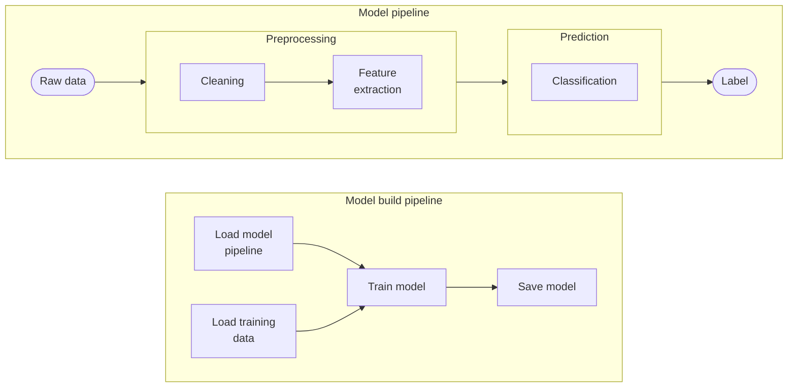
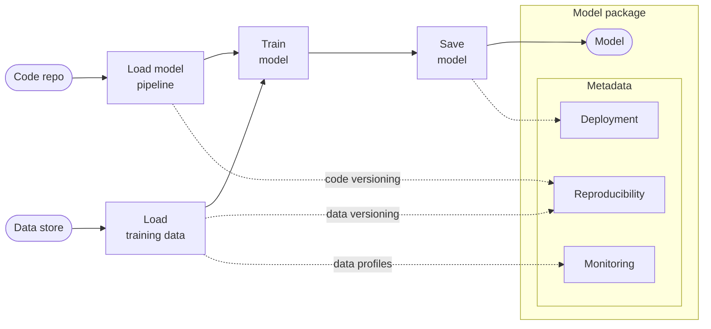
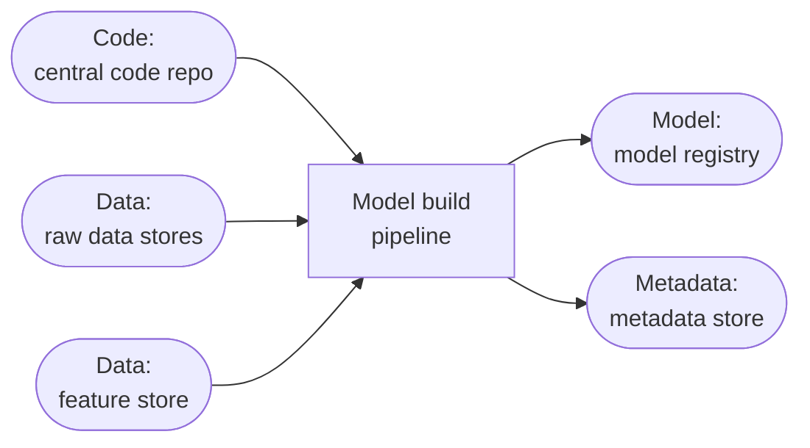

# 4.4 Reproducibility and CI/CD

A model that works in a notebook still has to be rebuilt, validated, and shipped the same way every time. This section covers what makes that possible: tracking where a model came from, validating its data, versioning everything, and automating the build.

## 4.4.1 Transparency and Reproducibility

A model handed over for deployment raises questions the person who trained it may not have answered: will it run on the production infrastructure, can anyone see how it was built, can it be reproduced, are its inputs validated, and how will it be monitored and debugged? Answering these early is cheaper than answering them at deployment time.

Each model should carry a record of where it came from: who trained it and when, the code version, the data version, and the parameters used to train it. That record makes the model auditable and lets you reproduce a result or trace a problem back to its cause.

Logging experiments in a metadata store (see [3.9 Experiment Tracking](../development/experiment-tracking.md)) gives you that record as a side effect.

Common concerns when putting a model in production:

  - Input data validation - data profiles (aka data expectations)
  - Performance deterioration. Minimum requirement: log inputs and outputs.
  - Debugging: log input data, error messages and predictions, using purpose-built tools rather than improvised ones.
  - Testing: am I comfortable making changes to this code?

      - Unit tests
      - Integration tests
      - Load tests
      - Stress tests
      - Deployment tests

*Input data validation at prediction time; the prediction or the error message goes back to the user. The data profile is created in the model build pipeline and saved with the metadata. Logging the input data, error messages and predictions is what makes the service debuggable.*

## 4.4.2 Profiling, Versioning, and Feature Stores

### Data Profiling

Automated data analysis and creation of high-level summaries (a.k.a. data profiles, expectations), used for validating and monitoring data in production.

Creating the data profile is one step in an ML pipeline checklist:

  - Is the code versioned?
  - Is the data versioned?
  - Train the model.
  - Save the model.
  - Create a data profile.
  - Record the exact version of the training data (data versioning, for reproducibility).

Risks of **not** using data profiles:

  - Clients complaining, although they submitted erroneous inputs to the model
  - No way to identify that data has drifted and our model is no longer valid

A training pipeline reads raw data from a **data store** and the model definition from a **code repository**, trains the model, and stores it in a **model registry**. It should also write to a **metadata store**: the dataset version, the train/test split, and a fingerprint of the data, so the exact build can be recreated.

A popular tool for data profiling is Great Expectations.

### Versioning

Versioning in machine learning engineering is the practice of systematically tracking and managing changes to all components of an ML project, including code, data, models, and hyperparameters, over time. Unlike traditional software development where Git excels at versioning code, ML projects involve large datasets and model artifacts that Git cannot efficiently handle.

Tools like DVC (Data Version Control) extend Git's capabilities by providing a lightweight mechanism to version large files and directories by storing their metadata (like checksums) in Git, while the actual data resides in external storage (e.g., cloud storage, local drives). This allows teams to precisely reproduce past experiments, revert to previous states, track data lineage, and ensure that a specific model was trained with an exact version of data and code, which is crucial for collaboration, debugging, and maintaining reliable production systems.

### Feature Stores

A feature store in machine learning engineering is a centralized repository that standardizes the management, storage, and serving of features for both model training and real-time inference. It acts as a bridge between data engineering and data science, allowing for the consistent definition, computation, and reuse of features across different models and teams, thereby preventing training-serving skew (where features used for training differ from those used in production; see [4.5.8](monitoring.md#458-training-serving-skew)). Typically, a feature store includes an offline store for historical, large-volume data used in training and an online store optimized for low-latency, single-record retrieval during live predictions, significantly streamlining the MLOps lifecycle by improving efficiency, reproducibility, and model reliability.

*Features defined once in the feature store (essentially a database) are reused by the training pipelines of different projects.*

Training and serving read data in different ways. Training scans large volumes in batch, so it needs storage optimized for throughput (the **offline store**). Serving fetches the features of one record at a time with low latency (the **online store**). A feature store provides both, computed from the same definitions.

*A feature store as a dual database: DB1 (the offline store) feeds training, DB2 (the online store) feeds the model at prediction time.*

Its main benefits are reusability (features are built once and shared across models) and consistency (training and serving use the same feature values, so a model trained on emails as plain text is not served the same emails as raw HTML).

## 4.4.3 CI/CD

*Continuous integration takes a change from plan to tested build; continuous deployment takes the tested build through release, deployment and operation. In the usual figure the two form linked loops that meet at testing.*

### Model Build Pipeline

Two pipelines are worth keeping apart: the **model pipeline** defines what the model does with an input, and the **model build pipeline** defines how the model is created and saved. The build pipeline is the one that runs in CI/CD.

*The model pipeline turns raw data into a label; the model build pipeline loads that pipeline and the training data, trains the model and saves it.*

The build pipeline loads the model definition from version-controlled code and the training data from a versioned data store, checked against data profiles. Its output is a **model package**: the trained model plus the metadata needed for deployment, reproducibility, and monitoring.

*The build pipeline's output is a model package: the trained model plus metadata for deployment, reproducibility (code and data versions) and monitoring (data profiles).*

At its simplest, the build pipeline loads the model definition, loads the training data, trains the model, and saves it. Running it inside CI/CD is what makes deployment automatic and results reproducible.

Its inputs are code from the repository, raw data from data stores, and engineered features from the feature store. Its outputs are the trained model, registered in a model registry, and the build metadata, stored in a metadata store.

*Inputs and outputs of the model build pipeline.*

### Testing and Pre-export Checks

Keep the learning part of the system encapsulated so everything around it can be tested on its own *(Rules of ML #5)*:

  - **Data into the algorithm**: Check that feature columns that should be populated are populated. Where privacy allows, inspect the training input by hand, and compare pipeline statistics against the same data processed elsewhere.
  - **Models out of the algorithm**: The model must give the same score in the training environment and in the serving environment.
  - **Code paths**: Test the code that creates examples in both training and serving, and make sure serving can load and use a fixed model.

Run sanity checks right before exporting a model, since a bad exported model is a user-facing problem. Check performance on held-out data (many continuously deploying teams gate on AUC), and don't export if you still have doubts about the data. A problem caught before export costs an email alert; a problem in a live model may cost a page. *(Rules of ML #9)*
