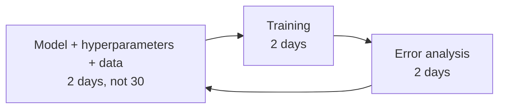
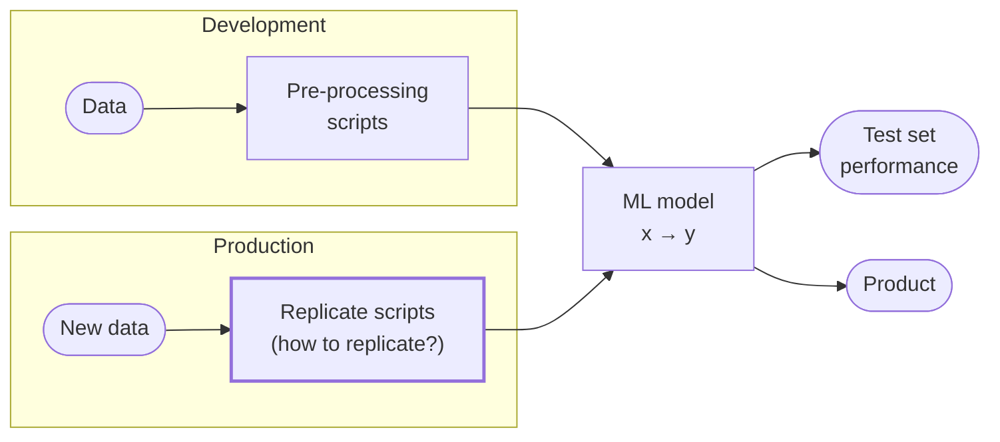
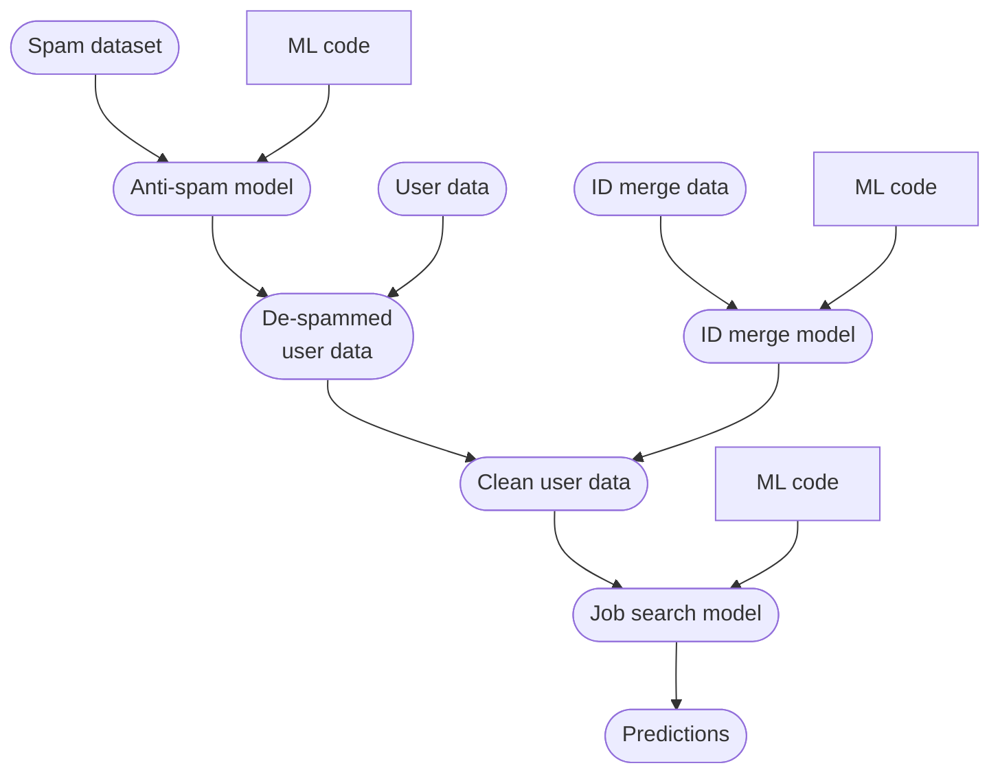

# 2.2 Data

## 2.2.1. Big Data vs. Good Data

Modern AI often leverages massive datasets from large internet companies with billions of users. While big data can significantly boost performance, many industries lack access to such volumes. In these cases, focusing on good data—high-quality, well-curated data—is critical.

### i. Characteristics of Good Data

Good data exhibits the following qualities:

1.  **Comprehensive Coverage**: Includes diverse inputs (x) to cover important cases. If coverage is lacking, data augmentation can generate additional examples to improve diversity.
2.  **Consistent and Unambiguous Labels**: Ensures labels (y) are clearly defined and consistently applied.
3.  **Timely Feedback**: Incorporates monitoring systems to track concept drift and data drift in production, providing actionable feedback to maintain performance.
4.  **Reasonable Size**: While not necessarily massive, the dataset should be sufficiently large to support effective training.

### ii. Why Good Data Matters

High-quality data is essential throughout the machine learning project lifecycle—from development to deployment. Consistent, well-defined, and diverse data ensures robust and reliable model performance, particularly in applications where collecting billions of data points isn’t feasible. By prioritizing good data, you can achieve high performance even with smaller datasets, using tools like data augmentation to address gaps in coverage.

### iii. Data Quality

Data quality can be thought of as having four dimensions:

  - Accuracy
  - Completeness
  - Consistency
  - Timeliness

| Dimension | Example question to answer | Example of a quality issue |
|---|---|---|
| Accuracy | Does our data correctly describe the customer? | The customer's age in the data is 18, but is actually 32. |
| Completeness | Is any customer data missing? | For 80% of the customers, we don't have a last name. |
| Consistency | Is the definition of the customer synchronized throughout the company? | The customer is active in one database but not in another. |
| Timeliness | When is the customer ordering data available? | Orders are synchronized at the end of the day, not in real time. |

*The four dimensions of data quality, with a customer-data example for each.*

## 2.2.2. Challenges in Data Definition

### i. Why Data Definition Is Difficult

Defining consistent data labels is challenging due to subjective interpretations, especially in ambiguous cases. For example, given a photo of two iguanas and the instruction "Use bounding boxes to indicate the position of iguanas", three labelers might use different conventions:

  - **Convention 1**: One box per iguana, each stopping where the other iguana begins, so the rear iguana's tail is cut off.
  - **Convention 2**: One box per iguana, each covering the whole animal including its tail, so the two boxes overlap.
  - **Convention 3**: A single box around both iguanas.

While any single convention may be acceptable (with the first two preferred), inconsistency—where each labeler uses a different convention—confuses the ML algorithm, reducing performance.

Similarly, in smartphone defect detection, labelers might identify “significant defects” differently:

  - **Labeler 1**: Marks only the most prominent scratch.
  - **Labeler 2**: Marks multiple defects (e.g., a scratch and a pit mark).
  - **Labeler 3**: Marks a single box covering all defects.

The second approach (marking multiple defects) is often most effective, but ambiguous instructions lead to inconsistent labeling, undermining the model. Clear, standardized instructions are essential to mitigate this issue.

### ii. Label Ambiguity Examples

Ambiguity in labeling extends to other domains, such as audio transcription. For an audio clip of someone saying, “Nearest gas station” on a busy roadside with a car passing by, labelers might transcribe it in various ways:

  - “Um… nearest gas station” (with ellipsis).
  - “Um, nearest gas station” (with a comma).
  - “Nearest gas station \[unintelligible\].”

These variations—differing in punctuation, spelling, or annotations—introduce noise. Standardizing one convention enhances the consistency of speech recognition data.

### iii. Impact of Data Preparation

Many ML practitioners initially use pre-prepared datasets from the internet, which is a valid starting point. However, for practical applications, how you prepare and define your dataset significantly impacts project success. Tailoring data to your specific problem, with clear inputs (x) and consistent labels (y), is crucial.

### iv. Examples of Ambiguous Ground Truth

#### User ID Merging

User ID merging is a common challenge in large companies, where multiple data records may correspond to the same person. For example, an online job listing website might have a user record with email, name, and address. After acquiring a mobile app for resume advice, the company faces a new database with potentially overlapping users.

| Field | Job board (website) | Resume chat (app) |
|---|---|---|
| Email | nova@deeplearning.ai | nova@chatapp.com |
| First name | Nova | Nova |
| Last name | Ng | Ng |
| Address | 1234 Jane Way | ? |
| State | CA | ? |
| Zip | 94304 | 94304 |

*Two records that may or may not be the same person: same name and zip code, different emails, and no address in the app. Adapted from DeepLearning.AI, MLOps Specialization.*

A supervised learning algorithm can predict whether two records represent the same person (output: 1 for same, 0 for different). Ground truth can be obtained if users explicitly link accounts, providing labeled examples. Without such data, companies often rely on human labelers (e.g., product managers) to manually compare records with similar names or ZIP codes. However, human judgment can be ambiguous, as records may or may not refer to the same person. Consistent labeling, even in ambiguous cases, improves algorithm performance.

**Ethical Note**: User ID merging must respect user privacy and comply with data usage permissions.

#### Other Structured Data Challenges

Structured data problems often involve ambiguity in ground truth. Examples include:

  - **Bot/Spam Detection**: Predicting whether a user account is a bot or spam based on activity patterns.
  - **Fraud Detection**: Identifying fraudulent online transactions.

In these tasks, ground truth can be unclear, and inconsistent labeling exacerbates noise. Clear labeling instructions that minimize randomness enhance model performance.

## 2.2.3. Best Practices for Data Definition

### i. Defining Inputs (x)

The quality of input data (x) is critical. For example, in smartphone defect detection:

  - **Image Quality**: Ensure adequate lighting, contrast, and resolution. Dark images where defects are invisible to humans are unsuitable, as even accurate labels can’t compensate for poor inputs.
  - **Action**: If inputs are inadequate (e.g., dark images), improve the data collection process, such as requesting better lighting in the factory, before labeling.

For structured data, selecting predictive features is key. In user ID merging, including rough GPS location (with user permission) can help determine if two accounts belong to the same person.

### ii. Defining Labels (y)

Consistent labels (y) are essential. Ambiguous labeling instructions lead to inconsistent data, as seen in the iguana and smartphone examples. Strategies to ensure consistency are discussed below.

### iii. Data Types and Sizes

Best practices vary based on data type (unstructured vs. structured) and dataset size (small vs. large, using a rough threshold of 10,000 examples):

  - **Unstructured Data**: Includes images, audio, and text. Humans excel at processing these, making human-level performance (HLP) a useful baseline. Data augmentation (e.g., generating synthetic images or audio) is effective.
  - **Structured Data**: Includes database records (e.g., user profiles). Humans are less adept at these tasks, and HLP is less relevant. Data augmentation is challenging, as synthesizing new users is impractical.
  - **Small Datasets (≤10,000 examples)**: Clean, consistent labels are critical, as a single mislabeled example can significantly impact performance (e.g., 1% of a 100-example dataset). Manual review is feasible.
  - **Large Datasets (\>10,000 examples)**: Manual review is impractical, so focus on robust data processes, clear labeling instructions, and scalable labeling teams.

| | Unstructured | Structured | Focus |
|---|---|---|---|
| **Small data** (≤10,000) | Manufacturing visual inspection from 100 training examples | Housing price prediction based on square footage, etc. from 50 training examples | Clean labels are critical |
| **Big data** (>10,000) | Speech recognition from 50 million training examples | Online shopping recommendations for 1 million users | Emphasis on data process |
| **Getting more data** | Humans can label data; data augmentation works | Harder: new examples are hard to create | |

*Major types of data problems, by data type and dataset size. Adapted from DeepLearning.AI, MLOps Specialization.*

For unstructured data, abundant unlabeled data (e.g., thousands of unlabeled smartphone images) can be labeled by humans or augmented. Structured data is harder to expand, as user bases are finite, and human labeling is often ambiguous.

### iv. Importance of Clean Labels

In small datasets, label consistency is paramount. For example, in a project to predict helicopter rotor speed from motor voltage, a small dataset of five noisy examples makes it difficult to determine the correct function (linear or curved). With clean, consistent labels, even five examples can yield a reliable model. Similarly, computer vision systems can perform well with just 30 consistently labeled images.

| Data size | Labels | What a model can learn (speed in rpm from voltage) |
|---|---|---|
| Small | Noisy | A handful of scattered points: several different curves fit equally well |
| Big | Noisy | Many noisy points: one clear curve still emerges |
| Small | Clean (consistent) | A handful of points that lie on one curve: the function is clear |

*Why label consistency matters most when data is small. Adapted from DeepLearning.AI, MLOps Specialization.*

Large datasets can face small data challenges in the “long tail” of rare events:

  - **Web Search**: Large search engines have vast query datasets, but rare queries have limited clickstream data.
  - **Self-Driving Cars**: Companies collect millions of driving hours, but rare events (e.g., a child running across a highway) have few examples.
  - **Product Recommendations**: With millions of products, niche items have limited interaction data.

Consistent labeling of these rare cases improves model performance, even in large datasets.

### v. Data Cleaning Questions

Before cleaning a dataset, work through these questions:

1.  **Backstory**: Where did the data come from? What do the rows represent?
2.  **Duplicates**: Are there duplicated rows? Do you know why?
3.  **Missing values**: Have all missing values been converted to the missing type? Why are they missing?
4.  **Data types**: Are numbers stored as strings? Should some numbers actually be categories?
5.  **Categorical data**: Do you have the categories you expect? Are there mistakes or inconsistencies?

## 2.2.4. Improving Label Consistency

To enhance label consistency:

1.  **Multi-Labeler Comparison**: Have multiple labelers annotate the same examples. Compare results to identify inconsistencies.
2.  **Self-Consistency Check**: Ask a labeler to re-label an example after a break to assess their consistency.
3.  **Discussion and Agreement**: When disagreements arise, convene labelers to discuss and agree on a consistent labeling convention. Document this agreement as updated labeling instructions.
4.  **Iterative Refinement**: Apply the new instructions to label more data. Repeat the comparison and discussion process if inconsistencies persist.
5.  **Input Quality Check**: If labelers indicate that inputs (x) lack sufficient information (e.g., dark images), improve the data collection process (e.g., enhance lighting).

### i. Standardizing Labels

Standardizing on a single convention (e.g., one transcription format for audio clips) reduces noise. For example, choosing “Um… nearest gas station” as the standard transcription ensures consistency.

### ii. Merging Classes

When distinguishing between classes is ambiguous (e.g., deep vs. shallow scratches), merging them into a single class (e.g., “scratch”) eliminates inconsistencies, simplifying the task for the algorithm. This is effective when the distinction isn’t critical.

### iii. Creating Uncertainty Classes

For ambiguous cases, introduce a new label to capture uncertainty:

  - **Smartphone Defects**: Label scratches as “defective,” “non-defective,” or “borderline” for ambiguous cases (e.g., medium-length scratches).
  - **Speech Recognition**: Use an “unintelligible” tag for unclear audio clips (e.g., “Nearest gas station \[unintelligible\]” instead of guessing “Nearest go” or “Nearest grocery”).

This approach improves consistency by allowing labelers to flag ambiguity explicitly.

### iv. Small vs. Large Datasets

  - **Small Datasets**: With few labelers, convene them to discuss and agree on conventions for specific examples. This is feasible due to the small team size.
  - **Large Datasets**: Establish consistent definitions with a small group, then distribute detailed instructions to a larger labeling team. Coordination is harder with many labelers.

### v. Avoid Over-reliance on Voting

Consensus labeling (voting by multiple labelers) can improve accuracy but is overused. Instead of relying on voting to resolve inconsistent labels, prioritize clear labeling instructions to reduce noise initially. Voting should be a last resort, as it’s less efficient than standardizing conventions upfront.

## 2.2.5. Human-level Performance (HLP)

### i. Role of HLP

HLP is a valuable benchmark for unstructured data tasks, estimating Bayes error (irreducible error) and aiding in error analysis and prioritization. For example, in visual inspection, if a business demands 99% accuracy but human inspectors achieve only 66.7% on a dataset (e.g., correctly labeling 4/6 examples), HLP sets a realistic baseline, showing that 99% may be unattainable.

| Ground truth label | Inspector | Correct? |
|---|---|---|
| 1 | 1 | Yes |
| 1 | 0 | No |
| 1 | 1 | Yes |
| 0 | 0 | Yes |
| 0 | 0 | Yes |
| 0 | 1 | No |

*An inspector matches the ground truth on 4 of 6 examples (66.7% accuracy), far from a business ask of 99%. Estimating Bayes error this way helps with error analysis and prioritization. Adapted from DeepLearning.AI, MLOps Specialization.*

Other uses of HLP:

  - **In academia**: Establish and beat a respectable benchmark to support publication.
  - **Setting targets**: When a business or product owner asks for 99% accuracy, HLP helps establish a more reasonable target.
  - **"Proving" ML superiority**: Showing that the ML system beats humans at the job, so the business should adopt it. Use with caution (see Limitations of HLP below).

### ii. Defining Ground Truth

HLP’s interpretation depends on the ground truth:

  - **External Ground Truth**: In medical imaging, if ground truth comes from a biopsy, HLP measures how well a doctor predicts the biopsy outcome, providing a clear baseline for algorithm performance.
  - **Human-Defined Ground Truth**: In visual inspection, where ground truth is another human’s label, HLP measures agreement between humans, not absolute accuracy.

### iii. Limitations of HLP

HLP can be misleading due to inconsistent labeling. For example, in speech recognition, if 70% of labelers transcribe “Um… nearest gas station” (ellipsis) and 30% use “Um, nearest gas station” (comma), the chance of two labelers agreeing is:

$$
P(\text{two labelers agree}) = 0.7^2 + 0.3^2 = 0.49 + 0.09 = 0.58
$$

| Quantity | Value |
|---|---|
| Labelers who write "Um… nearest gas station" | 70% |
| Labelers who write "Um, nearest gas station" | 30% |
| Two random labelers agree (HLP) | 0.58 |
| ML agrees with humans (always uses the ellipsis) | 0.70 |
| Apparent gain over HLP | +12% |

*Beating HLP is not proof of ML superiority: the 12% gain comes only from always picking the majority convention. Adapted from DeepLearning.AI, MLOps Specialization.*

Thus, HLP is calculated as 58%, reflecting labeler agreement rather than true performance. An algorithm consistently choosing the ellipsis convention achieves 70% agreement with humans, appearing to “outperform” HLP by 12%. However, this improvement is trivial, as both conventions are equally valid, and it may mask significant errors in other areas, creating a false impression of superiority.

### iv. Raising HLP

Improving label consistency can raise HLP, benefiting the model. In the visual inspection example above, suppose the two disagreements came from an unclear definition of a defect. If inspectors agree on a rule (for example, a scratch longer than 0.3mm is a defect) and relabel the six examples by it, inspector and ground truth now agree on all six, raising HLP from 66.7% to 100%. While this makes beating HLP impossible, it provides cleaner data, ultimately improving model performance.

### v. Structured Data and HLP

HLP is less common in structured data due to the difficulty of human labeling. Exceptions include:

  - **User ID Merging**: Humans label whether two records represent the same person.
  - **Network Security**: IT experts label network traffic as hacked or not.
  - **Fraud Detection**: Humans assess transaction legitimacy.
  - **Bot/Spam Detection**: Humans judge whether an account is spam or a bot.
  - **Transportation Mode**: From GPS data, humans label whether someone traveled on foot or by bike, car, or bus.

In these cases, low HLP often indicates inconsistent labeling. Improving labeling standards raises HLP and provides cleaner data, enhancing model performance.

## 2.2.6. Obtaining Data

### i. Balancing Data Collection Time

ML development is iterative, involving model selection, hyperparameter tuning, training, and error analysis. If training and error analysis each take a few days, spending 30 days collecting data delays iteration unnecessarily. Instead:

  - **Quick Start**: Aim to collect an initial dataset in a short time (e.g., 2–7 days) to enter the iteration loop quickly. For example, a week-long data collection sprint can yield creative solutions.
  - **Iterative Expansion**: After training and error analysis, collect more data as needed.
  - **Reframe the Question**: Instead of asking how long it would take to obtain m examples, ask how much data you can obtain in k days.

*The iteration loop: spend days, not a month, collecting data so you get into the loop as quickly as possible. Adapted from DeepLearning.AI, MLOps Specialization.*

Exception: If prior experience indicates a minimum dataset size (e.g., hours of speech data for recognition), invest upfront to meet that threshold. For new problems, start small, train, and use error analysis to guide further collection.

### ii. Data Source Inventory

Brainstorm potential data sources and evaluate their costs and timelines. For speech recognition:

| Source | What it is | Amount | Cost | Time |
|---|---|---|---|---|
| Owned | Transcribed audio you already have | 100h | $0 | 0 |
| Crowdsourced reading | Pay people to read text aloud | 1000h | $10,000 | 14 days |
| Pay for labels | Pay to transcribe unlabeled audio (natural speech) | 100h | $6,000 | 7 days |
| Purchase data | Buy audio from commercial providers | 1000h | $10,000 | 1 day |

*A data source inventory for speech recognition. Adapted from DeepLearning.AI, MLOps Specialization.*

Consider data quality, privacy, and regulatory constraints alongside financial and time costs. This inventory ensures informed decisions.

### iii. Labeling Methods

Common labeling approaches include:

  - **In-House**: Your team labels data. Costly for ML engineers but builds intuition. Spending a few hours or days labeling is valuable for new projects.
  - **Outsourced**: Hire specialized companies for efficient labeling, especially for niche tasks.
  - **Crowdsourced**: Use platforms to engage large groups, suitable for general tasks like audio transcription.

For specialized tasks (e.g., medical imaging, factory inspection), subject matter experts (SMEs) are often required, as typical labelers lack the expertise to diagnose X-rays or identify defects accurately.

### iv. Challenges in Labeling

Some tasks are inherently difficult for humans to label. In product recommendations, even close friends struggle to recommend products as well as algorithms do, so purchase data may serve as labels instead of human judgments.

Identifying the right labelers (e.g., SMEs for specialized tasks, fluent speakers for transcription) ensures high-quality labels.

### v. Dataset Size Scaling

When expanding a dataset (e.g., from 1,000 examples), avoid increasing by more than 10x at once (e.g., to 3,000–10,000 examples). Train a model on the expanded set, perform error analysis, and then decide if further increases are warranted. Large jumps (e.g., 100x) introduce unpredictability and risk over-investment.

### vi. Clean Labels for Filtering Tasks

In filtering tasks (spam, uninteresting emails), blocked examples never reach the user, so learning only from user feedback on what got through introduces sampling bias. Instead, mark a small slice of traffic (e.g., 1%) as **held out**, show all of it to users, and train on those examples. The filter then blocks slightly less (a filter that blocked 75% of negative examples still blocks at least 74%), in exchange for much cleaner data. If the filter blocks 95% or more, use an even smaller held-out slice (0.1% or less) just to measure performance: about ten thousand examples is enough for an accurate estimate. *(Rules of ML #34)*

## 2.2.7. Data Pipelines

A data pipeline processes raw data into a format suitable for ML. For example, to predict if a user is job-hunting based on their data, preprocessing steps like spam cleanup and user ID merging are necessary. These steps can be scripted or use ML algorithms, though scripting is simpler to manage.

### i. Replicability Challenges

During development, preprocessing scripts can be ad hoc, involving manual steps or files shared across team members’ computers. This creates replicability issues in production, where the input distribution must match the development data. The effort to ensure replicability depends on the project phase:

  - **Proof of Concept (POC) Phase**: Focus on validating the application’s feasibility. Manual preprocessing is acceptable, but take detailed notes and comment scripts to aid future replication. Avoid heavy process investment at this stage.
  - **Production Phase**: Prioritize replicability using tools like **TensorFlow Transform**, **Apache Beam**, or **Airflow** to create a robust, reproducible pipeline.

*The same model sits behind two pipelines: in development, pre-processing scripts feed it and the output is test set performance; in production, new data must go through scripts that replicate those steps before the output reaches the product. Adapted from DeepLearning.AI, MLOps Specialization.*

### ii. Complex Pipelines

Consider a pipeline for job-hunting prediction:

1.  **Spam Detection**: Start with a spam dataset (e.g., known spam accounts, blacklisted IPs). Apply a spam detection model to produce de-spammed user data.
2.  **User ID Merging**: Use labeled data (e.g., confirmed same-person accounts) to train an ID merge model. Apply it to de-spammed data to produce cleaned user data.
3.  **Job-Hunting Prediction**: Train a model on cleaned data to predict job-hunting behavior.

If errors are found (e.g., incorrect IP blacklists), updating the pipeline is challenging, especially if scripts are scattered across team members’ systems. **Data provenance** (data source) and **lineage** (processing steps) are critical for maintenance. Extensive documentation or tools like TensorFlow Transform help, though when the source course was recorded (2021), tools for provenance and lineage were still immature.

*A pipeline to predict whether someone is looking for a job (x = user data, y = looking for a job?). Every model depends on upstream data and code, so keep track of data provenance (where it comes from) and lineage (the sequence of steps). Adapted from DeepLearning.AI, MLOps Specialization.*

### iii. Metadata

**Metadata** (data about data) enhances error analysis and helps keep track of data provenance. For example:

  - **Visual Inspection**: Metadata includes photo timestamp, factory, line number, camera settings (e.g., exposure, aperture), phone model, and inspector ID. If certain samples produce errors, metadata helps identify patterns (e.g., specific factory lines).
  - **Speech Recognition**: Metadata like smartphone brand, labeler ID, or voice activity detection model can reveal error sources.

Storing metadata in MLOps frameworks (e.g., MLflow) facilitates analysis and improves algorithm performance, similar to commenting code.

### iv. Dropped Data When Copying Pipelines

New pipelines are often copied from existing ones, and the old pipeline may drop data the new one needs. Examples from Google:

  - The Google Plus What's Hot pipeline dropped older posts (it ranks fresh content). Copied for Google Plus Stream, where older posts still matter, it kept dropping them.
  - Logging only what the user saw makes it impossible to model why a post was *not* seen: all the negative examples are gone.
  - A Play Apps Home pipeline mixed in examples from the Play Games landing page with no feature to tell them apart.

Check what a copied pipeline filters out before reusing it. *(Rules of ML #6)*

### v. Importance-weight Sampled Data

When there is too much data, don't keep files 1–12 and ignore files 13–99. Data never shown to the user can be dropped, but sample the rest with **importance weighting**: if an example is kept with probability 30%, give it a weight of 10/3. This keeps the model's calibration intact. *(Rules of ML #30)*

How to split the data into training, dev, and test sets is covered in [3.2 Validation and Hyperparameter Tuning](../development/validation-and-tuning.md).
