# 2.1 Scoping

## 2.1.1. Scoping Overview

Choosing the right ML project is a rare and valuable skill. Careful scoping—evaluating options and selecting high-impact projects—maximizes success.

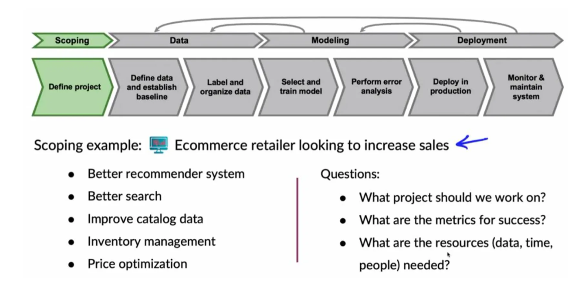

## 2.1.2. Scoping Process

Scoping involves identifying business problems, brainstorming AI solutions, and assessing feasibility and value.

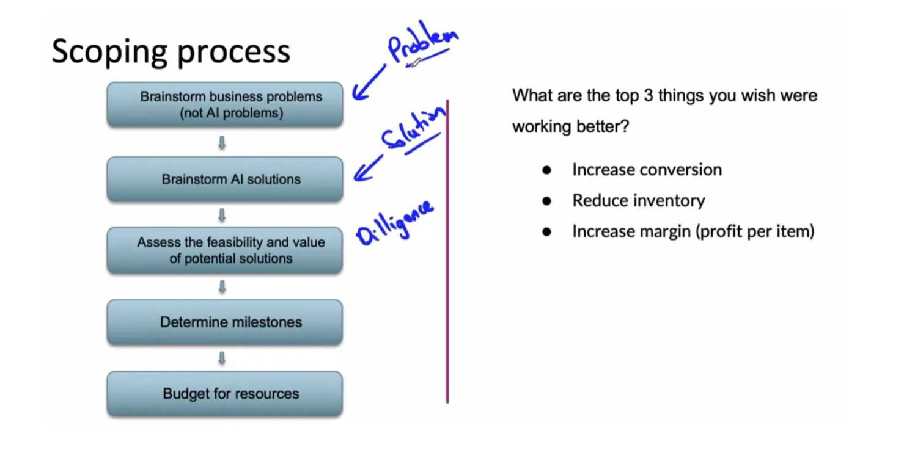

For an e-commerce retailer aiming to increase sales (as an example), follow these steps:

### i. Identify Business Problems

  - Collaborate with business owners to brainstorm problems (e.g., low conversions, excess inventory, low profit margins).
  - Focus on business objectives, not AI solutions. Ask, “What are the top three things you wish worked better?” Avoid AI-specific discussions initially.

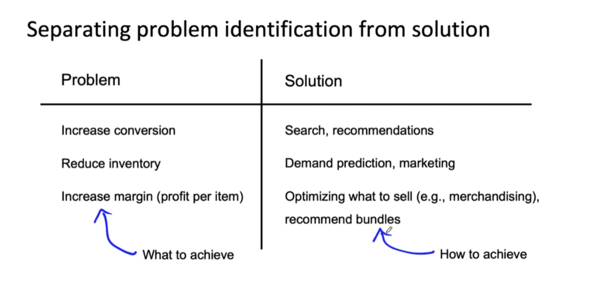

### ii. Brainstorm AI Solutions

  - Once problems are clear, explore AI solutions. Not all problems require AI, and that’s acceptable.
  - Example problems and solutions:

      - **Increase Conversions**: Improve website search, enhance product recommendations, redesign product displays, or surface relevant reviews.
      - **Reduce Inventory**: Predict demand to optimize stock, launch marketing campaigns to sell overstocked items.
      - **Increase Margins**: Optimize product selection (merchandising), recommend product bundles (e.g., camera with case).

### iii. Assess Feasibility and Value

  - **Feasibility**: Evaluate technical viability using benchmarks (e.g., literature, competitor solutions) and a 2x2 matrix of new vs. existing projects and unstructured vs. structured data:

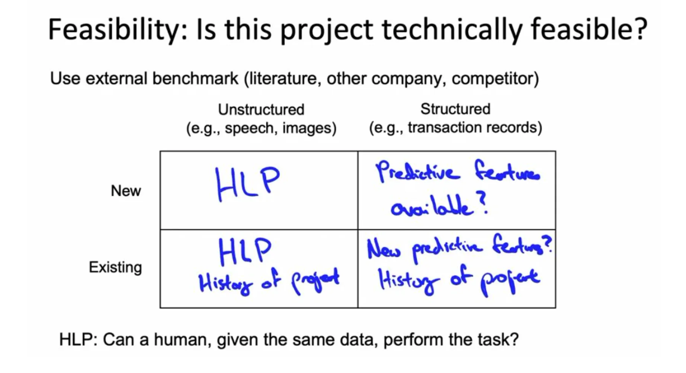

  - **Unstructured Data**:

      - **New Projects**: Use HLP to assess feasibility. If humans can perform the task (e.g., detect scratches in images), an algorithm likely can too.
      - **Existing Projects**: Compare to HLP and project history (past progress predicts future gains).
  - **Structured Data**:

      - **New Projects**: Ensure predictive features exist (e.g., past purchases predict future ones).
      - **Existing Projects**: Identify new predictive features to improve performance.
  - **HLP for Unstructured Data**: Ensure humans receive the same data as the algorithm (e.g., only camera images for traffic light detection, not in-car views). If humans can’t perform the task, improve inputs (e.g., better cameras) before proceeding.

  - **Structured Data Feasibility**: Verify that input features (x) predict outputs (y).

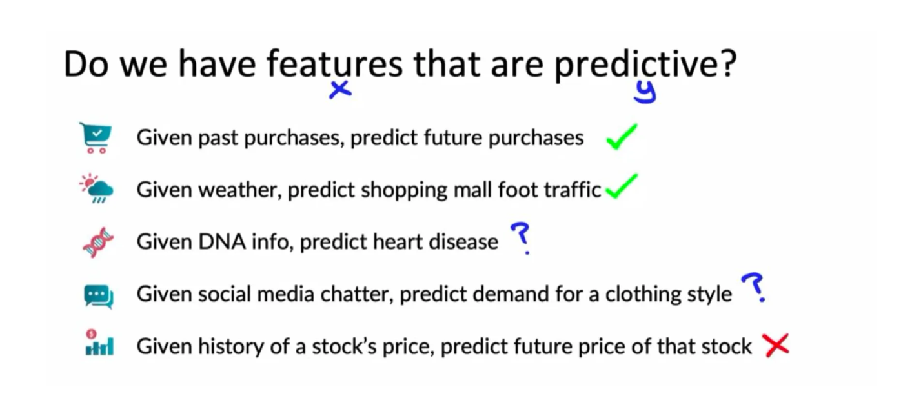

Examples:

  - **E-commerce**: Past purchases predict future ones (feasible).
  - **Mall Foot Traffic**: Weather predicts traffic (feasible).
  - **Heart Disease from DNA**: Genetic data is weakly predictive (challenging).
  - **Fashion Trends from Social Media**: Predicting future trends is difficult (iffy).
  - **Stock Prices**: Historical prices are not predictive (infeasible).

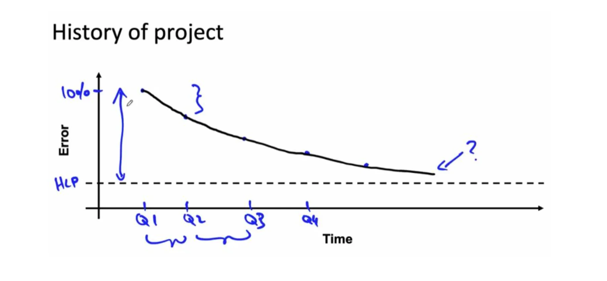

  - **Value**: Estimate business impact, bridging ML and business metrics:

      - ML teams optimize metrics like word-level accuracy (e.g., in speech recognition), while businesses prioritize user engagement or revenue.
      - Use Fermi estimates to relate ML improvements (e.g., 1% word accuracy increase) to business outcomes (e.g., 0.7% query accuracy increase, improving user engagement and revenue).
      - Compromise on metrics that both teams accept, requiring ML teams to stretch toward business goals and business teams to accept technical constraints.

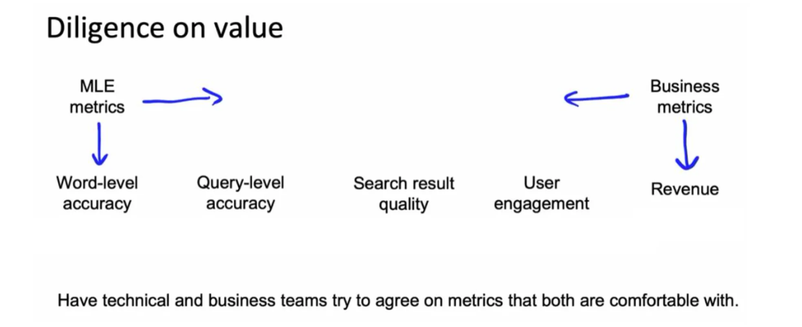

  - **Ethical Considerations**: Ensure the project creates positive societal value and is fair and unbiased. Consult industry-specific ethical frameworks (e.g., for lending, healthcare, or retail). If a project lacks societal benefit, consider abandoning it, even if economically viable.

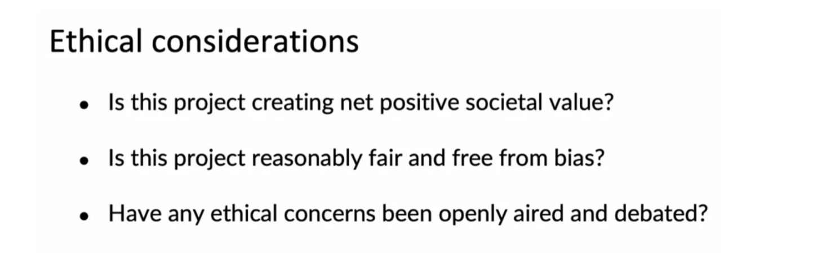

### iv. Define Milestones and Resources

  - Specify **ML metrics** (e.g., accuracy, precision-recall, fairness), **software metrics** (e.g., latency, throughput), and **business metrics** (e.g., revenue increase).
  - Estimate **resources**: Data volume, team involvement, cross-functional support, and timelines.
  - If specifications are unclear, conduct **benchmarking** (compare to similar projects) or build a **proof of concept** to refine estimates.

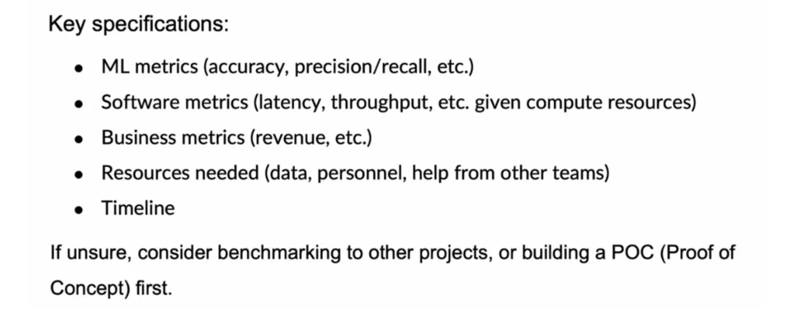

### v. Define Key Metrics

Successful data-driven initiatives require collaboration between technical experts (data scientists), domain specialists (SMEs), and business leaders (stakeholders) to achieve measurable business benefits like increased accuracy, customer satisfaction, and revenue generation.

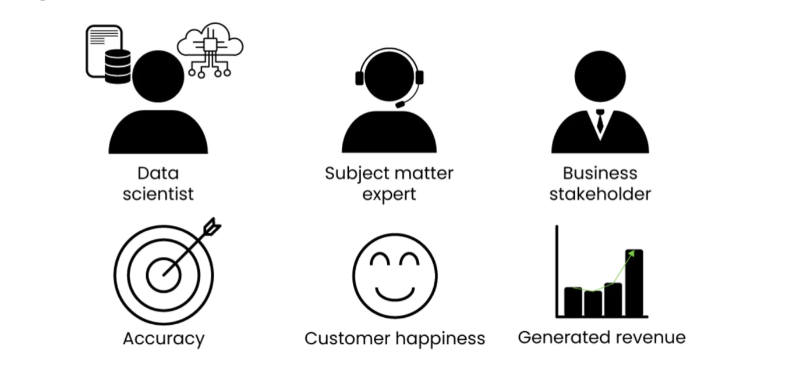

## 2.1.3. Workflows

### i. Project Workflow

An ML project moves from defining the problem to analysis (exploring the data, considering candidate models) to development, and ends in an ML application that may hold several models. What the application reveals in use feeds back into analysis and development, so the loop repeats.

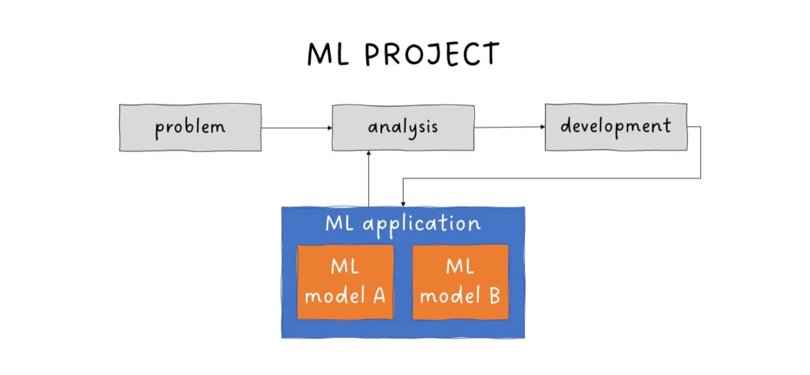

### ii. Modeling Workflow

At its core, a model is a function: it takes input data and returns predictions.

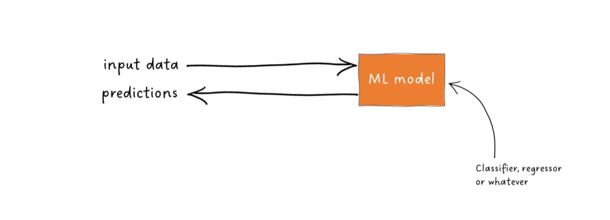

In an application, the model sits behind an API: it receives input data and returns predictions, and business rules turn those predictions into decisions or actions, usually shown to users through a GUI. A database stores the model's inputs and outputs.

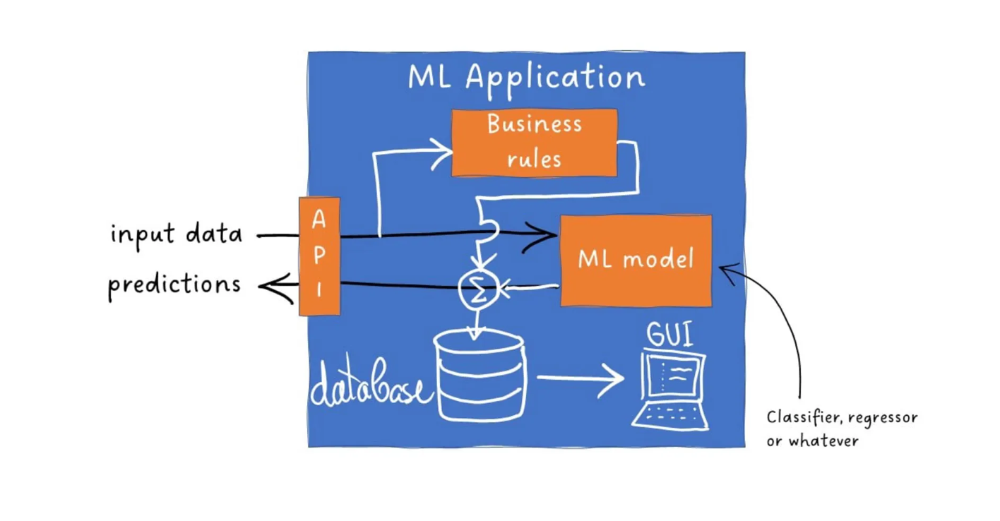

The application and the model have separate lifecycles. The model can be retrained and updated without a new application release, and the application can ship changes without touching the model.

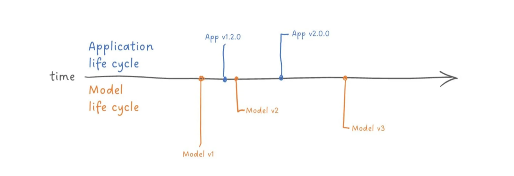

## 2.1.4. Before Machine Learning

Most of the problems in an ML project are engineering problems, and most of the gains come from good features rather than clever algorithms. Zinkevich sums it up as: "do machine learning like the great engineer you are, not like the great machine learning expert you aren't." *(Rules of ML, Overview)*

### i. Launch Without ML First

ML needs data. If ML would give a 100% improvement, a simple heuristic often gets you 50% of the way there. Rank apps by install count, block senders who spammed before, rank contacts by most recent use. If the product does not strictly need ML, ship it without ML until you have data. *(Rules of ML #1)*

### ii. Instrument Metrics Before Building the Model

Track as much as possible in the current system before formalizing what the ML system will do:

  - Permission to log is easier to get early on.
  - Historical data for a future concern is only available if you started collecting it.
  - Systems designed with instrumentation in mind are easier to evaluate later (no grepping logs to rebuild a metric).
  - You learn which metrics move and which stay flat when the product changes.

Pair this with an experiment framework that buckets users and aggregates statistics per experiment. Whenever you notice a problem or a change worth celebrating, add a metric for it. *(Rules of ML #2)*

### iii. Replace Complex Heuristics with ML

A simple heuristic gets the product out the door; a complex one becomes unmaintainable. Once you have data and a clear goal, move to ML: a learned model is easier to update and maintain than a growing pile of rules. *(Rules of ML #3)*

## 2.1.5. Choosing the Objective

A **metric** is any number the system reports. An **objective** is the one metric the algorithm directly optimizes. Measure many metrics; optimize one.

### i. Don't Overthink the First Objective

Early on, most metrics rise together, even the ones you don't optimize directly (optimizing clicks usually lifts time on site too). Don't spend effort balancing metrics while they are all still easy to improve. If the optimized metric goes up but the team decides not to launch, the objective needs revisiting. *(Rules of ML #12)*

### ii. Pick a Simple, Observable, Attributable Objective

The ML objective should be easy to measure and act as a proxy for the "true" goal, which is often unknown or disputed. The easiest things to model are user actions directly caused by the system:

  - **Model directly**: Was the ranked link clicked, the object downloaded, forwarded, rated, or flagged as spam?
  - **Use as metrics, not objectives**: Indirect effects such as next-day return, session length, or daily active users. These belong in A/B tests and launch decisions.
  - **Leave to human judgment**: User happiness, satisfaction, well-being, and company health. Connect these to proxies rather than asking the model to learn them.

*(Rules of ML #13)*

### iii. Use a Policy Layer for Extra Logic

Train on the simple objective and add a thin **policy layer** on top for final adjustments. Keep adversarial problems separate: quality ranking should assume good-faith content, while spam filtering is an arms race with fast-changing features, hard rules, and frequent retraining. Remove spam from the quality model's training data and merge the two systems' outputs in the policy layer. *(Rules of ML #13, #15)*

### iv. Launch Decisions Are Proxies for Long-term Goals

A model can lower log loss and raise installs in an A/B test, yet still be rejected because daily active users dropped 5%. Launch decisions weigh several metrics (engagement, DAU, revenue, partner ROI), and each of those is itself a proxy for long-term goals like a healthy product five years out. Only launches where all metrics improve (or none get worse) are easy. If a simple heuristic beats a sophisticated model on every metric, ship the heuristic. *(Rules of ML #39)*

When metrics plateau and the team starts arguing about issues outside the current objective, stop adding features: either change the objective or change the product goals. *(Rules of ML #38)*

## 2.1.6. Project Phases and Timeboxes

*Adapted from Eugene Yan, [Writing Docs: Why, What, and How](https://eugeneyan.com/writing/writing-docs-why-what-how/).*

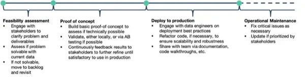

A project usually starts with a **feasibility assessment**. With the existing data and technology, can the problem be solved? If so, to what extent? This stage is a quick and dirty investigation, typically time-boxed at 1-2 weeks.

After feasibility comes a **proof of concept** (POC): a prototype *hacked* together to assess whether the solution is technically achievable. Ideally, it also tests the integration points with upstream data providers and downstream consumers. Can we meet the technical constraints (e.g., latency, throughput)? Is model performance satisfactory? This usually takes a month or two.

If all goes well, the next stage is to **develop for production**, also time-boxed. An overly generous timeline can lead to non-essential features being squeezed in and never-ending development, and without deploying it, no one benefits from it. This usually takes 3-6 months, including infra, job orchestration, testing, monitoring, documentation, etc.

Each phase is a natural point to write one of the documents in [5. Templates](../templates.md).
