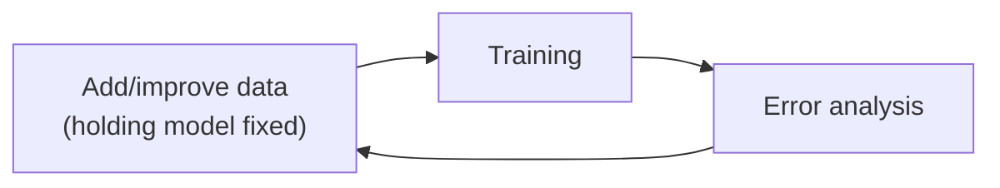
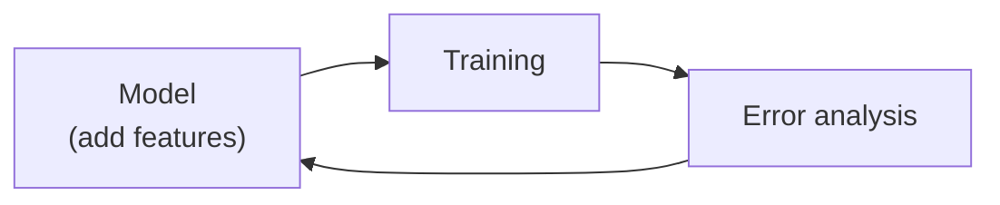

# 3.8 Data-centric AI Development

Traditional AI development often adopts a model-centric approach, focusing on optimizing models for fixed datasets. However, a data-centric approach, which prioritizes improving data quality, is increasingly valuable for many applications. This shift, combined with strategic feature engineering for structured data, can significantly enhance machine learning performance.

## 3.8.1 Model-Centric vs. Data-Centric AI Development

The two philosophies are introduced in [3.1.1](modeling-overview.md#311-model-centric-and-data-centric-ai). In data-centric development you keep a relatively stable model and iteratively improve the data with error analysis and data augmentation. For many applications, high-quality data lets several different models perform adequately, which reduces the need for cutting-edge algorithms.

|  | Model-centric view | Data-centric view |
|---|---|---|
| **Idea** | Take the data you have and develop a model that does as well as possible on it | Data quality is paramount: use tools to improve it, which lets multiple models do well |
| **What you iterate on** | Hold the data fixed and iteratively improve the code/model | Hold the code fixed and iteratively improve the data |

*The two views side by side. Adapted from DeepLearning.AI, MLOps Specialization.*

## 3.8.2 Data Augmentation

Imagine a graph where:

  - The **vertical axis** represents model performance (e.g., accuracy).
  - The **horizontal axis** conceptually represents the space of possible inputs (e.g., speech with background noises like car, plane, train, cafe, library, or food court).

| Input | Noise type | Model vs. HLP | After augmenting cafe noise |
|---|---|---|---|
| Plane, car, train, machine noise | Mechanical | Close to HLP | Small change |
| Library noise | Human | Well below HLP | Lifted |
| Cafe noise | Human | Well below HLP | Lifted most (augmentation target) |
| Food court noise | Human | Well below HLP | Lifted |

*Speech recognition example: augmenting cafe noise pulls up performance on cafe noise and on similar inputs nearby, with little effect on distant ones. Adapted from DeepLearning.AI, MLOps Specialization.*

**Mechanical noises** (car, plane, train) are similar to each other, as are **human-related noises** (cafe, library, food court). A model’s performance varies across these inputs, forming a curve (think of it as a rubber band) that reflects accuracy for each input type. Human-level performance (HLP) forms a separate curve, and the gap between the two curves indicates opportunities for improvement.

Data augmentation targets underperforming inputs (e.g., cafe noise). By adding augmented data, you “pull up” the model's curve at that point, improving performance. This often lifts nearby points (e.g., library or food court noise) as well, with diminishing effects on distant points (e.g., mechanical noises). For unstructured data, improving one area rarely degrades performance elsewhere, making data augmentation highly effective.

**Error Analysis Role**: Error analysis identifies the largest gaps to HLP, guiding where to collect or augment data to maximize performance gains.

**Data Augmentation for Unstructured Data**

Data augmentation efficiently generates additional training examples for unstructured data problems (e.g., images, audio, text). However, it requires careful design to ensure the augmented data is useful. Key decisions include selecting augmentation parameters, such as the type and intensity of background noise in audio.

**Example: Speech Recognition**

To augment an audio clip, you might add background cafe noise by summing the waveforms of the speech and noise. Decisions include:

  - **Type of Noise**: Cafe, car, or other relevant sounds.
  - **Noise Volume**: The loudness relative to the speech.

**Framework for Effective Data Augmentation**

**Create augmented examples that are:**

1.  Realistic: Resemble real-world scenarios (e.g., audio that sounds like a noisy cafe).
2.  Challenging for the Algorithm: The algorithm should perform poorly on these examples, indicating room for learning.
3.  Solvable by Humans: The input-to-output mapping (e.g., speech to transcription) should remain clear to humans or a baseline model. Avoid overly noisy examples where content is indiscernible.

**Validation Checklist**

Before training on augmented data, verify:

1.  Realism: Does the augmented audio sound plausible for the target scenario?
2.  Clear Mapping: Can humans understand the content (e.g., recognize spoken words)?
3.  Algorithm Weakness: Does the algorithm struggle with this data, confirming its potential to drive improvement?

This checklist ensures augmented data is effective without requiring lengthy retraining to validate parameter changes.

**Example: Image Augmentation**

For a small dataset of smartphone images with scratches, augmentation techniques include:

  - Horizontal Flipping: Creates a realistic image with the scratch repositioned.
  - Contrast Adjustment: Brightens the image to highlight the scratch, remaining realistic and human-interpretable.
  - Avoid Over-Augmentation: Darkening an image excessively may obscure the scratch, failing the checklist as humans can’t identify it.

Advanced methods, like using Photoshop to draw synthetic scratches or GANs to generate them, can work but are often unnecessary. Simpler techniques are typically faster and equally effective.

**Data Iteration Loop**

In data-centric AI, adopt a data iteration loop:

1.  Train the model on the current dataset.
2.  Perform error analysis to identify underperforming areas.
3.  Add or augment data to address these weaknesses.
4.  Retrain and repeat.

*The data iteration loop. Adapted from DeepLearning.AI, MLOps Specialization.*

This approach, combined with robust hyperparameter tuning, often outperforms model iteration (repeatedly refining the model) for practical applications.

**Does Adding Data Hurt Performance?**

Data augmentation can alter the training set’s distribution. For example, if cafe noise initially comprises 20% of the data but augmentation increases it to 50%, the training set may diverge from the development and test sets. Does this harm performance?

### Unstructured Data

For unstructured data problems, adding data rarely hurts performance if:

  - **The Model Is Large**: A high-capacity model (e.g., a large neural network with low bias) can handle distribution shifts without overfitting to augmented data.
  - **The Mapping Is Clear**: If the input-to-output mapping (e.g., audio to transcription) is unambiguous and humans can accurately label the data, additional data typically improves or maintains performance.

In such cases, augmenting cafe noise data enhances performance on cafe noise without degrading performance on other noise types.

**Potential Risks**

Performance may degrade in rare cases:

  - **Small Models**: A low-capacity model may overemphasize augmented data (e.g., cafe noise), reducing performance on other inputs (e.g., non-cafe noise).
  - **Ambiguous Mappings**: If the input-to-output mapping is unclear, augmented data can mislead the model. For example, in a Google Street View project to read house numbers, distinguishing between the digit “1” and the letter “I” was challenging. House numbers rarely include “I,” so “1” is a safer guess. Augmenting with ambiguous “I” examples skewed the dataset, causing the model to misclassify ambiguous cases as “I” more often, hurting performance.

This scenario is uncommon, especially in problems like speech recognition where mappings are typically clear. As long as the model is sufficiently large and labels are accurate, data augmentation is unlikely to harm performance.

### Structured Data

For structured data problems (e.g., databases with user or product features), creating new training examples is challenging due to fixed datasets (e.g., a set number of users or products). Instead, feature engineering—adding or enriching features to existing examples—is a powerful strategy.

**Example: Restaurant Recommendations**

In a restaurant recommendation system, error analysis revealed that vegetarians were frequently recommended meat-only restaurants, degrading user experience. Creating new users or restaurants wasn’t feasible, so feature engineering was used:

  - **User Features**: Add a feature indicating vegetarian preference, such as the percentage of vegetarian meals ordered or a score estimating vegetarian likelihood.
  - **Restaurant Features**: Include a feature noting whether the restaurant offers vegetarian options.

These features could be hand-coded or derived algorithmically (e.g., a model that classifies menu items as vegetarian).

**Example: Food Delivery**

In a food delivery system, some users consistently ordered only tea/coffee, while others ordered only pizza. To improve recommendations, add features like:

  - A flag or score indicating tea/coffee-only users.
  - A flag or score for pizza-only users.

These features help the model tailor recommendations to user preferences.

**Content-Based vs. Collaborative Filtering**

Recent trends in recommendation systems favor **content-based filtering** over **collaborative filtering**:

  - **Collaborative Filtering**: Recommends items based on what similar users like, requiring sufficient user interactions. It struggles with the **cold start problem**—recommending new items with few interactions.
  - **Content-Based Filtering**: Uses features of users and items (e.g., user preferences, restaurant menus) to make recommendations. It excels with new items, as it relies on item descriptions rather than user interactions.

For example, a new restaurant can be recommended based on its menu, even if few users have interacted with it. Capturing robust features is critical for content-based filtering success.

**Data Iteration for Structured Data**

The data iteration loop for structured data involves:

1.  Training the model on the current dataset.
2.  Conducting error analysis, user feedback, or competitor benchmarking to identify weaknesses.
3.  Adding or enriching features to address these issues.
4.  Retraining and repeating.

*The iteration loop for structured data, where each round adds features to the model. Adapted from DeepLearning.AI, MLOps Specialization.*

Unlike unstructured data, where human-level performance provides a clear baseline, structured data lacks such a reference, as humans struggle with tasks like recommending restaurants from raw data. Error analysis, user feedback, and competitor comparisons are thus critical for identifying improvement opportunities.

**Role of Feature Engineering in Deep Learning**

Before deep learning, feature engineering was essential for machine learning. While deep learning reduces the need for hand-crafted features in unstructured data problems—especially with large datasets—feature engineering remains vital for structured data, particularly when datasets are small or medium-sized. Thoughtfully designed features can significantly boost performance in these scenarios.
