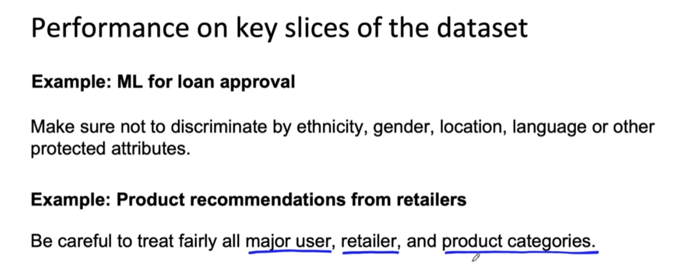
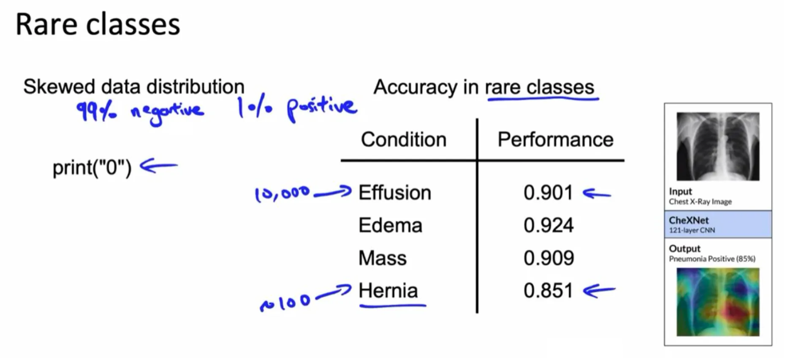
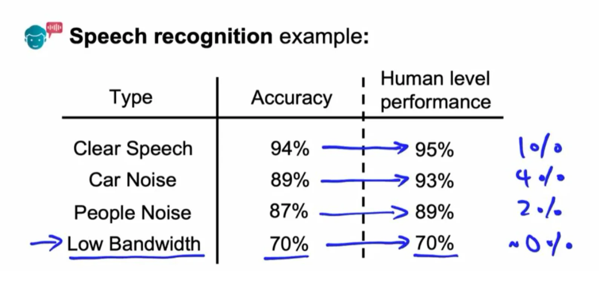

# 3.3 Model Baseline

## i. Getting Started

Launching an ML project can feel daunting, but you don’t need to nail everything on day one. Begin by spending a few hours researching—read a blog or paper to pick a reasonable algorithm, like a standard neural network, rather than chasing the latest cutting-edge option. Then, test your setup with a tiny dataset—say, five examples. Train the model and see if it can overfit, meaning it perfectly memorizes those few cases. If it can’t, something’s off with your code or configuration, and you’ve caught it early.

This approach gets you moving fast. You’ll learn more from tweaking and testing than from agonizing over the “best” starting point. Speed matters more than perfection at the outset.

## ii. Why Low Average Error Isn’t Always Enough

A model with a low average error might seem like a winner, but that number can hide serious flaws. Imagine a web search model that’s 99% accurate but fails to rank "[Google.com](http://google.com/)" correctly for a search on "Google"—that’s a critical miss, even if rare. Or consider a medical diagnosis model trained on data where 99% of patients are healthy. It could predict "healthy" every time, scoring 99% accuracy, yet miss every sick patient. That’s not just misleading—it’s dangerous.

The problem often stems from skewed data or overlooking rare but vital cases. Average error smooths over these issues, so you need to dig deeper. Check how the model handles the tough stuff—the edge cases or the minority classes that matter most to your application.

## iii. Setting a Baseline

Every ML project needs a starting point, or baseline, to measure progress against. Here are a few ways to set one:

  - **Human-Level Performance (HLP)**: How well do humans do? Great for tasks like image recognition (see [2.2.5 Human-level Performance](../design/data.md#225-human-level-performance-hlp)).
  - **Literature Search**: Check what others have achieved on similar problems.
  - **Quick Model**: Build a simple model fast to see what’s possible.
  - **Previous System Performance**: If you already have a machine learning system in place, its performance can serve as a baseline for improvement.

**Example: Speech Recognition Categories**

Suppose you’ve identified four major speech categories in your dataset, with your model achieving accuracies of 94%, 89%, 87%, and 70%, respectively. You might initially focus on improving the lowest-performing category (e.g., low-bandwidth audio at 70%). However, before prioritizing, it’s critical to establish a baseline for all categories.

To do this, have human transcriptionists label the data and measure their accuracy. This establishes the **human-level performance (HLP)** for each category. For instance, you might find that improving performance on clear speech to HLP could yield a 1% gain, while improving performance on audio with background car noise could yield a 4% gain. For low-bandwidth audio, however, the improvement might be negligible (0%).

This analysis reveals that low-bandwidth audio may be too garbled for even humans to transcribe accurately, suggesting it’s not a fruitful area for improvement. Instead, focusing on speech recognition with background car noise could be more productive. HLP provides a valuable baseline to guide your efforts toward high-impact areas, such as car noise data, rather than less promising ones like low-bandwidth audio.

**Baselines for Unstructured vs. Structured Data**

Best practices for establishing baselines vary depending on whether you’re working with **unstructured** or **structured** data.

  - **Unstructured data** includes datasets like images (e.g., pictures of cats), audio (e.g., speech recognition), or natural language. Humans excel at interpreting unstructured data, so measuring HLP is often an effective way to establish a baseline for these tasks.
  - **Structured data**, such as large databases from an e-commerce website (e.g., user purchases, timestamps, and prices), is less intuitive for humans. We didn’t evolve to analyze massive spreadsheets, so HLP is typically less useful as a baseline for structured data applications.

Given these differences, the approach to establishing baselines depends on the data type.

**Understanding Irreducible Error**

For unstructured data, HLP can help estimate the **irreducible error** or **Bayes error**—the theoretical best performance possible. For example, you might determine that low-bandwidth audio is so degraded that exceeding 70% accuracy is impossible, even for humans.

**Avoiding Unrealistic Expectations**

Some business teams may pressure machine learning teams to guarantee high accuracy (e.g., 80% or 99%) before a baseline is established. This puts the team in a challenging position. If faced with such demands, consider pushing back and requesting time to establish a rough baseline. This allows for a more informed prediction of the system’s potential accuracy.

## iv. Keep the First Model Simple

The first model gives the biggest boost to the product, so it doesn't need to be fancy. Most of the work is infrastructure: how examples reach the learner, what "good" and "bad" mean for the system, and how the model plugs into the application (scored live, or precomputed offline and stored in a table). Simple features make it easy to verify that features reach the learner correctly, that the model learns sensible weights, and that features reach the model correctly at serving time. Some teams aim for a "neutral" first launch that explicitly deprioritizes ML gains so they don't get distracted. *(Rules of ML #4)*

Prefer an interpretable, probabilistic model at first (linear, logistic, or Poisson regression). Its predictions read as probabilities or expected values, and it is approximately **calibrated** (the average prediction matches the average label on the subsets its features define). If predicted probabilities drift from what you see in production, that gap points to a bug. Simple models also make feedback loops easier to handle. *(Rules of ML #14)*

## v. Plan to Launch and Iterate

The current model won't be the last one; many teams launch a new model every quarter for years. New launches come from new features, retuned regularization and feature combinations, or a retuned objective. So ask of every change: does this complexity slow down future launches? Design the pipeline so features are easy to add, remove, or recombine, so a fresh copy can be built and verified, and so two or three copies can run in parallel. *(Rules of ML #16)*
