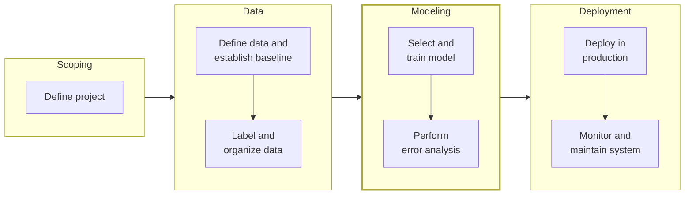
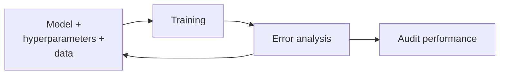
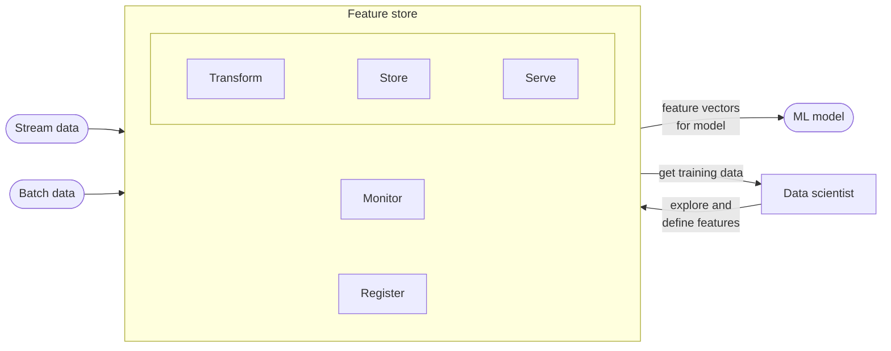
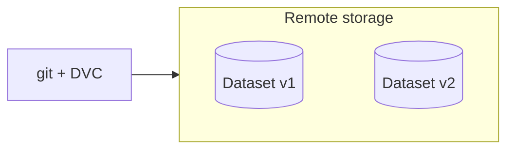

# 3.1 Modeling Overview

Machine learning development often revolves around two philosophies: model-centric and data-centric AI.

## i. Model-centric and Data-centric AI

*The ML project lifecycle with the modeling phase highlighted. Modeling can send you back to data, and deployment back to modeling or data. Adapted from DeepLearning.AI, MLOps Specialization.*

1.  In a **model-centric** approach, the emphasis is on crafting the perfect algorithm. Imagine you’re tuning a car’s engine—researchers might spend months designing a sophisticated neural network, tweaking its layers and connections, all while using a fixed dataset like a standard image collection. Historically, this has been the dominant method in AI research, with the focus on building ever-better models to outshine competitors on the same data.
2.  By contrast, a **data-centric** approach shifts the spotlight to the data itself. Here, the idea is to feed a solid but simpler model with high-quality, carefully curated data. It’s like ensuring the car runs on premium fuel rather than tinkering endlessly with the engine. In practice, this might mean cleaning up messy data, adding new examples, or enhancing what you already have. For many real-world projects, this method proves more efficient—great data can lift a basic model to impressive heights, often faster than perfecting a complex algorithm. For example, improving a dataset of customer reviews by removing duplicates and clarifying labels might boost a sentiment analysis model more than redesigning its architecture.

## ii. Key Challenges

Building a machine learning system is a balancing act between three core elements:

  - **Code**: The algorithm or model you write.
  - **Data**: The examples your model learns from.
  - **Hyperparameters**: Settings like how fast the model learns that guide its training.

$$
\text{AI system} = \underbrace{\text{Code}}_{\text{algorithm/model}} + \text{Data}
$$

*A model-centric approach works on the code; a data-centric approach works on the data. Adapted from DeepLearning.AI, MLOps Specialization.*

These pieces don’t come together in a straight line—it’s an iterative process. You start by training a model, test how it performs, spot where it goes wrong, and then adjust one of those three components. Maybe the code needs a bug fix, the data needs more variety, or the hyperparameters need fine-tuning. Then you try again. This cycle is normal and even valuable; each mistake teaches you something about what your system needs.

*Model development is an iterative process: each round adjusts the model, hyperparameters or data, trains, and runs error analysis, until the model is ready for a performance audit. Together, the code, hyperparameters and data define the ML model that maps X to Y. Adapted from DeepLearning.AI, MLOps Specialization.*

A key part of this process is figuring out *why* the model fails, which is where error analysis comes in. Suppose you’re building a speech recognition system, and it stumbles on clips with background noise. By studying those failures, you might realize the data lacks enough noisy examples, prompting you to add more. This interplay between code, data, and settings is what drives progress, making patience and curiosity essential traits for an ML developer.

## iii. Milestones in Training a Model

To gauge whether your model is on the right track, you need to measure its performance at three distinct stages:

1.  **Training Set Performance**: How well does the model learn the examples it’s been given? (e.g., predicting house prices from sizes it’s seen.)
2.  **Development (Dev) Set Performance**: Can it handle new, unseen data?
3.  **Test Set Performance**: Does it work well on a final, separate dataset?

But numbers alone don’t tell the whole story. A model might ace these metrics yet still fall short of your project’s needs. Take a loan approval system: even with high accuracy, it could unfairly reject certain applicants due to biased data. Success isn’t just about hitting a target score—it’s about meeting practical goals like fairness or reliability.

## iv. Feature Engineering

Goal is to enhance model performance. Tools and techniques help to process, select, and maintain features:

  - Feature selection

      - Domain-specific knowledge
      - Correlation
      - Feature importances
      - Other methods: univariate selection, Principal Component Analysis (PCA), Recursive Feature Elimination (RFE)
  - Feature store: only relevant for large teams working on multiple projects that use the same features (see [4.4 Reproducibility and CI/CD](../deployment/reproducibility-cicd.md))

*A feature store transforms, stores, serves, monitors and registers features from stream and batch sources, feeding both the model and the data scientist.*

  - Data version control

      - Tracking dataset changes
      - Maintaining consistency

*Git plus DVC versions the data: each dataset version (v1, v2) is kept in remote storage.*

**Rules of thumb for features** *(Rules of ML)*

  - **Mine existing heuristics** (#7): The problem usually had a rule-based solution before ML, and those rules carry intuition worth keeping. Four ways to reuse a heuristic: preprocess with it (e.g., block blacklisted senders outright), turn its score into a feature, feed its raw inputs to the model separately, or fold it into the label. Weigh each against the complexity it adds.
  - **Start with observed features, not learned ones** (#17): Features from an external system (e.g., a clustering model) carry that system's objective, can go stale, or change meaning when updated. Deep or factored features are non-convex, so run-to-run variation hides whether a change helped. Get a baseline without them first.
  - **Use content features that generalize across contexts** (#18): Signals from other surfaces (plus-ones and reshares before a post reaches What's Hot, co-watches from YouTube search for Watch Next) let the model promote new items it has no history for in the current context.
  - **Use very specific features when you have the data** (#19): With lots of data, millions of simple features (document IDs, canonicalized queries) are easier to learn than a few complex ones. Groups of features that each cover a tiny slice are fine if together they cover more than 90% of examples; regularization removes the ones with too little support.
  - **Combine features in human-understandable ways** (#20): The two standard transformations are **discretization** (turn age into buckets; basic quantiles are enough) and **crosses** (e.g., {gender} × {country}). Crosses of three or more columns need massive data and can overfit.
  - **Scale feature count to data size** (#21): Roughly, a linear model can learn about as many weights as you have data for. 1,000 examples: a dozen hand-built features (dot products, TF-IDF). 10 million examples: around 100,000 features with regularization. Billions of examples: around 10 million features via crosses plus feature selection.
  - **Clean up unused features** (#22): Unused features are technical debt and slow down trying new ones. Check coverage: a personalization feature that only 8% of users have won't help much, but a feature on 1% of the data that is 90% positive can be great.
  - **Give feature columns owners and documentation** (#11): Know who created and maintains each feature, what it is, where it comes from, and how it is expected to help. Hand over that knowledge when the owner leaves.
