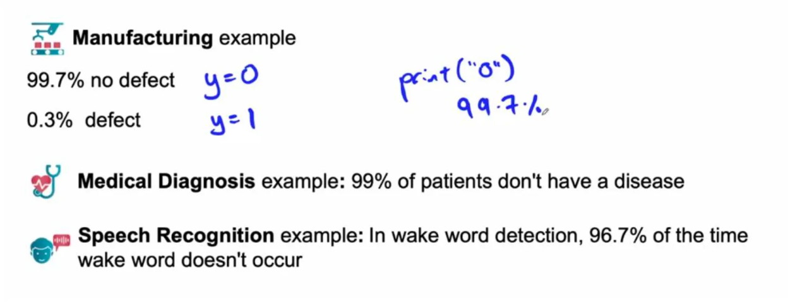
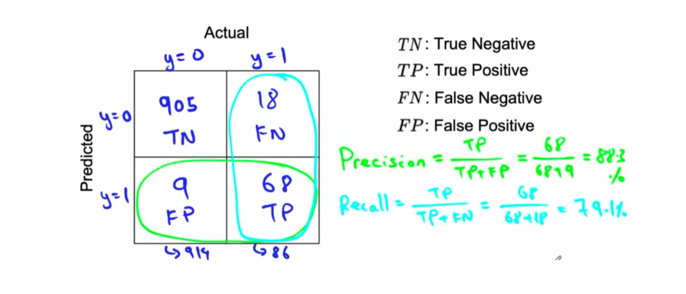
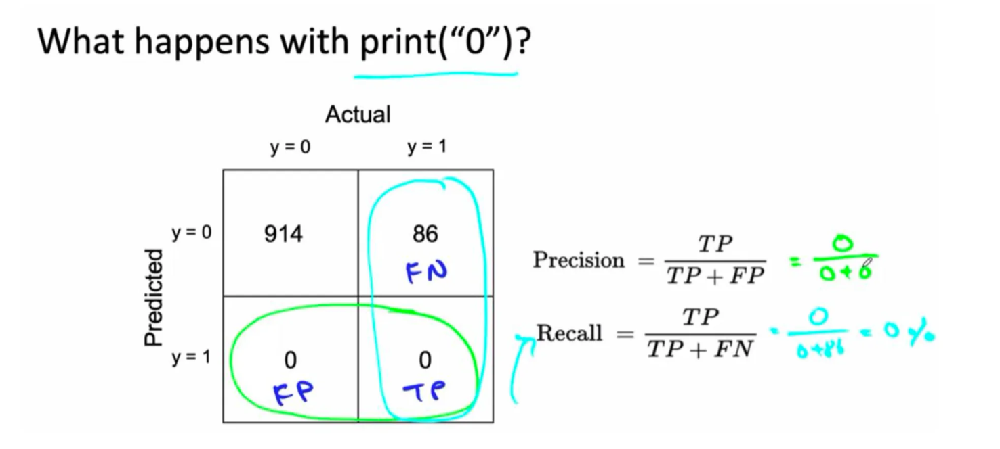
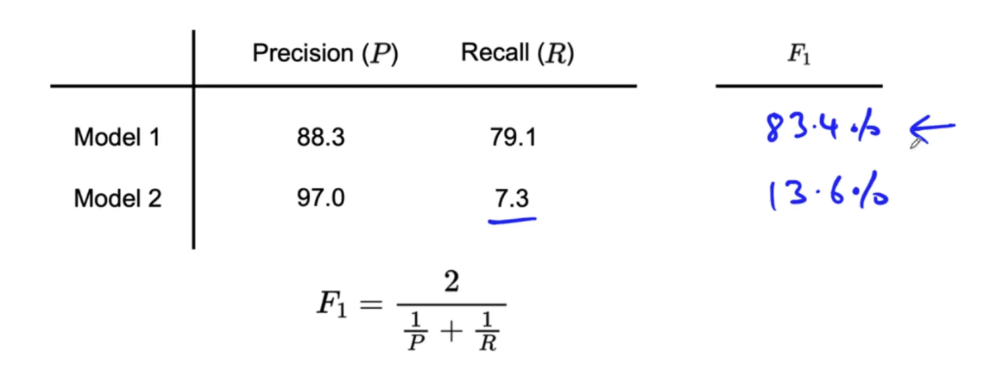
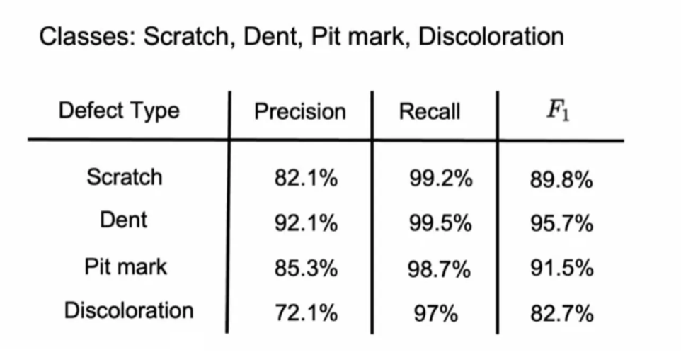

# 3.6 Skewed Datasets

Skewed datasets, where one class significantly outnumbers another, pose challenges for evaluating machine learning models. Accuracy alone is often misleading in such cases, and alternative metrics like precision, recall, and the F1 score provide a clearer picture of performance.

## i. Challenges of Skewed Datasets

In skewed datasets, the majority class dominates, making high accuracy achievable with simplistic models that fail to detect the minority class. Consider these examples:

  - **Manufacturing Smartphones**: If 99.7% of smartphones have no defects (labeled y=0) and only 0.3% are defective (y=1), an algorithm that always predicts "no defect" achieves 99.7% accuracy, despite being ineffective at identifying defects.
  - **Medical Diagnosis**: If 99% of patients don’t have a disease, predicting "no disease" for everyone yields 99% accuracy, yet fails to identify any actual cases.
  - **Wake Word Detection**: In systems detecting wake words (e.g., "Hey Siri"), the wake word is rarely spoken. A typical dataset might have 96.7% negative examples (no wake word) and 3.3% positive examples, making accuracy a poor metric.

In such cases, always predicting the majority class produces high accuracy but misses critical minority class instances, rendering the model practically useless.

## ii. Using a Confusion Matrix

For skewed datasets, a confusion matrix is a more effective evaluation tool. It organizes predictions against actual labels, with one axis representing ground truth (y=0 or y=1) and the other representing predictions. For a dataset with 1,000 examples (914 negative, 86 positive, i.e., 91.4% negative, 8.6% positive), a confusion matrix reveals how well the model handles both classes.

## iii. Precision and Recall

**Precision** and **recall** are key metrics for skewed datasets, offering deeper insights than accuracy:

  - **Precision**: The proportion of positive predictions that are correct.
  - **Recall**: The proportion of actual positive cases correctly identified.

For the example dataset (914 negative, 86 positive), an algorithm that always predicts "negative" achieves:

  - **0% recall**, as it fails to detect any positive examples.
  - **High precision** (if it never predicts positive, precision is undefined or trivially high), but this is meaningless given the low recall.

Low recall flags the algorithm’s failure to identify the minority class, making precision and recall more informative than accuracy.

## iv. Comparing Models with the F1 Score

When comparing models with different precision and recall values, the F1 score provides a single, balanced metric. The F1 score is the harmonic mean of precision and recall, emphasizing the lower of the two values to ensure both are reasonably high. Mathematically:

While the F1 score is widely used, you may adjust the weighting of precision and recall based on your application’s needs. For instance, some scenarios may prioritize recall over precision or vice versa.

## v. Multi-class Classification with Skewed Data

Skewed datasets are also common in **multi-class classification** problems, such as detecting multiple rare defect types in smartphone manufacturing (e.g., scratches, dents, pit marks, or LCD discoloration). Since each defect type may be rare, accuracy is misleading, as a model could achieve high accuracy by ignoring all defects.

Instead, evaluate **precision and recall for each defect type** individually. For example:

  - **High Recall Preference**: Manufacturing often prioritizes high recall to minimize defective phones reaching customers. Slightly lower precision is tolerable, as human inspectors can verify flagged phones to filter out false positives.
  - **F1 Score for Comparison**: Compute the F1 score for each defect type to obtain a single metric for performance across all classes. This helps benchmark against human-level performance and prioritize which defect type to address next.

Using the F1 score avoids the pitfalls of accuracy, which remains high even if the algorithm misses rare defects. It also guides prioritization by highlighting the most impactful defect types to improve.
