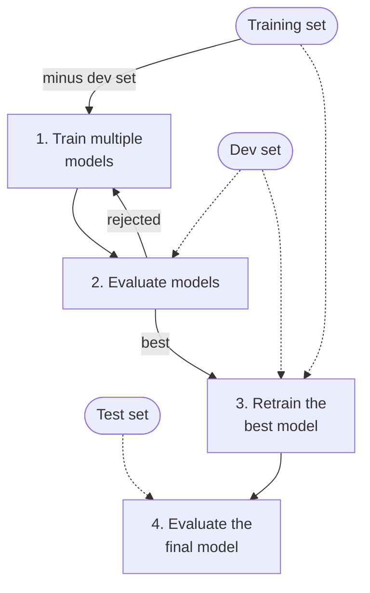

# 3.2 Validation and Hyperparameter Tuning

Before training anything, decide how the data is split and how candidate models and hyperparameters will be compared, so every later result is measured the same way.

## 3.2.1 Testing and Validating

Split the data into training set and test set (typically 80-20%; if it’s big data then 90-10%). The error rate on new cases is called the *generalization error.* If the training error is low but the generalization error is high, it means that your model is overfitting the training data.

## 3.2.2 Hyperparameter Tuning and Model Selection

Evaluating a model is simple enough but what if you are hesitating between two types of models? Train both and compare how well they generalize using the test set. Now suppose model A performs better and now you want to apply some regularization to avoid overfitting. How do you choose the value of the regularization hyperparameter? You can’t keep reusing the test set, or the model and its hyperparameters will end up fitted to it. A solution to this problem is creating a validation set (aka dev set): you hold out part of the training set to evaluate several candidate models and select the best one. More specifically, you train multiple models with various hyperparameters on the reduced training set (training set - dev set) and select the model that performs best on the dev set. After that, you train the best model on the full training set and this gives you the final model. Lastly, you evaluate this final model on the test set to get an estimate of the generalization error. When data is scarce, use cross-validation instead of a single dev set: evaluate each candidate on several small validation folds and average the results.

*Model selection using holdout validation: candidates are compared on the dev set, the winner is retrained on training plus dev data, and the test set is used once at the end. Dashed arrows are data feeds. Adapted from Géron, *Hands-On Machine Learning* (Figure 1-25).*

An important rule to remember is that both the validation set and the test set must be as representative as possible of the data you expect to use in production.

## 3.2.3 Searching the Hyperparameter Space

  - **Grid search** tries every combination of a few values per hyperparameter. It gets expensive quickly and spends many trials on hyperparameters that barely matter.
  - **Random search** samples combinations at random. With the same budget it explores many more values of each hyperparameter, so prefer it unless there are very few values to explore (Géron).
  - **Bayesian optimization** fits a probabilistic model (a Gaussian process) of validation performance as a function of the hyperparameters, and uses it to pick the next combination most likely to beat the best so far. It needs fewer training runs, which matters when each run is slow ([Snoek, Larochelle & Adams](https://arxiv.org/abs/1206.2944)).

## 3.2.4 Choosing a Splitting Strategy

  - **Is there a time component in my data where the future shouldn't influence the past?**

      - **YES:** You **must** use a **Time-Based Split**. Stratification is secondary and can be more complex to implement with time splits, but the time-based separation is non-negotiable.
      - **NO:** Proceed to the next question.
  - **Is this a classification problem?**

      - **YES:** You **should** use a **Stratified Split** (stratify=y). It prevents "bad luck" splits and is crucial for imbalanced datasets. It's good practice even for balanced datasets.
      - **NO (e.g., a regression problem):** A standard **Random Split** is usually fine.

For production systems, the time-based split should mirror how the model is used: if the model is trained on data up to January 5th, test it on data from January 6th onward. Expect it to do somewhat worse on the newer data, but not radically worse. Because of daily effects, absolute rates (click rate, conversion rate) may shift; a ranking metric like AUC should stay reasonably close. *(Rules of ML #33)*

## 3.2.5 Balanced Splits for Small Datasets

For small datasets, balanced splits ensure representative train, development (dev), and test sets. In a visual inspection dataset with 100 images (30 defective, 70 non-defective), a 60/20/20 split might yield:

  - **Unbalanced Split**: Train (21 defective, 35% defective), Dev (2 defective, 10% defective), Test (7 defective, 35% defective).
  - **Balanced Split**: Train (18 defective, 30%), Dev (6 defective, 30%), Test (6 defective, 30%).

Balanced splits maintain the dataset’s true distribution (30% defective), improving model evaluation. For large datasets, random splits are typically representative, making balancing less critical.
