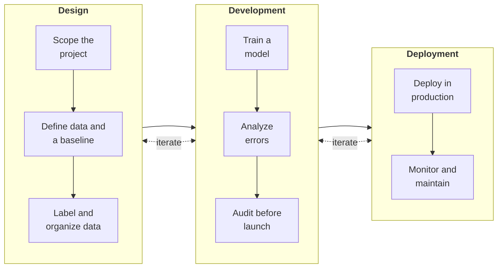

# Machine Learning Knowledge Base

These are study notes on building machine learning systems end to end. They compress the process into three stages, **design**, **development**, and **deployment**, and follow one idea through all of them: most of the work in production ML is engineering and data, not algorithms.

*Scope: classic (predictive) ML systems. LLMs and foundation models are not covered.*



*From a business problem to a model serving users. Each stage is a set of steps, and work moves back and forth between stages: error analysis can call for more data, and monitoring triggers retraining. Adapted from DeepLearning.AI, MLOps Specialization.*

## 1 · Overview

New here? Start with the [lifecycle](overview/lifecycle.md), which walks all three stages once, then use the [project checklist](overview/checklist.md) as a step-by-step guide. The [speech recognition case study](overview/case-study-speech-recognition.md) shows the stages applied to one system.

- [1.1 Introduction](overview/introduction.md): why ML, types of ML systems, and the main challenges
- [1.4 MLOps](overview/mlops.md): maturity levels and what to automate at each stage

## 2 · Design

Design decides what to build before anything is trained: which business problem is worth solving, whether ML is the right tool, which single objective the model should optimize, and what data it needs, defined consistently enough that a model can learn from it.

- [2.1 Scoping](design/scoping.md)
- [2.2 Data](design/data.md)

## 3 · Development

Development turns scoped data into a working model: set up validation, get a baseline fast, then iterate with error analysis, more often by improving the data than the model. It ends with an audit before anything reaches users.

- [3.1 Modeling Overview](development/modeling-overview.md)
- [3.2 Validation and Hyperparameter Tuning](development/validation-and-tuning.md)
- [3.3 Model Baseline](development/model-baseline.md)
- [3.4 Error Analysis](development/error-analysis.md)
- [3.5 Prioritizing Improvements](development/prioritizing-improvements.md)
- [3.6 Skewed Datasets](development/skewed-datasets.md)
- [3.7 Performance Auditing](development/performance-auditing.md)
- [3.8 Data-centric AI Development](development/data-centric-development.md)
- [3.9 Experiment Tracking](development/experiment-tracking.md)

## 4 · Deployment

Deployment puts the model in front of real data: choosing an architecture, rolling out gradually with a way back, making builds reproducible, and monitoring the system once it is live. A first deployment is only about halfway through the project, since live traffic reveals what development could not.

- [4.1 Key Challenges in Deployment](deployment/key-challenges.md)
- [4.2 Deployment Architecture](deployment/architecture.md)
- [4.3 Common Deployment Patterns](deployment/deployment-patterns.md)
- [4.4 Reproducibility and CI/CD](deployment/reproducibility-cicd.md)
- [4.5 Monitoring](deployment/monitoring.md)
- [4.6 Case Study: Defect Inspection in Manufacturing](deployment/case-study-defect-inspection.md)

## Appendix

- [Templates](templates.md): the three documents worth writing along the way: one-pagers, design docs, and after-action reviews
- [Sources](sources.md): the courses, books, and articles these notes draw on

```{toctree}
:hidden:
:caption: 1 · Overview

overview/introduction
overview/lifecycle
overview/checklist
overview/mlops
overview/case-study-speech-recognition
```

```{toctree}
:hidden:
:caption: 2 · Design

design/scoping
design/data
```

```{toctree}
:hidden:
:caption: 3 · Development

development/modeling-overview
development/validation-and-tuning
development/model-baseline
development/error-analysis
development/prioritizing-improvements
development/skewed-datasets
development/performance-auditing
development/data-centric-development
development/experiment-tracking
```

```{toctree}
:hidden:
:caption: 4 · Deployment

deployment/key-challenges
deployment/architecture
deployment/deployment-patterns
deployment/reproducibility-cicd
deployment/monitoring
deployment/case-study-defect-inspection
```

```{toctree}
:hidden:
:caption: Appendix

templates
sources
```
