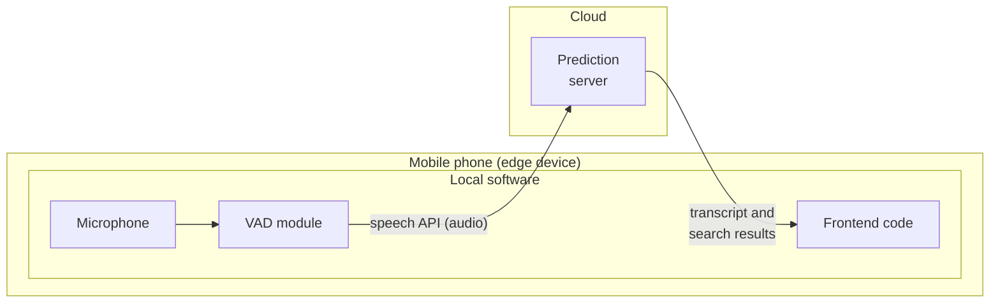

# 1.5 Case Study: Speech Recognition System

This example illustrates the steps required to build and deploy a speech recognition system using the machine learning (ML) project lifecycle.

## Scoping

Begin by defining the project, such as developing a speech recognition system for voice search. This involves identifying key metrics, which vary by application. For speech recognition, critical metrics include:

  - **Accuracy**: How precise is the system in transcribing speech?
  - **Latency**: How long does it take to process and transcribe speech?
  - **Throughput**: How many queries per second can the system handle?
  - Additionally, estimate the resources needed, such as time, computational power, budget, and project timeline.

## Data

In this phase, define the data, establish a baseline, and label and organize it. A key challenge in speech recognition is ensuring consistent data labeling. For example, consider an audio clip for voice search with the phrase “Um, today’s weather.” Possible transcriptions include:

1.  “Um, today’s weather”
2.  “Um… today’s weather”
3.  “Today’s weather”

Any of these transcriptions may be reasonable, but inconsistency—e.g., using all three across the dataset—can confuse the learning algorithm and degrade performance. Standardizing on one convention, such as the first or second option, significantly improves results.

Other data definition questions include:

  - How much silence should be included before and after a speaker’s audio (e.g., 100, 300, or 500 milliseconds)?
  - How should volume normalization be handled? Some speakers are loud, others soft, and some clips may contain both loud and soft segments within the same audio?

Addressing these questions ensures high-quality data.

In production systems, datasets are not static. You may need to edit the training or test sets to improve data quality and enhance system performance.

## Modeling

Training an ML model requires three key inputs:

  - **Code**: The algorithm or neural network architecture.
  - **Hyperparameters**: Settings that tune the model’s performance.
  - **Data**: The labeled dataset used for training.

In academic research, the focus is often on varying the code or hyperparameters while keeping the data fixed. However, when building a production ML system, it’s often more effective to use a reliable open-source implementation (e.g., from GitHub) and focus on optimizing the data and hyperparameters. In short, ML system = code + data. Error analysis is critical here, as it identifies where the model falls short and guides systematic improvements to the data or code.

Rather than collecting more data indiscriminately, which can be costly, error analysis helps target specific data needs, making the process more efficient and leading to a high-accuracy model.

## Deployment

Once the model is trained and error analysis indicates satisfactory performance, the system is ready for deployment. A typical speech recognition deployment for voice search might involve:

  - An **edge device** (e.g., a smartphone) running software that records audio via the microphone.
  - A **Voice Activity Detection (VAD)** module that isolates audio segments containing speech, sending only those to a prediction server (often hosted in the cloud).
  - The prediction server, which returns the transcribed text and search results to the user, displayed through the smartphone’s frontend interface.

*Speech recognition deployment: the phone detects voice activity and sends audio to a cloud prediction server, which returns the transcript and search results. Adapted from DeepLearning.AI, MLOps Specialization.*

Deploying the system requires integrating it into production, developing supporting software, and implementing monitoring to track performance and incoming data.

## Maintenance

Post-deployment, continuous monitoring and maintenance are essential. Andrew Ng's course gives an example: a speech recognition system trained mostly on adult voices was deployed, and an increasing number of younger users (teenagers and children), whose voices differed significantly, degraded its performance. The team collected additional data from younger speakers to retrain the model.

A key challenge in deployment is **concept drift** or **data drift**, where the data distribution changes (e.g., more young voices). Effective monitoring systems are crucial for detecting such issues, and timely fixes—such as collecting targeted data or retraining the model—are necessary to maintain performance and deliver value.
