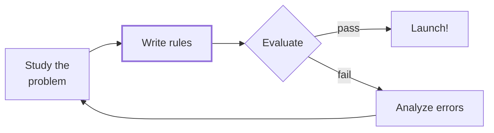
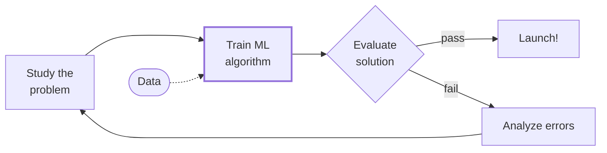
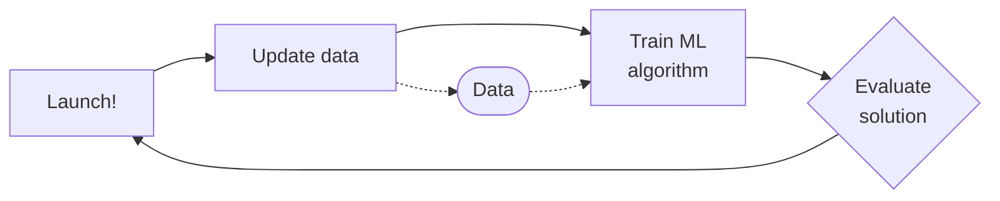
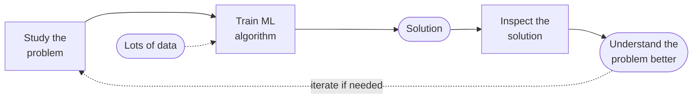
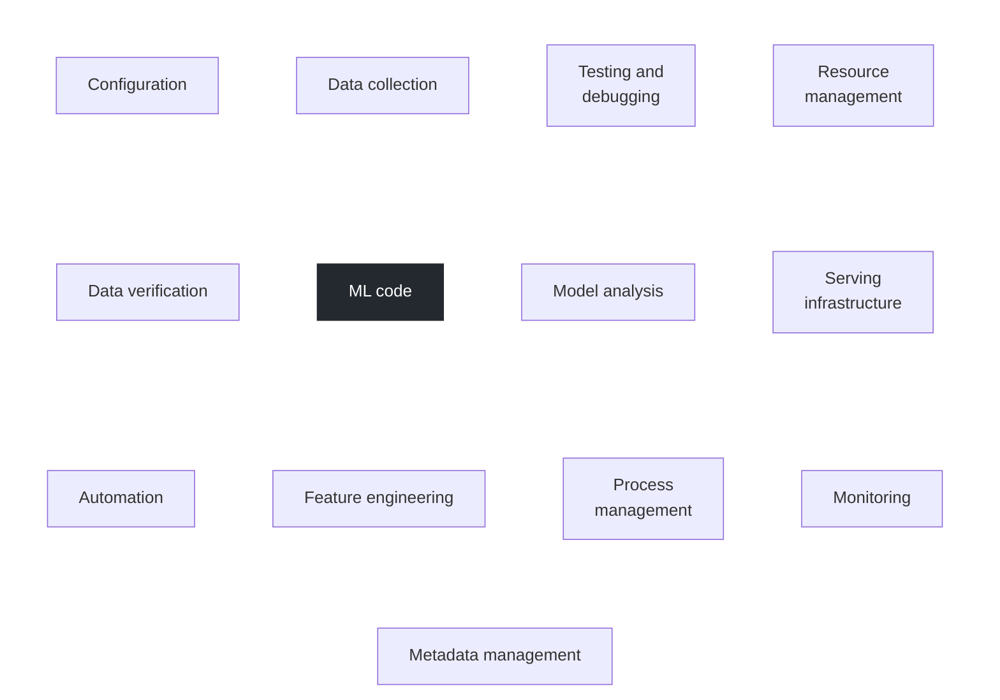

# 1.1 Introduction

## 1.1.1 Why ML

Machine Learning is the science and art of programming computers so they can learn from data.

**Traditional approach.** You study the problem, write rules by hand, evaluate them, and launch if they work. If they don't, you analyze the errors and refine the rules. The list of rules keeps growing and gets hard to maintain.

*The traditional approach: hand-written rules, refined after each failed evaluation. Adapted from Géron, *Hands-On Machine Learning* (Figure 1-1).*

**Machine learning approach.** You still start by studying the problem, but instead of writing rules you train an algorithm on data. If the evaluated solution falls short, error analysis sends you back to the problem, the data, or the training setup.

*The machine learning approach: the rule-writing step becomes training on data. Adapted from Géron, *Hands-On Machine Learning* (Figure 1-2).*

**Adapting to change.** Once launched, the system can be retrained automatically as new data arrives, so it keeps up with a changing environment without anyone rewriting rules.

*Automatically adapting to change: the whole loop can be automated. Adapted from Géron, *Hands-On Machine Learning* (Figure 1-3).*

**Helping humans learn.** Inspecting a trained model (for example, which features it relies on most) can reveal patterns in the problem that people hadn't noticed, and that insight feeds back into how the problem is understood.

*Machine learning can help humans learn: inspecting the trained solution gives insight into the problem. Adapted from Géron, *Hands-On Machine Learning* (Figure 1-4).*

To summarize, ML is great for:

  - Problems for which existing solutions require a lot of fine-tuning or long lists of rules
  - Complex problems for which using a traditional approach yields no good solution
  - Fluctuating environments
  - Getting insights about complex problems and large amounts of data

## 1.1.2 Types of ML Systems

There are many different types of ML systems so it’s useful to classify them in broad categories, based on the following criteria:

  - How they are supervised during training (supervised, unsupervised, etc.)
  - Whether or not they can learn incrementally on the fly (online learning vs. batch learning)
  - Whether they work by simply comparing new data points to known data points, or instead by detecting patterns in the training data and building a predictive model

### Training supervision

  - Supervised learning (regression, classification)
  - Unsupervised learning (clustering, dimensionality reduction, anomaly detection)
  - Semi-supervised learning
  - Reinforcement learning (an agent in an environment given rewards and penalties to find the most optimal policy)

### Batch vs online learning

In **batch learning**, the system is incapable of learning incrementally: it must be trained using all the available data. This takes a lot of time and computing resources, so it’s typically done offline. First the system is trained, and then it is launched into production and runs without learning anymore (offline learning), it just applies what it has learned.

In **online learning**, you train the system incrementally by feeding in data instances sequentially, individually or in small groups called mini-batches. Each learning step is fast and cheap, so the system can learn about new data on the fly, as it arrives. Additionally, they can be used to train models on huge datasets that cannot fit in one’s machine’s main memory (this is called out-of-core learning). The algorithm loads part of the data, runs a training step on that data, and repeats the process until it has run on all of the data. Out-of-core learning is usually done offline, so think of it as incremental learning rather than online learning.

A big challenge of online learning is that if bad data is fed to the system, performance will drop. To reduce this risk, monitor the system closely and switch learning off if you detect a decline in performance. Monitor the input data and react to abnormal data, for example by using an anomaly detection algorithm.

### Instance-based vs model-based learning

**Instance-based** systems learn the training examples by heart and generalize to new cases by comparing them to the stored examples with a similarity measure (e.g., k-nearest neighbors). **Model-based** systems build a model from the examples (e.g., a linear regression) and use the model to make predictions.

## 1.1.3 Main Challenges of ML

The two things that can go wrong are “bad model” and “bad data”.

Bad data:

  - Insufficient quantity of training data
  - Nonrepresentative training data
  - Poor quality data
  - Irrelevant features

Bad model:

  - Overfitting the training data. Possible solutions:

      - Simplify the model by selecting one with fewer parameters, by reducing the number of features in the training data, or by constraining the model
      - Gather more training data
      - Reduce the noise in the training data (higher quality data)
  - Underfitting the training data. Possible solutions:

      - Select a more powerful model, with more parameters
      - Feed better features to the learning algorithm (feature engineering)
      - Reduce the constraints on the model (for example by reducing the regularization hyperparameter)

## 1.1.4 ML in Production

Deploying machine learning (ML) models into production environments involves challenges that extend beyond model development. Effective deployment integrates machine learning expertise with software engineering practices to ensure continuous and reliable operation within a larger system.

Key challenges include:

  - Ensuring consistent performance in real-world conditions.
  - Managing concept drift and data drift.
  - Handling extensive software infrastructure, where ML code typically comprises only 5-10% of the total codebase.

*In a production ML system, the ML code is one small part of a much larger system. Adapted from Sculley et al., *Hidden Technical Debt in Machine Learning Systems* (2015).*

Beyond the machine learning code, there are also many other components for managing the data, such as data collection, data verification, feature extraction. And after you are serving it, we also need to consider how to monitor and analyze the system. There are often many other components that need to be built to enable a working production deployment.

**MLOps** encompasses the practices for the continuous, reliable, and efficient design, deployment, and maintenance of machine learning systems in production.

Originating from DevOps, MLOps addresses the full machine learning lifecycle. Its benefits include:

  - Improved collaboration
  - Automated deployment
  - Robust monitoring of model performance

The practices and maturity levels are covered in [1.4 MLOps](mlops.md).
