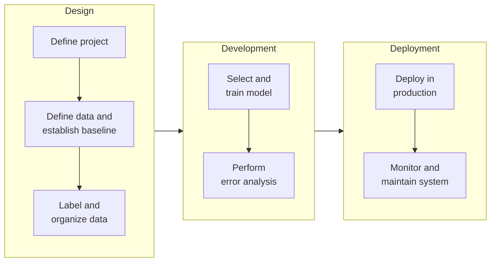

# 1.2 ML Project Lifecycle

When building a machine learning (ML) system, planning the project lifecycle helps outline all necessary steps effectively. As you work on an ML system, this framework will help you identify critical tasks, ensure the system functions properly, and minimize unexpected challenges.

The ML project lifecycle consists of iterative stages that guide the development and deployment of an ML system.

*The ML project lifecycle. Each stage also loops back: error analysis can send you back to collect more data, and monitoring triggers retraining. Adapted from DeepLearning.AI, MLOps Specialization.*

The iterative nature of this lifecycle means feedback from later stages often informs adjustments to earlier ones. ML projects are often highly iterative. During error analysis, you may need to refine the model or revisit earlier steps to collect additional data. Before deployment, you typically perform a final check or audit to verify that the system’s performance is adequate and reliable for its intended application. Deploying a system for the first time means you’re only about halfway to completion. Live traffic often reveals critical insights needed to optimize performance.

## 1.2.1. Design

**Scoping**

Begin by defining the project and deciding what to focus on. Specify the ML application, including what X (input) and Y (output) represent.

  - Define project objectives, specifying inputs (X) and outputs (Y).
  - Establish performance metrics (e.g., accuracy, latency, throughput).
  - Estimate required resources (e.g., time, compute, budget).

**Data**

After selecting the project, gather the required data for your algorithm. This involves defining the data, establishing a baseline, labeling, and organizing it.

  - Collect, label, and organize data, ensuring quality and consistency.
  - Address issues such as inconsistent labeling or missing values.
  - Establish a performance baseline (covered in [3.3 Model Baseline](../development/model-baseline.md)).

Covered in depth in [2. Design](../index.md#design), starting with [2.1 Scoping](../design/scoping.md).

## 1.2.2. Development

With data in hand, proceed to train the model. This phase includes selecting and training the model and conducting error analysis.

  - Select and train a model using the prepared dataset.
  - Conduct error analysis to identify improvement areas.
  - Iterate on model architecture, hyperparameters, or data as needed.

Covered in depth in [3. Development](../index.md#development), starting with [3.1 Modeling Overview](../development/modeling-overview.md).

## 1.2.3. Deployment

To deploy the system, integrate it into production, develop the necessary software, and monitor the system. Continuously track incoming data and maintain the system’s performance. For instance, if the data distribution shifts, you may need to update the model.

  - Integrate the model into a production environment (e.g., via APIs).
  - Ensure compliance with performance requirements (e.g., latency, throughput).
  - Address operational constraints (e.g., resource availability, security).

**Maintenance**

Post-deployment maintenance often involves further error analysis, retraining the model, or incorporating new data. As the system runs on live data, its output can be fed back into the dataset to update the data, retrain the model, and deploy an improved version.

  - Monitor system performance for issues like concept or data drift.
  - Update the model with new data or retraining as required.
  - Refine the system based on real-world feedback.

Covered in depth in [4. Deployment](../index.md#deployment), starting with [4.1 Key Challenges](../deployment/key-challenges.md).

## 1.2.4. Roles

An ML project needs both business and technical people. Business roles define the problem and judge whether the result is useful; technical roles build the data pipelines, the model, and the system around it.

  - Business roles

      - Business stakeholder
      - Subject matter expert
  - Technical roles

      - Data Engineer
      - Data Scientist
      - Machine Learning Engineer
