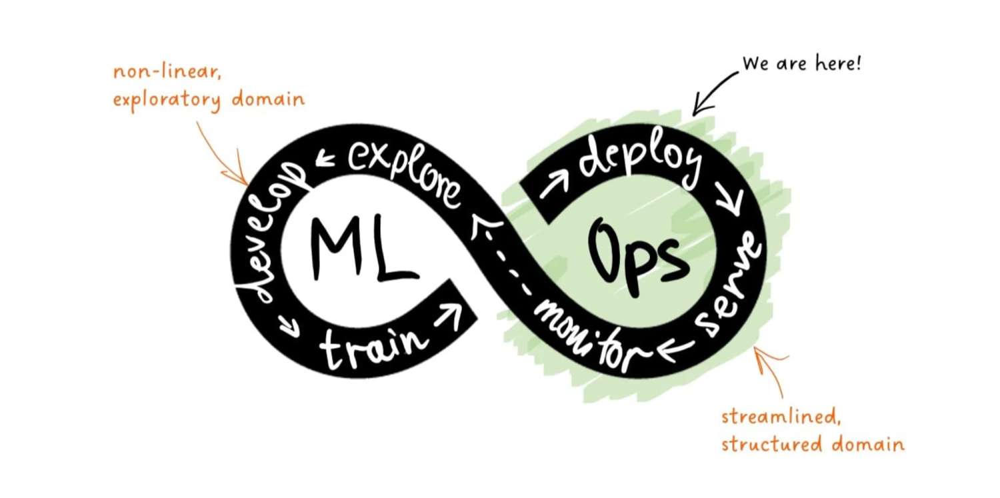
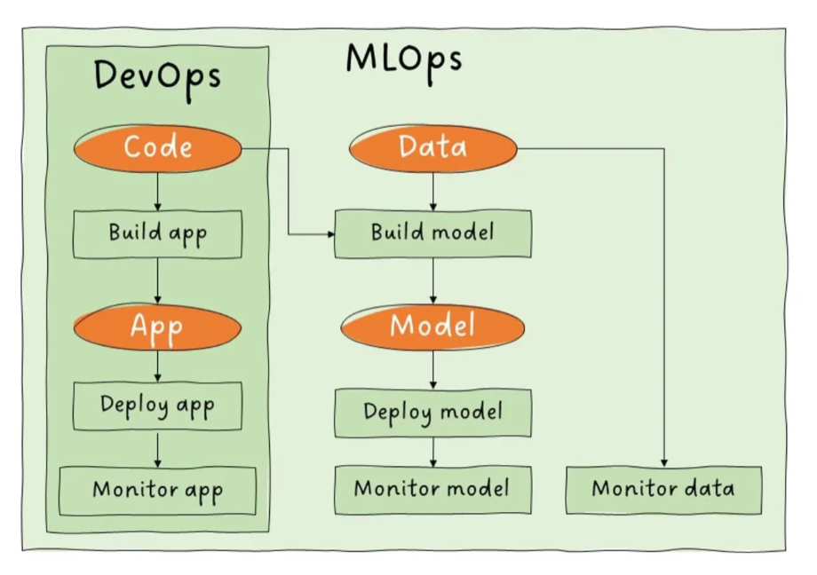
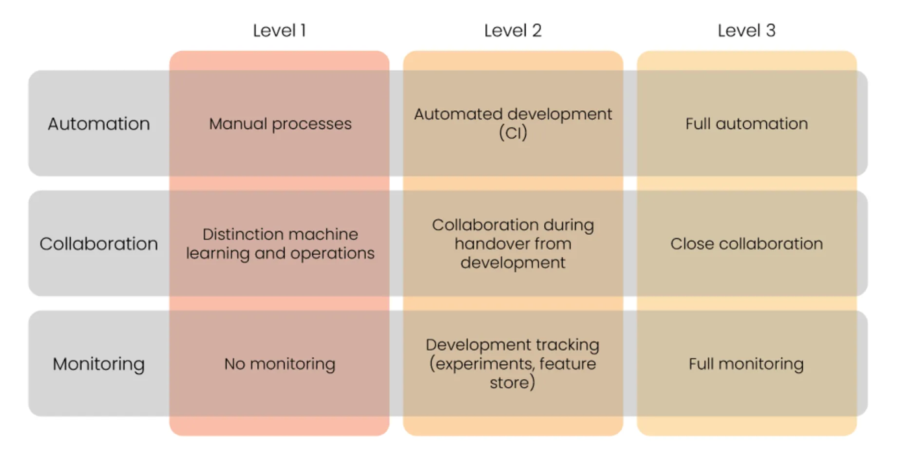
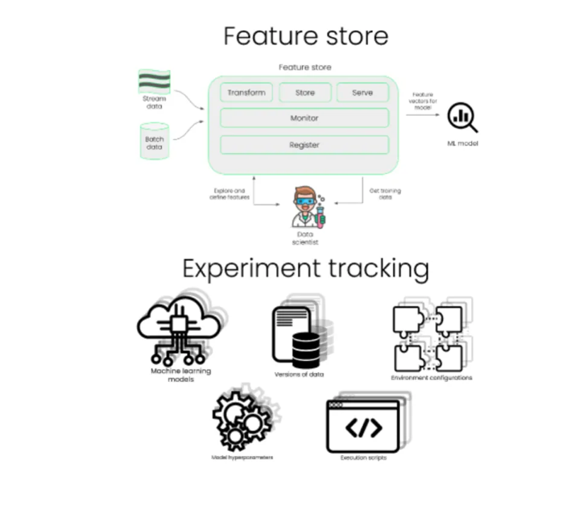
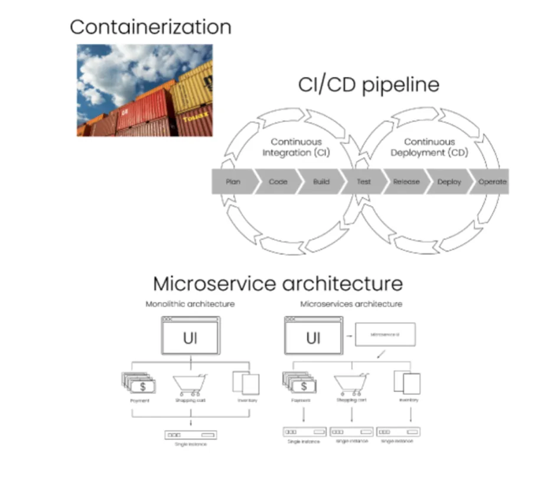

# 1.4 MLOps

MLOps (Machine Learning Operations) is a set of practices that integrates Machine Learning, DevOps, and Data Engineering to streamline and automate the entire lifecycle of machine learning models, from development and experimentation to reliable deployment, monitoring, and continuous improvement in production environments.

It focuses on ensuring reproducibility, scalability, version control, and efficient collaboration among data scientists, ML engineers, and operations teams to deliver and maintain high-performing ML solutions.

Regarding **maturity levels**, a usual starting point is:

  - Manual ML workflows
  - Manual deployment
  - Ad hoc monitoring

This leads to an accumulation of technical debt.

As companies progress through the maturity levels, the level of automation, collaboration, and monitoring rises. A higher level is not necessarily better for every team, and most of the progress happens in the development and deployment stages.

**ML Workflows**

  - Data collection and preparation
  - Data-labeling
  - Model selection
  - Model training
  - Model packaging
  - Model deployment
  - Model monitoring and maintenance

The more of this workflow is automated, the higher the MLOps maturity.

## Level 1: Manual processes

  - Manual process for development
  - Manual process for deployment
  - No collaboration between ML and operations
  - Teams work in isolation
  - No tracking of development
  - No monitoring after deployment

## Level 2: Automated development

  - Automated development pipeline (Continuous integration)
  - Manual process for deployment
  - After development teams will collaborate to deploy model
  - Tracking of ML experiments and features
  - Little monitoring after deployment

## Level 3: Automated development and deployment

  - Automated development pipeline (CI)
  - Automated deployment pipeline (CD)
  - Close collaboration between teams
  - Monitoring of development and deployment
  - Potentially automatically triggering retraining

## Automation by stage

Which parts of each stage can be automated, and what that buys:

**Design**

  - Project design remains a manual process; templates help it scale (see [5. Templates](../templates.md)).
  - Data acquisition can be automated, which helps keep data quality high.

**Development**

  - A feature store saves time rebuilding the same features and helps scale across projects.
  - Automated experiment tracking ensures reproducibility.

**Deployment**

  - Containerization makes it easy to start up copies of the same application, which improves scalability.
  - A CI/CD pipeline automates development and deployment and speeds up both.
  - A microservices architecture improves scalability and lets services be developed and deployed independently.

