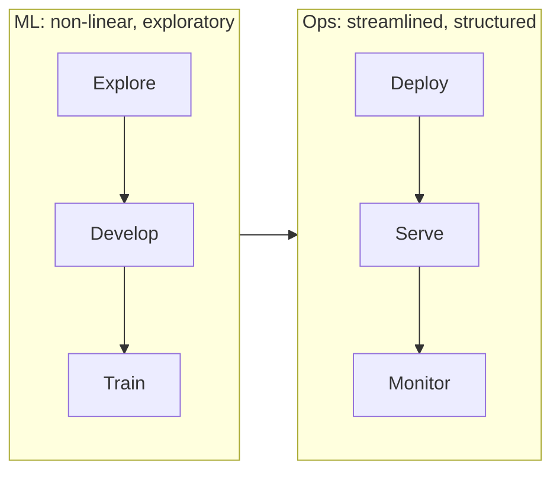
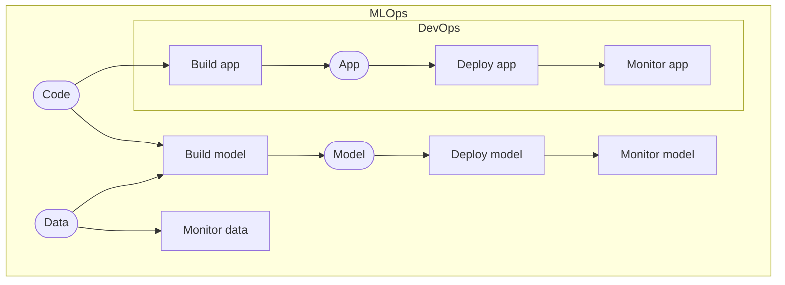
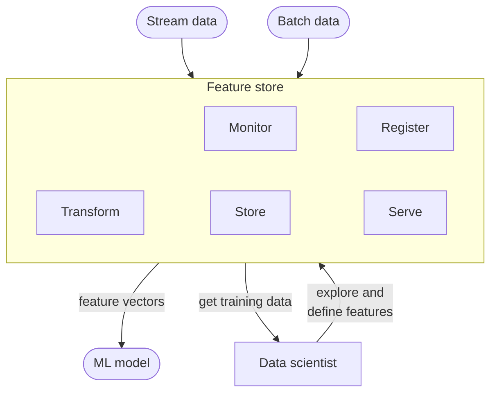
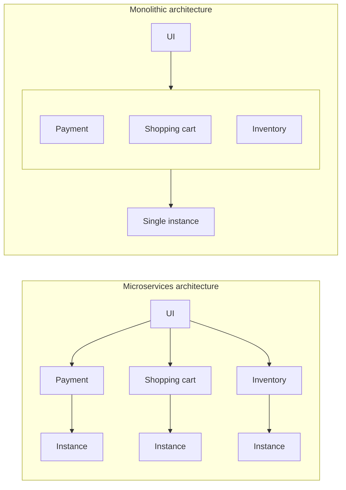

# 1.4 MLOps

MLOps (Machine Learning Operations) is a set of practices that integrates Machine Learning, DevOps, and Data Engineering to streamline and automate the entire lifecycle of machine learning models, from development and experimentation to reliable deployment, monitoring, and continuous improvement in production environments.

*MLOps joins an exploratory ML loop to a structured operations loop; monitoring feeds back into exploration.*

It focuses on ensuring reproducibility, scalability, version control, and efficient collaboration among data scientists, ML engineers, and operations teams to deliver and maintain high-performing ML solutions.

*DevOps builds, deploys and monitors an app from code. MLOps adds data as a second input to build a model, and monitors the data as well as the model.*

## 1.4.1 Maturity Levels

A usual starting point is:

  - Manual ML workflows
  - Manual deployment
  - Ad hoc monitoring

This leads to an accumulation of technical debt.

As companies progress through the maturity levels, the level of automation, collaboration, and monitoring rises. A higher level is not necessarily better for every team, and most of the progress happens in the development and deployment stages.

| | Level 1 | Level 2 | Level 3 |
|---|---|---|---|
| **Automation** | Manual processes | Automated development (CI) | Full automation |
| **Collaboration** | Distinction between machine learning and operations | Collaboration during handover from development | Close collaboration |
| **Monitoring** | No monitoring | Development tracking (experiments, feature store) | Full monitoring |

*Automation, collaboration and monitoring at each MLOps maturity level.*

**ML Workflows**

  - Data collection and preparation
  - Data-labeling
  - Model selection
  - Model training
  - Model packaging
  - Model deployment
  - Model monitoring and maintenance

The more of this workflow is automated, the higher the MLOps maturity.

### Level 1: Manual Processes

  - Manual process for development
  - Manual process for deployment
  - No collaboration between ML and operations
  - Teams work in isolation
  - No tracking of development
  - No monitoring after deployment

### Level 2: Automated Development

  - Automated development pipeline (Continuous integration)
  - Manual process for deployment
  - After development teams will collaborate to deploy model
  - Tracking of ML experiments and features
  - Little monitoring after deployment

### Level 3: Automated Development and Deployment

  - Automated development pipeline (CI)
  - Automated deployment pipeline (CD)
  - Close collaboration between teams
  - Monitoring of development and deployment
  - Potentially automatically triggering retraining

## 1.4.2 Automation by Stage

Which parts of each stage can be automated, and what that buys:

**Design**

  - Project design remains a manual process; templates help it scale (see [Templates](../templates.md)).
  - Data acquisition can be automated, which helps keep data quality high.

      - For example, an ETL pipeline extracts order data and weather data, combines them, and loads the result into a database, followed by automated data quality checks.

**Development**

  - A feature store saves time rebuilding the same features and helps scale across projects.
  - Automated experiment tracking ensures reproducibility.

      - It records the machine learning models, versions of data, environment configurations, model hyperparameters, and execution scripts.

*A feature store ingests stream and batch data, serves feature vectors to models, and gives data scientists one place to define features and pull training data.*

**Deployment**

  - Containerization makes it easy to start up copies of the same application, which improves scalability.
  - A CI/CD pipeline automates development and deployment and speeds up both.

      - Continuous integration (CI) covers plan, code, build, and test; continuous deployment (CD) starts at test and continues with release, deploy, and operate.
  - A microservices architecture improves scalability and lets services be developed and deployed independently.

*In a monolith, payment, shopping cart and inventory ship together as a single instance; with microservices, each service runs as its own instance.*
